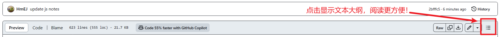

# 学习笔记

1. [docker](docker/docker.md)
2. [clash-linux-config](Java/clash配置.md)
3. [swagger](swagger-demo/swagger笔记.md)

## 笔记

1. [👉Knowledge📕](Java/🌟重要知识点汇总.md)
2. [👉Git📖](Java/Git.md)
3. [👉JVM📖](Java/JVM组成.md)
4. [👉MySql](Java/SQL数据库.md)
5. [👉JDK17](Java/JDK17常用新特性.md)
6. [👉Interview](面试知识点/面试知识点.md)

Obsidian笔记

1. [👉HTML基础📖](Java/1-HTML基础.md)
8. [👉CSS📖](Java/2-CSS.md)
9.  [👉JavaScript📖](Java/JavaScript.md)
10. [👉Ajax📖](Java/Ajax.md)
11. [👉VUE📖](Java/VUE.md)
6. [👉JAVA入门📖](Java/3-Java%20SE%20入门.md)
7. [👉方法📖](Java/4-方法.md)
8. [👉数组📖](Java/5-数组.md)
9. [👉面向对象📖](Java/6-面向对象.md)
10. [👉异常处理📖](Java/7-异常处理.md)
11. [👉常用类📖](Java/8-常用类.md)
12. [👉集合📖](Java/9-集合.md)
13. [👉IO流📖](Java/10-IO流.md)
14. [👉多线程📖](Java/11-多线程.md)
15. [👉网络编程📖](Java/12-网络编程.md)
16. [👉反射📖](Java/13-反射.md)
17. [👉JDBC📖](Java/14-JDBC.md)
13. [👉JavaWeb📖](Java/JavaWeb.md)

---

## 框架

1. [👉MyBatis 逆向工程](Java/mybatis-generator.md)
2. [👉Spring AOP|声明式事务](SpringPractice10-6/学习记录10-6.md)
3. [👉SpringMVC 了解MVC|核心组件|控制流程](SpringMVC/SpringMVC学习记录10-7.md)
4. [👉SpringMVC 组件配置](SpringMVC02/SpringMVC学习记录第二天10-8.md)
5. [👉SpringMVC 异步通信|上传与下载](SpringMVC03/SpringMVC02/SpringMVC45%2010-1112.md)
6. [👉SSM整合](ssm-integration/记录.md)
7. [👉SSM整合 聚合式](web-aggregation/记录.md)
8. [👉springboot](springboot-helloworld/学习记录.md)
9.  [👉MyBatis-Plus](mybatis-plus/mp-demo/MyBatis-Plus笔记.md)

## 设计模式

1. [👉设计模式](design_pattern/设计模式.md)

---

## 测试题

1. [👉数组💯](Java/面试简单题测试.md)
2. [👉异常和常用类💯](Java/模拟测试摸底题.md)
3. [👉集合💯](Java/集合中难测试题.md)
4. [👉IO流💯](Java/IO流简单测试题.md)
5. [👉线程💯](Java/线程简单测试题.md)
6. [👉SQL💯](Java/SQL简单测试题.md)
    附: 💾[sql文件](Java/tb_order.sql)
---

## 感谢
感谢`Jinhui-Huang`大佬对我学习提供的帮助
👉
