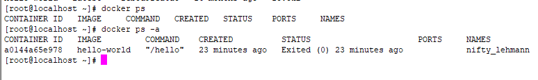
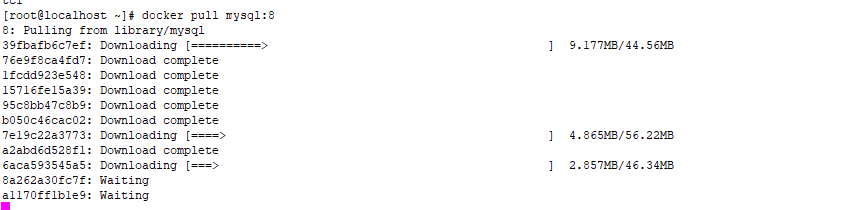

# 1、docker概述

## 1、什么是docker

Docker 是一个开源的应用容器引擎，让开发者可以打包他们的应用以及依赖包到一个可移植的[镜像](https://baike.baidu.com/item/镜像/1574?fromModule=lemma_inlink)中，然后发布到任何流行的 [Linux](https://baike.baidu.com/item/Linux?fromModule=lemma_inlink)或[Windows](https://baike.baidu.com/item/Windows/165458?fromModule=lemma_inlink)操作系统的机器上，也可以实现[虚拟化](https://baike.baidu.com/item/虚拟化/547949?fromModule=lemma_inlink)。容器是完全使用[沙箱](https://baike.baidu.com/item/沙箱/393318?fromModule=lemma_inlink)机制，相互之间不会有任何接口。

Docker可以让开发者打包自己成应用成一个镜像，发布到服务器上，或者发布到开源社区，实现网络上的资源共享。镜像发布到服务器后，以容器的方式运行，也是虚拟化的一个特性。容器之间是充分隔离的，采用沙盒机制，互相之间不会有影响。而且Docker是可移植的，跨平台的。

## 2、什么是沙盒

**沙盒**（英语：sandbox，又译为**沙箱**），[计算机专业](https://baike.baidu.com/item/计算机专业/10586245?fromModule=lemma_inlink)术语，在计算机安全领域中是一种安全机制，为运行中的程序提供的隔离环境。通常是作为一些来源不可信、具破坏力或无法判定程序意图的程序提供实验之用。

 

## 3、docker容器和虚拟机的区别

相同点：docker容器和虚拟机都采用了虚拟的技术。

不同点：docker相当于虚拟机而言，少了虚拟机操作系统层，少了一层就少了很多的资源浪费，所以docker的效率更高。

 


## 4、Docker架构

docker分三大部分：客户端、docker主机和镜像仓库。

客户端是人和docker对话用的。就是执行docker命令，在命令行执行。

docker主机是本地处理docker相关操作的。运行在操作系统上的，我们不能直接观察和操作。

镜像仓库是事先准备好的镜像池。提供了丰富的镜像，供每个docker使用。

客户端和docker主机都是安装在我们的操作系统行，镜像仓库是在公网上或者是我们自己创建的私有库。

两个关键词：

镜像：images，可以理解成一个系统的镜像文件，例如发给大家的centOS镜像。

容器：containers， 容器是镜像在运行时的一个状态。

images相当于硬盘上的文件，containers相当于运行硬盘上的文件，包括其内存状态。


## 5、核心概念

 

核心有三个，用来连接主机的clients，安装了docker的主机Hosts，和保存镜像文件的registries

## 6、docker的特性及优点

特点：

隔离，文件隔离、系统隔离、资源隔离、网络隔离、日志隔离等。每个容器都完全独立运行在一个沙盒中，所有数据、资源都是隔离的，比如，CPU、内存等等，网络上会为每个容器虚拟一个ip地址，docker为每个容器都提供自己的日志，互不影响。

优点：

它的虚拟化做的比虚拟机要好，更节省字样。可以跨平台，不需要担心操作系统的影响，另外docker的应用也很广泛，各大公司都有应用。

缺点：

docker对程序是友好的，但是不善于处理文件和数据，一般情况会将文件或数据以路径映射的方式挂载到容器外。

# 2、部署docker环境

官网手册：https://docs.docker.com/engine/install/centos/

## 1、查看一下Linux内核版本

docker支持3.10及以上版本，一定要看一下内核版本

用命令：unmae -r


## 2、卸载老版本docker，避免产生影响


```shell
yum remove docker \
                  docker-client \
                  docker-client-latest \
                  docker-common \
                  docker-latest \
                  docker-latest-logrotate \
                  docker-logrotate \
                  docker-engine
```


## 3、升级yum和配置源


```
yum install -y yum-utils

yum-config-manager \
    --add-repo \
    https://download.docker.com/linux/centos/docker-ce.repo
```

## 4、在虚拟机中安装docker

此处是最新版本的安装，建议不要安装最新版本。


## 5、查看历史版本的docker


## 6、安装指定版本的docker

我们统一安装：20.10.8版本


```
yum install --setopt=obsoletes=0 docker-ce-<VERSION_STRING> docker-ce-selinux-<VERSION_STRING>.noarch
```

把<VERSION_STRING>替换成版本号即可

yum install --setopt=obsoletes=0 docker-ce-20.10.8-3.el7 docker-ce-selinux-20.10.8-3.el7.noarch

## 7、安装成功


## 8、启动服务验证一下

执行命令：docker --version ，查看一下docker版本，有信息代表安装成功


docker安装成功后，需要启动docker服务才可以用


命令：

docker images ：查看docker镜像

systemctl start docker ：启动docker服务

systemctl stop docker ：停止docker服务

systemctl enable docker ：开机自启docker服务

# 3、docker的常用操作

## 0. 查看容器状态

`docker inspect <容器id/容器name>`

## 1、查看本地【镜像】

docker images ：查看docker镜像


REPOSITORY：镜像的名字

TAG：镜像的标签

IMAGE ID：镜像的唯一标识

CREATED：创建这个镜像的时间

SIZE：镜像的大小

## 2、查找指定镜像

### 1、到官网去查

网站： https://hub.docker.com/


选用这种有认证的镜像

### 2、用命令查

docker search 镜像名称


## 3、拉取镜像

docker pull 镜像名称

docker pull tomcat


TAG的latest代表当前镜像的标签，latest是最新的一个镜像。

docker pull 镜像名称:标签名

一般标签名中会包含版本号。

我们统一用tomcat8

docker pull tomcat:8


## 4、查看容器

docker ps ：查看正在运行的容器

docker ps -a ：查看所有容器，包括运行的和停止的



CONTAINER ID：容器唯一标识

IMAGE：对应的镜像名字

COMMAND：执行的命令

CREATED：创建时间

STATUS：容器的状态

PORTS：容器的端口号，是自定义的

NAMES：容器的名字，是自定义的

## 5、移除容器

docker rm 容器的名字或唯一标识


当用id移除时，可以只输入id的前几个符号，docker会自动去配置，但是要注意列表中是否有类似的，为了确保移除时一定是对的，建议复制容器唯一标识移除。

移除镜像：

docker rmi 镜像的id

移除镜像要用id移除，命令虽然支持按照名称移除，但是按照名称容易出错，要按id移除。

docker操作镜像时，如果用的是名字，那么会默认加上标签，对应的是latest这个标签。

## 6、启动容器

docker start 容器id/名字


docker stop 容器id/名字

docker restart 容器id/名字

## 7、启动Tomcat

docker run --name tc -p 8080:8080 tomcat:8或镜像id

docker run --name tc1 -p 8080:8080 -d 73365378bc27


--name：给容器取一个名字

-p：端口映射，将容器的端口映射到服务器上，冒号前的端口是服务器的端口号，后面的是容器的端口号。例如：-p 8081:8080，将容器的8080端口映射到服务器的8081端口，访问时访问8081端口就相当于访问容器的8080端口。

-d：后台运行。像tomcat这种持续运行的程序，需要用后台运行的方式，这样不影响终端做其他操作。


注意：容器的名字是唯一，无论容器的状态是什么，名称都不允许重复。

## 8、进入容器内

docker exec -it 容器的名字或id /bin/bash

-it：进入到容器中，是-i -t的缩写。

/bin/bash：是命令需要的路径参数


容器内部仍然可以用Linux命令。

## 9、Tomcat启动后404问题

外部访问tomcat时会出现404，是因为webapps目录文件下没有任何文件，tomcat自带的页面都在webapps.dist目录文件下，复制过来即可，只复制ROOT目录文件就可以了。

## 10、补充

执行exit或Ctrl+d可以从容器中退出，到服务器上。

进入容器的-it命令，-i：以交互模式运行虚拟机

?								  -t：为容器分配一个伪终端

docker logs 容器名称或id -f：输出容器日志，-f代表持续输出，会保持日志输出的状态，一直打印日志，Ctrl+C退出。


## 11、MySQL数据库安装和配置

### 1、拉取MySQL镜像

统一下载8版本



### 2、启动MySQL

docker run --name mm -p 3306:3306 -e MYSQL_ROOT_PASSWORD=123456 -d mysql:8

-e：配置信息，配置root的密码。


### 3、目录映射

```
docker run --name mmy -p 3306:3306 -e MYSQL_ROOT_PASSWORD=123456 -d \
-v /usr/local/docker/mysql/logs:/var/log/mysql \
-v /usr/local/docker/mysql/conf:/etc/mysql \
-v /usr/local/docker/mysql/data:/var/lib/mysql  mysql:8
```

-v：目录映射，同-p格式。目录文件必须手动创建才能映射。


## 12、创建docker镜像

### 1、创建Dockerfile

创建一个文件名为Dockerfile的文件，这个文件是没有后缀名的

FROM openjdk:8
ADD t-springboot-1.0-SNAPSHOT-exec.jar /app.jar
RUN bash -c 'touch /app.jar'
ENTRYPOINT ["java","-jar","/app.jar"]
RUN /bin/cp /usr/share/zoneinfo/Asia/Shanghai /etc/localtime && echo 'Asia/Shanghai' >/etc/timezone

### 2、上传jar

上传我们准备好的springboot打好的包，在把Dockerfile上传到相同的目录下，注意，目录里不要有其它的文件。


### 3、执行命令

进入Dockerfile所在的目录中，执行命令

docker build -t 镜像名字（自己取的，不能有大写字母）:标签（可以省略，省略代表的是latest） 目录（用.，代表当前目录)

docker build -t testspringboot . 


-t：是给镜像添加一个标签

目录是Dockerfile所在目录

### 4、启动

docker run --name tsb -p 8898:8898 -d testspringboot

访问测试，测试地址：http://172.19.186.149:8898/start/test


