# 单体架构

**单体架构**： 将所有业务的所有功能集中在一个项目中开发，打成一个包部署

优点：

- 架构简单
- 部署成本低

缺点：

- 团队协作成本高
- 系统发布效率低
- 系统可用性差

# 微服务

微服务架构，是服务化思想指导下的一套最佳实践架构方案。就是把单体架构中的功能模块拆分为多个独立的项目。

- 粒度小
- 团队自治
- 服务自治

> 小记：
>
> 今天在导入黑马商城项目的时候，因为我是linux环境，而教程中是windows环境，所以关于hm-nginx这个前端项目的导入有点不一样。我是使用的docker进行nginx容器的创建，然后把项目的配置文件nginx.conf，网页目录html，日志目录logs挂载到容器中去。需要注意的是在挂载的时候可以一次性映射多个端口，这取决于配置文件中的server数量。并且映射过去的配置文件中的root路径，必须是docker容器中的路径。项目跑起来正常，没什么问题，但是访问宿主机后端服务端口时报错：502 bad gateway。 先去查看宿主机上的logs日志， 这样显示`2023/12/08 09:34:52 [error] 29#29: *2 connect() failed (111: Connection refused) while connecting to upstream, client: 172.17.0.1, server: localhost, request: "POST /api/users/login HTTP/1.1", upstream: "http://127.0.0.1:8080/users/login", host: "localhost:18080", referrer: "http://localhost:18080/login.html"` 这个其实就是配置文件中配置的代理ip是localhost，localhost在docker容器中指的是docker自身的ip, 而不是我宿主机的ip，因此容器尝试访问8080端口时，由于没有对应的后端服务，所以出现拒绝连接的报错。所以只需要把代理ip改成宿主机的真实ip地址就好( 使用`hostname -I `命令快速查看本机所有ip ) 也就是 `proxy_pass http://192.168.1.115:8080;`这种形式，而非 `proxy_pass http://localhost:8080;`。

> 以前我总喜欢用localhost来代替127.0.0.1这种类似的数字书写形式，因为我觉得localhost书写比较简便。但是现在看来，某些场景下localhost并不通用。看来还是数字书写形式比较好。我没有特意的去学过docker， 只是了解了一些挂载文件之类的方法。之前还有点懵懂的，经过nginx这一折腾，我现在对于docker的理解和使用已经升了一个档次了，同时对nginx也有所了解。非常高兴，我觉得这个过程值得记录，因此写下这篇小记。

# SpringCloud

官网：https://spring.io/projects/spring-cloud/

集成了各种微服务功能组建，基于springboot实现这些组建的自动装备，提供良好的开箱即用体验：

- 服务注册发现 `Eureka` `Nacos` `Consul`
- 服务远程调用 `OpenFeign` `Dubbo`
- 服务链路监控 `Zipkin` `Sleuth`
- 统一配置管理 `SpringCloudConfig` `Nacos`
- 统一网关路由 `SpringCloudGateway` `Zuul`
- 流控、降级、保护 `Hystix` `Sentinel`

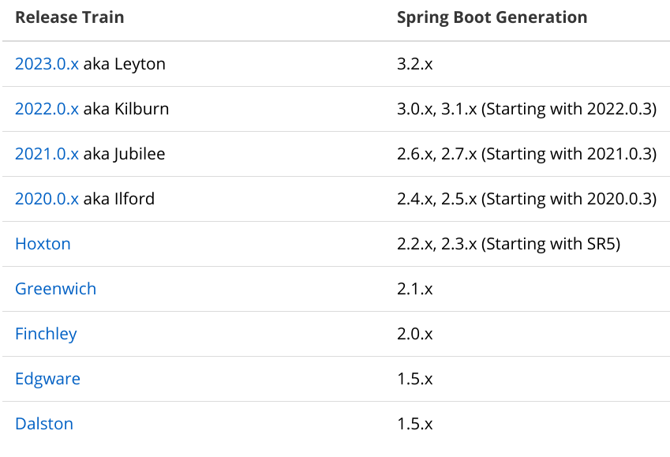

# 微服务拆分原则

## 什么时候拆分？

- 创业型项目

先采用单体架构，快速开发，快速试错。随着规模扩大，逐渐拆分

- 确定的大型项目

资金充足，目标明确，直接选择微服务架构，避免后续拆分的麻烦

## 目标

- 高内聚
- 低耦合

## 方式

- 纵向拆分：按照业务模块来拆分

- 横向拆分：抽取公共服务，提高复用性

## 拆分

微服务在企业中有两种工程结构：

- 独立project

- Maven聚合

[查看代码](hmall/)  

# 远程调用🌟

Spring提供一个`RestTemplate`工具，可以实现Http请求的发送。

1. 注入`RestTemplate`到spring容器

   ```java
   @Bean
   public RestTemplate restTemplate(){
       return new RestTemplate();
   }
   ```

2. 发起远程调用

   ```java
   //2.1利用restTemplate发起http请求，得到http响应
   ResponseEntity<List<ItemDTO>> response = restTemplate.exchange(
           "http://localhost:8081/items?ids={ids}",  //请求路径
           HttpMethod.GET,   //请求方式 
       	null,  //请求实体
           new ParameterizedTypeReference<List<ItemDTO>>() {
           },  //返回值类型，由于这里返回值是一个List,所以是这种写法
       	Map.of("ids", CollUtil.join(itemIds, ","))  //请求参数
   );
   ```

# 服务治理(Nacos)🌟

## 注册中心

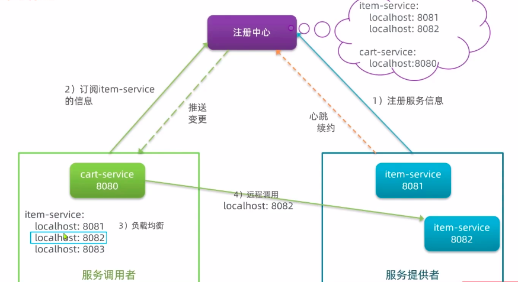

三个角色： 

- 服务提供者 ： 暴露服务接口，供其他服务调用
- 服务调用者 ： 调用其他服务提供的接口
- 注册中心 ： 记录并监控微服务各实例状态，推送服务变更信息

## Nacos

Nacos是alibaba的产品，目前已加入到SpringCloudAlibaba中。

官方文档：https://nacos.io/zh-cn/docs/quick-start.html

### 部署

<details>
    <summary>部署过程参考</summary>
使用docker方式部署nacos：https://cloud.tencent.com/developer/article/2294185
</details>

---

1. 创建[nacos数据库](resources/nacos.sql)用于存储元数据

2. 配置[环境配置文件](resources/custom.env)

   ```.env
   PREFER_HOST_MODE=hostname
   MODE=standalone  # 运行模式
   SPRING_DATASOURCE_PLATFORM=mysql  # 数据库
   MYSQL_SERVICE_HOST=192.168.1.115  # 宿主机ip地址
   MYSQL_SERVICE_DB_NAME=nacos  # 数据库名
   MYSQL_SERVICE_PORT=3307  # 数据库端口
   MYSQL_SERVICE_USER=root  # 数据库用户名
   MYSQL_SERVICE_PASSWORD=123  # 数据库密码
   MYSQL_SERVICE_DB_PARAM=characterEncoding=utf8&connectTimeout=1000&socketTimeout=3000&autoReconnect=true&useSSL=false&allowPublicKeyRetrieval=true&serverTimezone=Asia/Shanghai  # 数据库连接参数
   ```

3. 创建容器

   ```bash
   docker run -d \
   --name nacos \
   --env-file ./nacos/custom.env \
   -p 8848:8848 \
   -p 9848:9848 \
   -p 9849:9849 \
   --restart=always \
   nacos/nacos-server:latest
   ```

4. 访问nacos http://localhost:8848/nacos/

账号密码都是`nacos`

## 服务注册

1. 引入nacos discovery依赖

   ```xml
   <dependency>
       <groupId>com.alibaba.cloud</groupId>
       <artifactId>spring-cloud-starter-alibaba-nacos-discovery</artifactId>
       <version>2022.0.0.0</version>
   </dependency>
   ```

2. 配置nacos地址

   ```yaml
   spring:
   	application:
   		name: item-service # 服务名称
       cloud:
       	nacos:
       		server-addr: 192.168.1.115:8848 #nacos地址
   ```

3. 启动服务，访问nacos注册中心

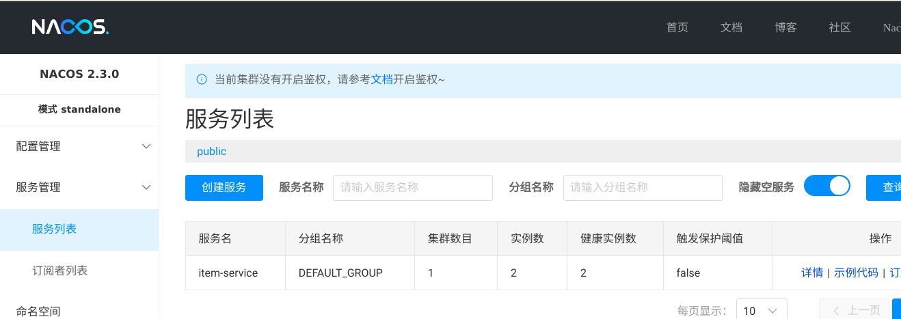

## 服务发现

1. 引入nacos discovery依赖
2. 配置nacos地址

3. 服务发现

   - springcloud提供的顶级接口`DiscoveryClient`用于实现服务发现功能

   ```java
   //1.依赖注入
   private final DiscoveryClient discoveryClient;
   //2.根据服务名称获取实例列表
   List<ServiceInstance> instances = discoveryClient.getInstances("item-service");
   //3.通过负载均衡获取具体实例
   ServiceInstance instance = instances.get(RandomUtil.randomInt(instances.size()));
   //获取到实例后，就可以拿到该实例的所有信息，包括ip,端口等
   //4.通过具体实例的信息，进行远程调用...
   ResponseEntity<List<ItemDTO>> response = restTemplate.exchange(
           "http://"+instance.getUri()+"/items?ids={ids}",
           HttpMethod.GET, null,
           new ParameterizedTypeReference<List<ItemDTO>>() {
           }, Map.of("ids", CollUtil.join(itemIds, ","))
   );
   ```

# OpenFeign🌟

OpenFeign是一个声明式的http客户端，可以让我们远程调用的步骤变得简单。

官方地址：https://github.com/OpenFeign/feign

## 使用

1. 引入依赖，包括 OpenFeign和负载均衡的组件SpringCloudLoadBalancer （以前是Ribbon）

   ```xml
   <!--openFeign-->
   <dependency>
     <groupId>org.springframework.cloud</groupId>
     <artifactId>spring-cloud-starter-openfeign</artifactId>
   </dependency>
   <!--负载均衡器-->
   <dependency>
     <groupId>org.springframework.cloud</groupId>
     <artifactId>spring-cloud-starter-loadbalancer</artifactId>
   </dependency>
   ```

2. 通过在启动类前加上 `@EnableFeignClients`注解，启用OpenFeign

   ```java
   @EnableFeignClients
   @MapperScan("com.hmall.cart.mapper")
   @SpringBootApplication
   public class CartApplication {  ...
   ```

3. 编写FeignClient

   ```java
   @FeignClient(value = "item-service")
   public interface ItemClient {
       @GetMapping("/items")
       List<ItemDTO> queryItemByIds(@RequestParam("ids") Collection<Long> ids);
   }
   ```

4. 使用FeignClient, 实现远程调用

   ```java
   List<ItemDTO> items = itemClient.queryItemByIds(itemIds);
   ```

## 连接池

其自带的http请求的实现方式是`HttpURLConnection`, 该实现不支持连接池。我们可以替换为`Apache HttpClient`或者`OKHttp`这种支持连接池的实现方式，来增强远程调用的性能。

### 步骤

1. 引入依赖

   ```xml
   <!--OK http 的依赖 -->
   <dependency>
     <groupId>io.github.openfeign</groupId>
     <artifactId>feign-okhttp</artifactId>
   </dependency>
   ```

2. 开启连接池功能

   ```yml
   feign:
     okhttp:
       enabled: true
   ```

## 最佳实践

- 项目是maven聚合结构，可以选择新增一个通用的模块，用来存放所有模块对外暴露的客户端等，这种方式项目的耦合度会更高

  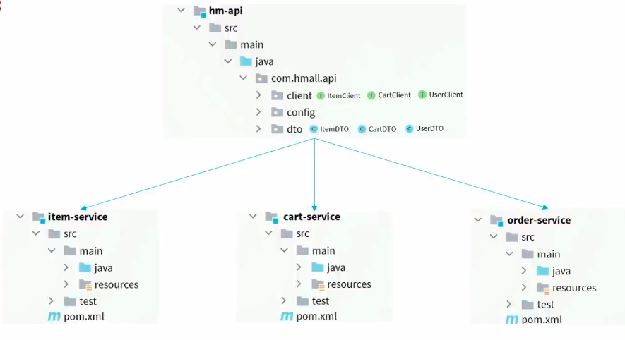

- 项目是独立project结构，可以选择每个模块负责各自对外暴露的接口，以及数据传输对象等

  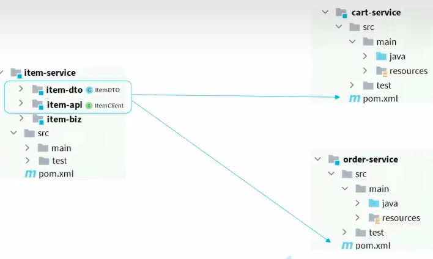

本教学实例采用第一种方式。

首先需要抽取Feign客户端，新建一个hm-api模块，将openfeign依赖和loadbalancer依赖转移过去，然后将feign客户端和dto对象代码转移即可。

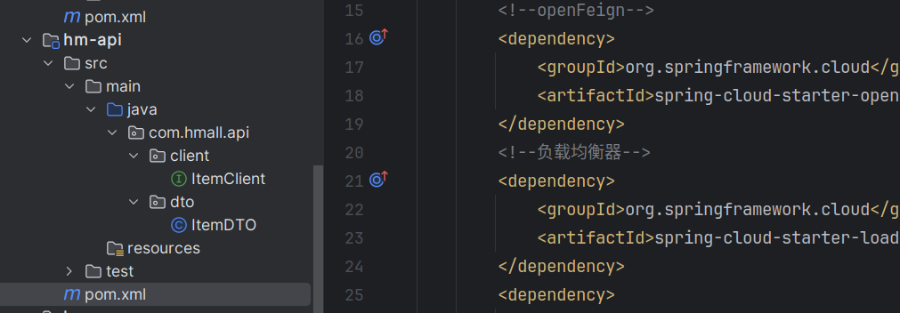

然后在需要使用客户端的微服务中引入该hm-api模块。由于hm-api模块中的客户端所在包与cart-service启动类所在包不同，因此直接启动会无法找到feignclient这个bean。所以我们还需要扫描这个包。在启动类的`@EnableFeignClients`注解上添加扫包参数，即可正常使用openfeign客户端。

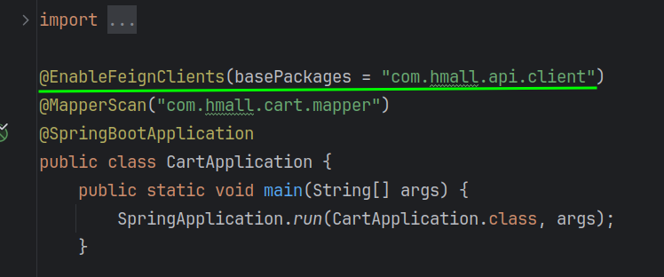

## 日志

OpenFeign的日志只有在项目的日志级别为debug级别时才会生效。其自身日志也分为几个级别。默认是none不生产任何日志。我们需要手动修改日志等级。

1. 生命一个类型为Logger.Level的Bean，在其中定义日志级别

   ```java
   public class DefaultFeignConfig {
       @Bean
       public Logger.Level feignLoggerLevel(){
           return Logger.Level.FULL;
       }
   }
   ```

2. 此时bean还没有生效，想要配置单独的某个FeignClient的日志，可以在`@FeignClient`注解中加上该配置类属性

   ```java
   @FeignClient(value="item-service",configuration = DefaultFeignConfig.class)
   ```

3. 想要全局配置，让所有的FeignClient都按照这个日志等级输出日志，需要在启动类的`@EnableFeignClient`注解中加上配置类属性

   ```java
   @EnableFeignClients(basePackages = "com.hmall.api.client",defaultConfiguration = DefaultFeignConfig.class)
   ```


# 网关🌟

网关负责请求的路由，转发和身份校验等

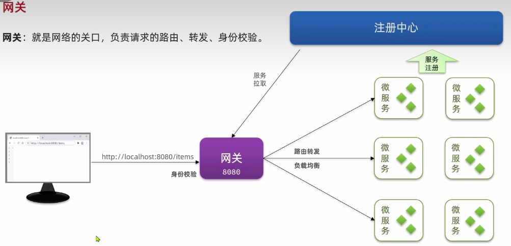

SpringCloud提供两个网关组件：

- SpringCloud Gateway  - 基于WebFlux响应式编程✅
- Netfilx Zuul - 基于Servlet的阻塞式编程❎

## 网关路由

开发者需要配置一些**路由规则**，告诉网关如何路由请求。

网关本质上也是一个微服务，需要注册到注册中心中去。所以我们使用网关第一步就是创建一个网关服务

### 实施步骤

1. 创建网关微服务模块

2. 引入相关依赖

   ```xml
   <?xml version="1.0" encoding="UTF-8"?>
   <project xmlns="http://maven.apache.org/POM/4.0.0"
            xmlns:xsi="http://www.w3.org/2001/XMLSchema-instance"
            xsi:schemaLocation="http://maven.apache.org/POM/4.0.0 http://maven.apache.org/xsd/maven-4.0.0.xsd">
       <parent>
           <artifactId>hmall</artifactId>
           <groupId>com.heima</groupId>
           <version>1.0.0</version>
       </parent>
       <modelVersion>4.0.0</modelVersion>
   
       <artifactId>hm-gateway</artifactId>
   
       <properties>
           <maven.compiler.source>11</maven.compiler.source>
           <maven.compiler.target>11</maven.compiler.target>
       </properties>
       <dependencies>
           <!--common  项目的通用工具模块-->
           <dependency>
               <groupId>com.heima</groupId>
               <artifactId>hm-common</artifactId>
               <version>1.0.0</version>
           </dependency>
           <!--网关-->
           <dependency>
               <groupId>org.springframework.cloud</groupId>
               <artifactId>spring-cloud-starter-gateway</artifactId>
           </dependency>
           <!--nacos discovery  注册中心-->
           <dependency>
               <groupId>com.alibaba.cloud</groupId>
               <artifactId>spring-cloud-starter-alibaba-nacos-discovery</artifactId>
           </dependency>
           <!--负载均衡-->
           <dependency>
               <groupId>org.springframework.cloud</groupId>
               <artifactId>spring-cloud-starter-loadbalancer</artifactId>
           </dependency>
       </dependencies>
       <!-- springboot打包编译插件 -->
       <build>
           <finalName>${project.artifactId}</finalName>
           <plugins>
               <plugin>
                   <groupId>org.springframework.boot</groupId>
                   <artifactId>spring-boot-maven-plugin</artifactId>
               </plugin>
           </plugins>
       </build>
   </project>
   ```

3. 启动类

   ```java
   package com.hmall.gateway;
   
   import org.springframework.boot.SpringApplication;
   import org.springframework.boot.autoconfigure.SpringBootApplication;
   
   @SpringBootApplication
   public class GatewayApplication {
       public static void main(String[] args) {
           SpringApplication.run(GatewayApplication.class, args);
       }
   }
   
   ```

4. 配置路由

   ```yaml
   server:
     port: 8080
   spring:
     application:
       name: gateway
     cloud:
       nacos:
         server-addr: 192.168.1.121:8848  # nacos
       gateway:
         routes:
           - id: item # 路由规则id，自定义，唯一
             uri: lb://item-service # 路由的目标服务，lb代表负载均衡，会从注册中心拉取服务列表
             predicates: # 路由断言，判断当前请求是否符合当前规则，符合则路由到目标服务
               - Path=/items/**,/search/** # 这里是以请求路径作为判断规则
           - id: cart
             uri: lb://cart-service
             predicates:
               - Path=/carts/**
           - id: user
             uri: lb://user-service
             predicates:
               - Path=/users/**,/addresses/**
           - id: trade
             uri: lb://trade-service
             predicates:
               - Path=/orders/**
           - id: pay
             uri: lb://pay-service
             predicates:
               - Path=/pay-orders/**
   
   ```

### 其他的路由属性

网关路由对应的Java类型是`RouteDefinition`，其中常见的属性有：

- `id` : 路由唯一标识
- `uri` ：路由目标地址
- `predicates` ： 路由断言，判断请求是否符合当前路由
- `filters` ：路由过滤， 对请求或响应做特殊处理 

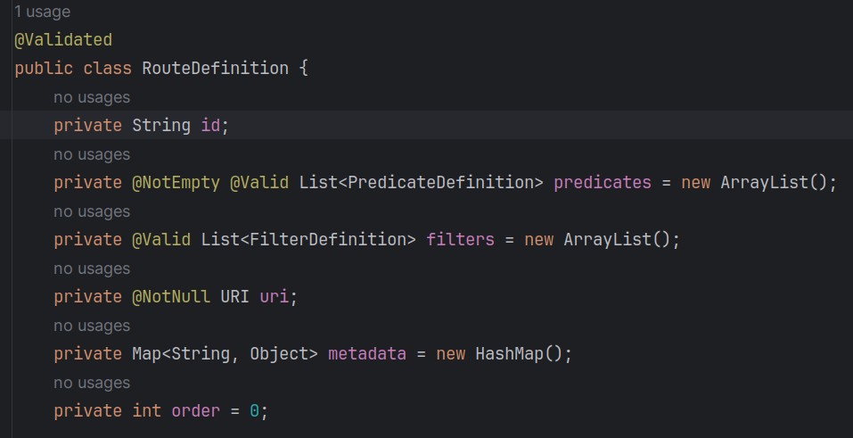

#### Predicates路由断言

spring提供了12中基本的`RoutePredicateFactory`实现：

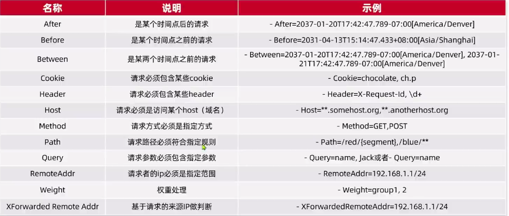

具体介绍查看[官方文档](https://docs.spring.io/spring-cloud-gateway/reference/spring-cloud-gateway/request-predicates-factories.html)

#### Filters路由过滤

spring提供33种路由过滤器

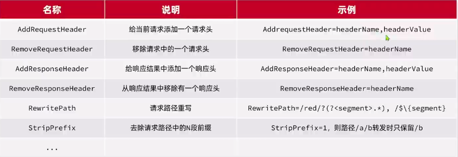

具体介绍查看[官方文档](https://docs.spring.io/spring-cloud-gateway/reference/spring-cloud-gateway/gatewayfilter-factories/addrequestheader-factory.html)

#### 全局路由过滤器 

想要为所有接口添加路由过滤器，指定`default-filters`属性（与routes同级）即可：

```yaml
    spring:
        cloud:    
            gateway:
>     			routes: <5 items>
              	default-filters:
                	- AddRequestHeader=truth,bagayalu
```


> ⚠️注意：
>
> 在书写predicates和filters属性时，name和args之间如果采用简写形式，即`- Path=/addresses/**`  之间不要存在空格。name和args需要紧密连在一起，否则启动服务会报错！


## 网关登陆校验

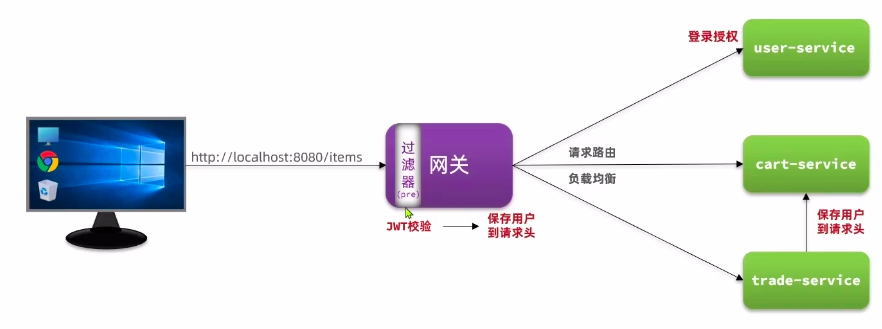

网关请求处理流程：

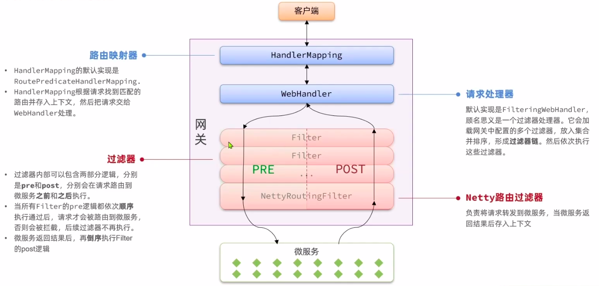

根据执行流程可以知道，我们想要在网关转发请求之前做登陆校验，就需要自定义一个过滤器，并且在过滤器的pre阶段进行逻辑判断。

### 自定义GlobalFilter

网关过滤器有两种： 

- `GateWayFilter` : 路由过滤器
- `GlobalFilter` : 全局路由过滤器

`GlobalFilter`类的`filter`方法涉及到的几个参数：

- `ServerWebExchange`： 请求的上下文信息，包含整个filter-chain的共享数据，包括request,response等
- `GatewayFilterChain`：过滤器链
- `Mono` ：一个回调函数，非阻塞式的。该回调函数内部其实就是过滤的Post部分需要执行的内容

1. 创建一个类，实现`GlobalFilter`接口，重写其中`filter`方法，添加过滤逻辑

   ```java
   public class MyGlobalFilter implements GlobalFilter, Ordered {
       @Override
       public Mono<Void> filter(ServerWebExchange exchange, GatewayFilterChain chain) {
           // 模拟登陆校验逻辑
           ServerHttpRequest request = exchange.getRequest();
           HttpHeaders headers = request.getHeaders();
           System.out.println("header : "+headers);
           return chain.filter(exchange);
       }
   }
   ```

2. 还要保证我们的自定义过滤器比`NettyRoutingFilter`先执行，就要保证我们的优先级比他高。观察`NettyRoutingFilter`源码发现，`NettyRoutingFilter`通过实现`Ordered`接口来定义优先级。`NettyRoutingFilter`的优先级是int的最大值，表示其优先级在整个过滤链中最低。我们自定义的过滤器优先级的数字只要小于int的最大值就好了。这样我们优先级就高于`NettyRoutingFilter`了。

   ```java
   public class MyGlobalFilter implements GlobalFilter, Ordered {
       @Override
       public Mono<Void> filter(ServerWebExchange exchange, GatewayFilterChain chain) {
           // 模拟登陆校验逻辑
           ServerHttpRequest request = exchange.getRequest();
           HttpHeaders headers = request.getHeaders();
           System.out.println("header : "+headers);
           return chain.filter(exchange);
       }
   
       @Override
       public int getOrder() {
           return 0;  //优先级高于NettyRoutingFilter
       }
   }
   ```

### 自定义GatewayFilter

[查看教程](https://www.bilibili.com/video/BV1kH4y1S7wz?p=29&spm_id_from=pageDriver&vd_source=4d79aa6bdc0ac3d438853bf8e2dd6928)

###  实现登陆校验

#### 实现步骤

1. **生成jks格式私有密钥**

   >使用keytool  - java提供的证书管理工具
   >
   >- alias 密钥别名
   >- keyalg 使用的hash算法
   >- keypass 密钥的访问密码
   >- keystore 密钥库的文件名  - 证书的文件名
   >- storepass 密钥库的访问密码  - 访问证书的密码

   ```bash
   keytool -genkeypair -alias small-tools -keyalg RSA -keypass 123456 -keystore jwt.jks -storepass 123456
   ```

   查询证书

   ```bash
   keytool -list -keystore jwt.jks
   ```

2. **生产公有密钥**

   ```bash
   keytool -list -rfc --keystore jwt.jks | openssl x509 -inform pem -pubkey
   ```

3. **在yaml配置文件中配置Jwt令牌**

   ```yaml
   hm:
     jwt:
       location: classpath:hmall.jks    # 密钥位置resources下
       alias: hmall  # 密钥别名
       password: hmall123  # 访问密钥的密码
       tokenTTL: 30m   
     auth:
       excludePaths: # 不需要登陆校验的路径
         - /search/**
         - /users/login
         - /items/**
         - /hi
   ```

   这些配置信息需要被获取，因此需要定义一些bean来映射这些信息。

4. **定义bean**

   - `AuthProperties` 获取auth配置信息（放行路径）[click](hmall/hm-gateway/src/main/java/com/hmall/gateway/config/AuthProperties.java)
   - `JwtProperties` 获取jwt配置信息 [click](hmall/hm-gateway/src/main/java/com/hmall/gateway/config/JwtProperties.java)
   - `SecurityConfig` 自动装配工具 [click](hmall/hm-gateway/src/main/java/com/hmall/gateway/config/SecurityConfig.java)
   - `JwtTool` JWT工具，包含生成和解析`token`的功能 [click](hmall/hm-gateway/src/main/java/com/hmall/gateway/util/JwtTool.java) 
   - `**.jks`  密钥文件 (放在resources下)

5. **自定义过滤器**

   ```java
   @Component
   @RequiredArgsConstructor
   public class AuthGlobalFilter implements GlobalFilter, Ordered {
   	
       private final AuthProperties authProperties;
       
       private final JwtTool jwtTool;
       //spring提供的路径匹配工具
       private final AntPathMatcher antPathMatcher = new AntPathMatcher();
   
       @Override
       public Mono<Void> filter(ServerWebExchange exchange, GatewayFilterChain chain) {
           //1.取request对象
           ServerHttpRequest request = exchange.getRequest();
           //2.判断是否需要登陆拦截，如果不需要直接放行
           //2.1拿到需要放行的路径,如果在配置中，就放行
           if (isExclude(request.getPath().toString())) {
               //放行
               return chain.filter(exchange);
           }
           //3. 获取 token
           String token = null;
           List<String> headers = request.getHeaders().get("authorization");
           if (headers != null && !headers.isEmpty()) {
               token = headers.get(0);
           }
           //4. 解析token
           Long userId = null;
           try {
               userId = jwtTool.parseToken(token);
           } catch (UnauthorizedException e) {
               //拦截 设置响应状态码为401
               ServerHttpResponse response = exchange.getResponse();
               response.setStatusCode(HttpStatus.UNAUTHORIZED);
               return response.setComplete();
           }
           //5. todo 传递用户信息
           System.out.println("userID = " + userId);
           //6. 放行
           return chain.filter(exchange);
       }
   
       private boolean isExclude(String path) {
           //AntPathMatcher进行路径匹配
           for (String pathPattern : authProperties.getExcludePaths()) {
               if (antPathMatcher.match(pathPattern,path)) {
                   return true;
               }
           }
           return false;
       }
   
       @Override
       public int getOrder() {
           return 0;
       }
   }
   ```

   > 使用了AntPathMatcher，这是 spring提供的一个工具类，用于处理路径匹配。支持一些ant风格的路径匹配规则，比如`/**` 表示匹配任意路径，`*`表示匹配路径中的任意字符，`？`表示匹配路径中的一个字符等。

## 网关传递用户

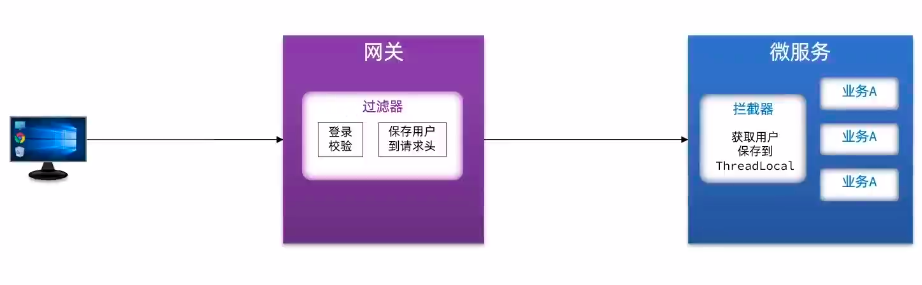

### 实现步骤

1. 在网关登陆校验过滤器中，将用户信息放到请求头中去

   上述`//5. todo 传递用户信息` bu zh o

   ```java
   //将用户信息存到请求头中
   ServerWebExchange swe = exchange.mutate() //对下游请求做更改
           .request(builder -> builder.header("user-info", userInfo))
           .build();
   //放行
   return chain.filter(swe)
   ```

   > 上述步骤是在建造一个包含"user-info"请求头的一个新的exchange对象。

2. 在通用模块中编写springmvc拦截器，获取登陆用户

   因为每个微服务都依赖于这个通用模块，因此直接在该模块中获取登陆用户，避免代码冗余

   ```java
   public class UserInfoInterceptor implements HandlerInterceptor {
       @Override
       public boolean preHandle(HttpServletRequest request, HttpServletResponse response, Object handler) throws Exception {
           //在控制器执行之前获取用户信息
           //1.获取登陆的用户信息
           String userInfo = request.getHeader("user-info");
           //2.判断是否获取了用户，如果有存入ThreadLocal
           if (StrUtil.isNotBlank(userInfo)){
               UserContext.setUser(Long.valueOf(userInfo));
           }
           //3.放行（我们springmvc中拦截器不做登陆校验，请求一律放行）
           return true;
       }
       @Override
       public void afterCompletion(HttpServletRequest request, HttpServletResponse response, Object handler, Exception ex) throws Exception {
           //视图渲染完毕后。。
           //清理用户信息
           UserContext.removeUser();
       }
   }
   ```

3. 写完拦截器后，想要他生效，还需要进行一些配置，添加拦截器到Ioc中去。我们之前用的[xml方式](/framework/SpringMVC02/SpringMVC学习记录第二天10-8.md#拦截器-interceptor) ，现在使用Java代码方式   
   ```java
   @Configuration
   public class MvcConfig implements WebMvcConfigurer {
       @Override
       public void addInterceptors(InterceptorRegistry registry) {
           registry.addInterceptor(new UserInfoInterceptor())
   //                .addPathPatterns("/**") 不配置拦截路径，默认拦截所有
           ;
       }
   }
   ```

4. 之前学过[springboot自动装配原理](/framework/springboot-helloworld/学习记录.md#enableautoconfiguration注解)，我们还得在spring.properties中加上这个拦截器，spring才能帮我们自动装配

   ```properties
   org.springframework.boot.autoconfigure.EnableAutoConfiguration=\
     com.hmall.common.config.MyBatisConfig,\
     com.hmall.common.config.JsonConfig, \
     com.hmall.common.config.MvcConfig 
   ```

5. 启动服务，发现报错，因为我们包括网关在内的所有微服务都依赖于这个通用模块，然后其他的微服务有springmvc的依赖，而网关是没有springmvc的依赖的，因此我们的springmvc拦截器对网关来说就无法注入。所以报错。还是涉及到[springboot自动装配原理](/framework/springboot-helloworld/学习记录.md#condition)，我们使用`@ConditionalOnClass`注解来配置拦截器的生效范围

   ```java
   @Configuration
   @ConditionalOnClass(DispatcherServlet.class)
   public class MvcConfig implements WebMvcConfigurer {
       @Override
       public void addInterceptors(InterceptorRegistry registry) {
           registry.addInterceptor(new UserInfoInterceptor())
   //                .addPathPatterns("/**") 不配置拦截路径，默认拦截所有
           ;
       }
   }
   ```

   > 这样配置后，由于其他微服务都有springmvc的依赖，自然就有springmvc的核心-前端控制器的字节码文件。而我们的网关由于没有springmvc的依赖，也就没有前端控制器，也就不会来加载这个拦截器了。这样网关启动时就不会报错了。

## 微服务间传递用户 - OpenFeign

基于OpenFeign的`RequestInterceptor`接口来实现微服务间的用户信息传递。

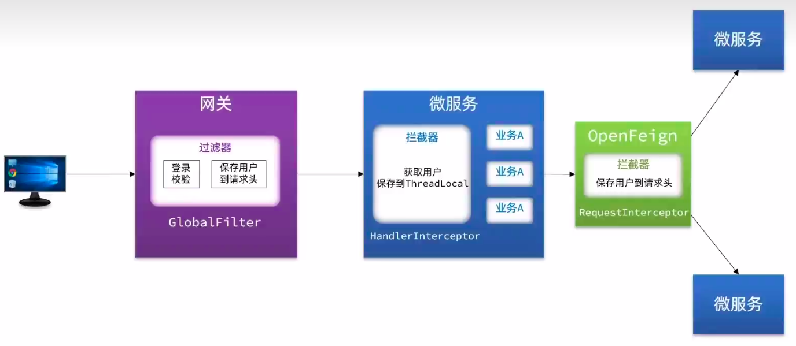

微服务之间的远程调用通过openfeign来实现，这种情况下为什么不能直接从UserContext中获取用户信息呢？

之前我们的UserInfoInterceptor获取用户信息是从网关的**请求头**中获取并保存到UserContext中。也就是说我们微服务的每次互相调用，都会从这次调用请求的请求头中获取用户信息。

举个例子：从网关到微服务1之间的调用，请求头中 有用户信息，自然可以获取到存入UserContext中。那么从微服务1到微服务2的调用，是openfeign帮我们完成的，我们知道具体过程，这里面的请求头里是没有用户信息的。所以微服务2就无法拿到用户信息。那我们要实现的目标就是让微服务1到微服务2这个过程的请求头中有用户信息，不仅是这样，还得保证微服务2到微服务3，微服务3到微服务4 ... 他们之间的请求头中都有用户信息，这样才行。

要实现上述目的，难道我们要一个个手写请求头吗？ 其实openfeign给我们提供了一个接口：`RequestInterceptor`请求拦截器，可以拦截所有feign客户端请求，每次请求开始前都会执行这个接口中的方法，我们使用这个接口来获取请求头中的信息。

因为网关到微服务1的过程，请求头中包含用户信息，所以UserContext中保存的有用户信息，所以我们在拦截器中将这个UserContext中的信息存入请求头中，这样，之后的每次请求都调用这个过程，那么每个请求头就都有用户信息了。

> 我们在hm-api中新增一个配置类或者在现有配置类中写都行。因为代码比较简单，直接在现有配置类中写

```java
public class DefaultFeignConfig {
    @Bean
    public Logger.Level feignLoggerLevel(){
        return Logger.Level.FULL;
    }

    @Bean
    public RequestInterceptor userInfoInterceptor(){
        return new RequestInterceptor() {   //函数式接口，可以转为lambda形式
            @Override
            public void apply(RequestTemplate template) {
                Long userId = UserContext.getUser();
                if (userId!=null){
                    template.header("user-info", userId.toString()); //设置请求头
                }
            }
        };
    }
}
```

> 这样，网关到微服务间每次调用都能获取用户信息
>
> 1. 网关请求到第一个微服务，请求头中有用户信息
> 2. 该请求被springmvc拦截，然后从请求头中获取用户信息，保存到UserContext里
> 3. 第一个微服务向第二个微服务发请求，该请求被 feign拦截器拦截，从UserContext里获取用户信息，存入请求头中
> 4. 该请求又被springmvc拦截，从请求头中获取用户信息，存入UserContext里供第二个微服务使用。。。
>
> > 就这样，springmvc拦截器和feign拦截器相互配合，让大家都能获取到用户信息。🥳

# 配置管理(Nacos)🌟

## 配置共享

### 1. 添加配置到nacos

添加一些共享配置到nacos中，包括：jdbc,  mp, 日志, swagger, openfeign等配置

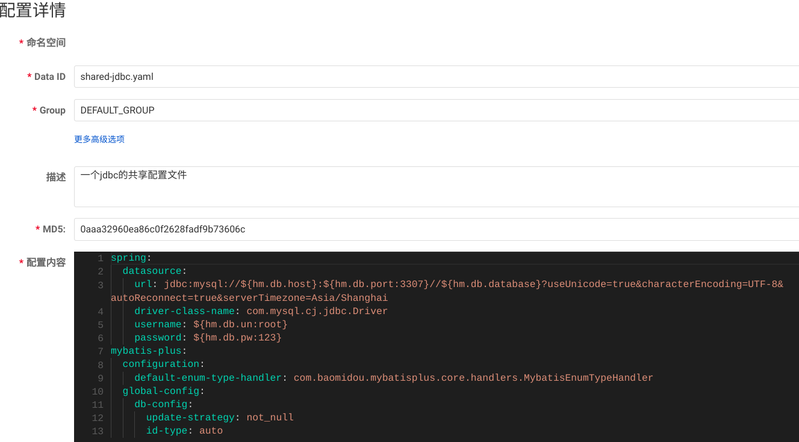

### 2. 拉取共享配置

基于NacosConfig拉取共享配置代替微服务本地配置，首先需要了解springcloud项目启动流程：

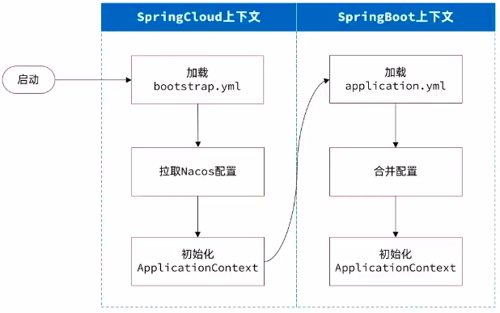

1. 引入依赖

   ```xml
   <!--nacos配置管理-->
   <dependency>
       <groupId>com.alibaba.cloud</groupId>
       <artifactId>spring-cloud-starter-alibaba-nacos-config</artifactId>
   </dependency>
   <!--读取bootstrap文件-->
   <dependency>
       <groupId>org.springframework.cloud</groupId>
       <artifactId>spring-cloud-starter-bootstrap</artifactId>
   </dependency>
   ```

2. 新建bootstrap.yaml

   ```yaml
   spring:
     application:
       name: cart-service  #微服务名称
     profiles:
       active: dev
     cloud:
       nacos:
         server-addr: 192.168.1.121:8848   # nacos地址
         config:
           file-extension: yaml       # 文件拓展名，我们在配置中心设置的是 xxx.yaml
           shared-configs:          # 共享的配置
             - data-id: shared-jdbc.yaml
             - data-id: shared-log.yaml
             - data-id: shared-swagger.yaml
   ```

这样配置以后，再次启动项目，就发现项目能从nacos中拉取共享配置了，我们只需要简单对项目进行一些定制的配置就好了

## 配置热更新

前提条件：

1. nacos中要有一个与微服务名有关的配置文件

   `[spring.application.name]-[spring.active.profile].[file-extension]`

   `微服务名称-激活的profile.文件拓展名`

2. 微服务中要以特定方式读取需要热更新的配置属性，并运用 到业务代码中

   有两种方式实现：

   ```java
   ✅
   @Data
   @ConfigurationProperties(prefix="hm.cart")
   public class CartProperties{
   	private int maxItems;
   }
   ```

   ```java
   ❎
   @Data
   @RefreshScope
   public class CartProperties{
       @Value(${hm.cart.maxItems})
       private int maxItems;
   }
   ```

3. 然后在nacos更改配置文件中的配置项，可以实现无需重启服务的热更新。

# 服务保护和分布式事务🌟

雪崩问题：微服务调用链路中的某个服务故障，导致所有微服务都不可用，造成雪崩问题。解决雪崩问题就需要服务降级。

## 服务降级方案

### 请求限流

限制访问接口的请求的并发量，避免服务因流量激增出现故障

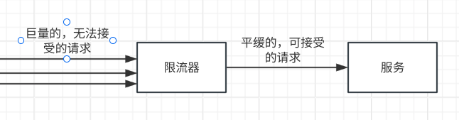

### 线程隔离

通过**限定每个业务能使用的线程数量**而将故障业务隔离，避免故障扩散

### 服务熔断

由断路器统计请求的异常比例或慢调用比例，如果超出阈值则会熔断该业务，拦截该接口的请求。

熔断期间，所有请求快速失败，都走fallback逻辑

## 服务降级技术

|          |            Sentinel  (alibaba)            | Hystrix  (netflix)          |
| -------- | :---------------------------------------: | --------------------------- |
| 线程隔离 |                信号量隔离                 | 线程池隔离/信号量隔离       |
| 熔断策略 |         基于慢调用比例或异常比例          | 基于异常比例                |
| 限流     |           基于QPS, 支持流量整形           | 有限的支持                  |
| Fallback |                   支持                    | 支持                        |
| 控制台   | 开箱即用,可配置规则,查看秒级监控,机器发现 | 不完善                      |
| 配置方式 |           基于控制台,重启后失效           | 基于注解或配置文件,永久生效 |

### Sentinel

[sentinel](https://sentinelguard.io/zh-cn/docs/quick-start.html)是alibaba开源的一款微服务流量控制组件

#### 部署

##### 1. 安装控制台

- 下载[控制台jar包](https://github.com/alibaba/Sentinel/releases)

- 下载完成后使用`java -jar`命令启动控制台，或者将jar打包为docker镜像，这样更方便 启动。

  ```bash
  java -Dserver.port=8090 -Dcsp.sentinel.dashboard.server=localhost:8090 -Dproject.name=sentinel-dashboard -jar sentinel-dashboard.jar
  ```

​	其他启动时可配置参数参考[官方文档](https://github.com/alibaba/Sentinel/wiki/%E5%90%AF%E5%8A%A8%E9%85%8D%E7%BD%AE%E9%A1%B9)

- 一切配置完成后，我们访问配置中设置的ip地址即可进入控制台

##### 2. 微服务整合

1. 引入sentinel依赖

   ```xml
   <!--sentinel-->
   <dependency>
       <groupId>com.alibaba.cloud</groupId>
       <artifactId>spring-cloud-starter-alibaba-sentinel</artifactId>
   </dependency>
   ```

2. 配置控制台

   ```yaml
   spring:
     cloud:
       sentinel:
         transport:
           dashboard: localhost:8091 #控制台地址
   ```

#### 簇点链路

簇点链路就是单机调用链路。是一次请求进入服务后经过的每一个被Sentinel监控的而资源链。默认Sentinel会监控SpinrgMVC的每一个EndPoint(http接口)。限流，熔断等都是针对簇点链路中的资源设置的。而资源名默认就是接口的请求路径。

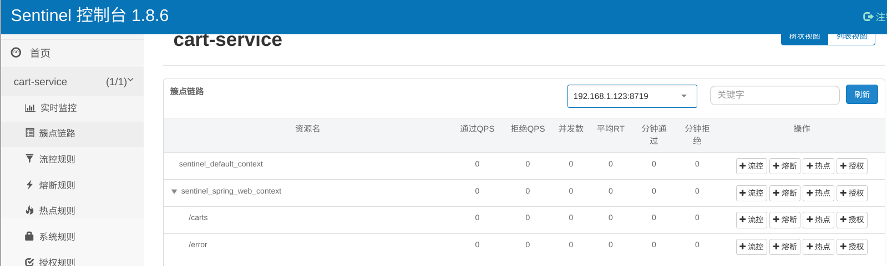

Restful风格的接口请求路径一般都相同，这会导致簇点资源名重复。因此，我们修改配置，把**请求方式+请求路径**的作为簇点资源名称。

```yaml
spring:
  cloud:
    sentinel:
      transport:
        dashboard: localhost:8091 #控制台地址
      http-method-specify: true  # http方法详情
```

#### 请求限流

在sentinel控制台，对簇点链路进行流控

点击流控按钮，进行相关配置即可限流

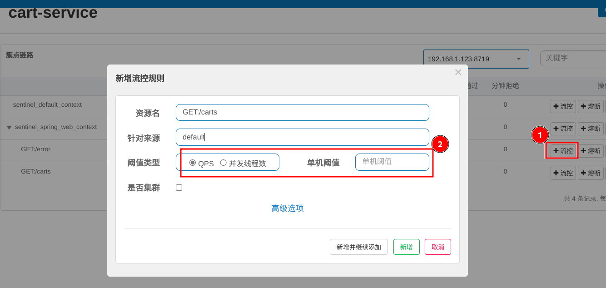

#### 线程隔离

线程隔离就是基于并发线程数进行限流

1. 让openfeign整合sentinel

   ```yaml
   feign:
   	sentinel:
   		enabled: true #开启feign对sentinel的整合
   ```

2. 这样sentinel控制台就能看到被监控的feign客户端

   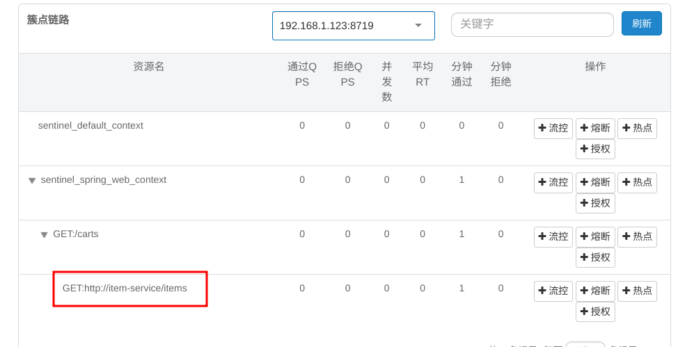

3. 我们基于线程数对这个调用进行流控，就达到了隔离的目的

   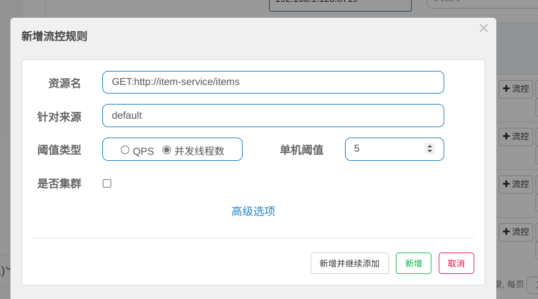

#### Fallback

feignclient的fallback有两种配置方式：

- `FallbackClass` ,  无法对远程调用的异常处理 ❎
- `FallbackFactory` , 可以对远程调用的异常处理 ✅

1. 自定义类，实现`FallbackFactory`，写对某个feignclient的falllback逻辑

   ```java
   @Slf4j
   public class ItemClientFallbackFactory implements FallbackFactory<ItemClient> {
       @Override
       public ItemClient create(Throwable cause) {
           return new ItemClient() {
               @Override
               public List<ItemDTO> queryItemByIds(Collection<Long> ids) {
                   log.error("查询商品异常, 异常原因：",cause);   //fallback逻辑
                   return Collections.emptyList();
               }
               @Override
               public void deductStock(List<OrderDetailDTO> items) {
                   throw new RuntimeException(cause);  
               }
           };
       }
   }
   ```

2. 将定义的fallbackfactory在配置类中定义为bean

   ```java
   @Bean
   public ItemClientFallbackFactory itemClientFallbackFactory(){
       return new ItemClientFallbackFactory();
   }
   ```

3. 在对应feignclient上添加fallbackFactory属性

   ```java
   @FeignClient(value = "item-service",fallbackFactory = ItemClientFallbackFactory.class)
   public interface ItemClient {
       @GetMapping("/items")
       List<ItemDTO> queryItemByIds(@RequestParam("ids") Collection<Long> ids);
   
       @PutMapping("/items/stock/deduct")
       void deductStock(List<OrderDetailDTO> items);
   }
   ```

#### 服务熔断

断路器工作原理：

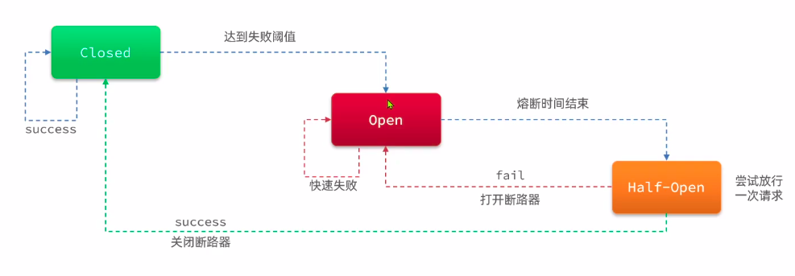

在sentinel控制台配置簇点链路的熔断规则即可。

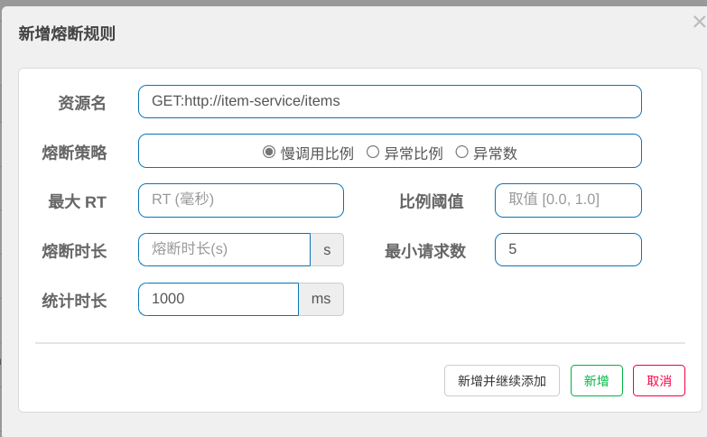

熔断规则解释：

- 最大RT  (response time)：最大响应时间，超过这个时间将配合其他熔断条件进行熔断
- 比例阈值：达到熔断条件的请求比例
- 最小请求数：设为5, 比例设为0.5, 就表示5个请求中有一半以上，响应时间超过设定值，就会触发熔断

- 统计时长： 条件统计的时间，1s就是每秒统计一次。

#### Sentinel持久化

- 掏钱，使用付费版本  ❎
- 白嫖，将配置文件放到nacos中  ✅

[动态规则扩展](https://github.com/alibaba/Sentinel/wiki/%E5%8A%A8%E6%80%81%E8%A7%84%E5%88%99%E6%89%A9%E5%B1%95)

1. 引入nacos-sentinel依赖

   ```xml
   <dependency>
       <groupId>com.alibaba.csp</groupId>
       <artifactId>sentinel-datasource-nacos</artifactId>
       <version>x.y.z</version>
   </dependency>
   ```

2. 在nacos配置服务降级策略

   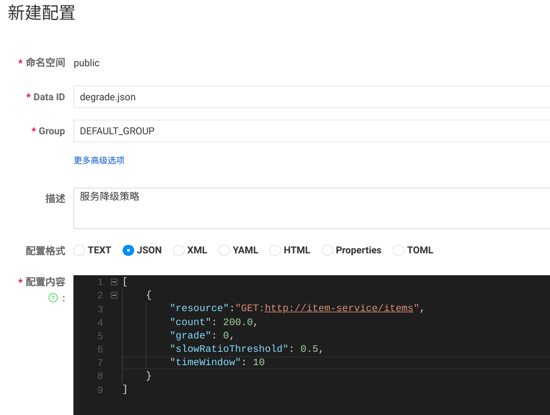

   ```yaml
   [
       {
           "resource":"GET:http://item-service/items",
           "count": 200.0,
           "grade": 0,
           "slowRatioThreshold": 0.5,
           "timeWindow": 10
       }
   ]
   ```

3. 拉取配置

   在yaml中配置

   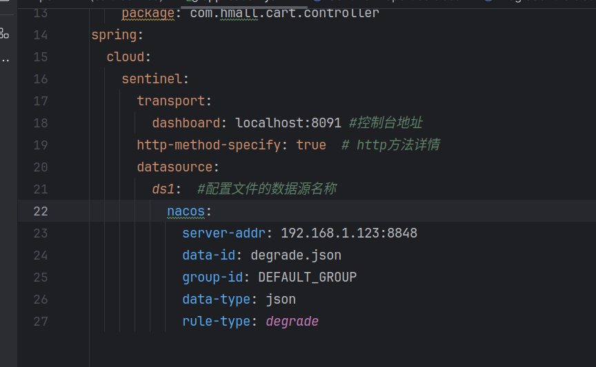

   ```yaml
     datasource:
       ds1:  #配置文件的数据源名称
         nacos:
           server-addr: 192.168.1.123:8848 #nacos地址
           data-id: degrade.json 
           group-id: DEFAULT_GROUP
           data-type: json
           rule-type: degrade
   ```

## 分布式事务

在分布式系统中，如果一个业务需要多个服务合作完成，而且每一个服务都有事务，多个事务必须 同时成功或失败，这样的事务就是**分布式事务**，其中的每个服务的事务就是一个**分支事务**。整个业务成为**全局事务**。

### Seata

[Seata](https://seata.io/zh-cn/docs/user/quickstart/)是alibaba开源的分布式事务解决方案。

Seata事务管理中的三个角色：

- TC ( Transaction Coordinator) 维护全局和分支事务的状态，协调全局事务提交或回滚
- TM ( Transaction Manager) 定义全局事务的范围，开始全局事务，提交或回滚全局事务
- RM ( Resource Manager) 管理分支事务，与TC交谈以注册分支事务和报告分支事务的状态

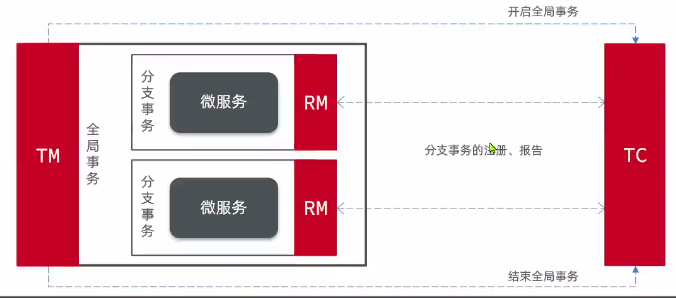

### 部署TC服务

1. 准备[数据库表](resources/seata-tc.sql)

   Seata支持多种存储模式，考虑到持久化的需要，一般采用基于数据库的存储。

2. 准备[配置文件](resources/seata/application.yml)

3. docker部署

   ```bash
   docker run --name seata -p 8099:8099 -p 7099:7099 -e SEATA_IP=192.168.1.123 -v ./seata/logs/seata:/root/logs/seata  -v ./seata:/seata-server/resources --privileged=true --network=hm-net -d seataio/seata-server:1.5.2
   ```

   > 部署到docker里的seata本身也是个springboot项目
   >
   > 要注意seata服务的版本和spirngboot的版本对应

### 微服务集成seata

1. 引入依赖

   ```xml
   <!--seata-->
   <dependency>
     <groupId>com.alibaba.cloud</groupId>
     <artifactId>spring-cloud-starter-alibaba-seata</artifactId>
   </dependency>
   ```

2. 在yaml中添加配置，让微服务找到tc服务地址

   这一步应该配置到nacos的共享配置中，然后在需要启用事务的微服务中使用bootstrap.yaml来拉取服务。

   ```yaml
   seata:
     registry: # TC服务注册中心的配置，微服务根据这些信息去注册中心获取tc服务地址
       type: nacos # 注册中心类型 nacos
       nacos:
         server-addr: 192.168.150.101:8848 # nacos地址
         namespace: "" # namespace，默认为空,起数据隔离作用
         group: DEFAULT_GROUP # 分组，默认是DEFAULT_GROUP
         application: seata-server # seata服务名称
         username: nacos
         password: nacos
     tx-service-group: hmall # 事务组名称
     service:
       vgroup-mapping: # 事务组与tc集群的映射关系
         hmall: "default"
   ```


3. 参与事务的微服务引入seata的依赖，并且在bootstrap.yaml中拉取seata的共享配置这样就好了。

### XA模式

XA规范是 X/Open组织定义的分布式事务处理标准(DTP ,distributed transcation processing) 

XA模式工作原理：

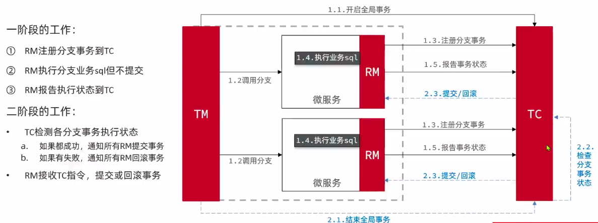

- 可以保证事务的强一致性，很安全
- 但是缺点就是速度慢，某些场景下可能效率较低

#### 实现

seata的starter已经完成了xa模式的自动装配，因此我们想要使用只需要在yaml里配置一下就好了

1. 配置yaml

   ```yaml
   seata:
   	data-source-proxy-mode: XA #开启数据源代理了的XA模式
   ```

2. 给全局事务的入口方法添加`@GlobalTranscational`注解

   ```java
   @Override
   @GlobalTransactional  //seata提供的注解
   public Long createOrder(OrderFormDTO orderFormDTO) {
   	//业务逻辑...
   }
   ```

3. 其他的事务还得加上 spring的事务注解`@Transcational`

### AT模式

是Seata主推的模式 (默认模式) ，同样是分阶段提交的事务模型，弥补了XA模型中资源锁定周期过长的缺陷。

AT模式工作原理：

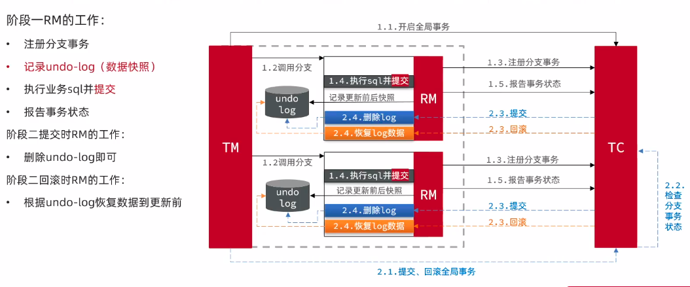

- 向比于XA，性能不错
- 会出现短暂数据不一致的情况，能保证最终一致

#### 实现

1. 准备undo_log[数据表](resources/seata-at.sql)

   每一个相关的微服务都应该有一个自己的回滚日志表

   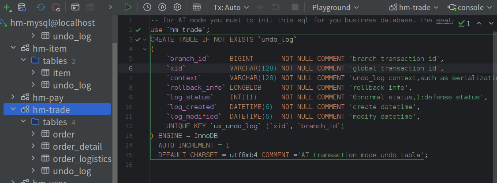

2. 配置yaml设置事务模式为at模式(默认模式，删掉也行)

   ```yaml
   seata:
   	data-source-proxy-mode: AT #开启数据源代理了的AT模式
   ```

3. 剩下的就和XA模式一样，在事务入口加注解(`@GlobalTranscational`)，在其他事务方法上加注解(`@Transcational`)。
