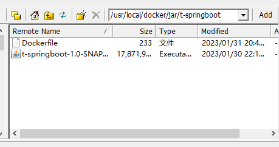
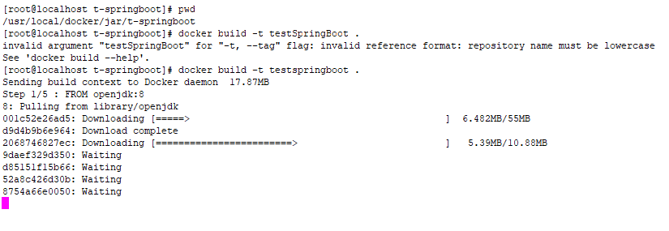
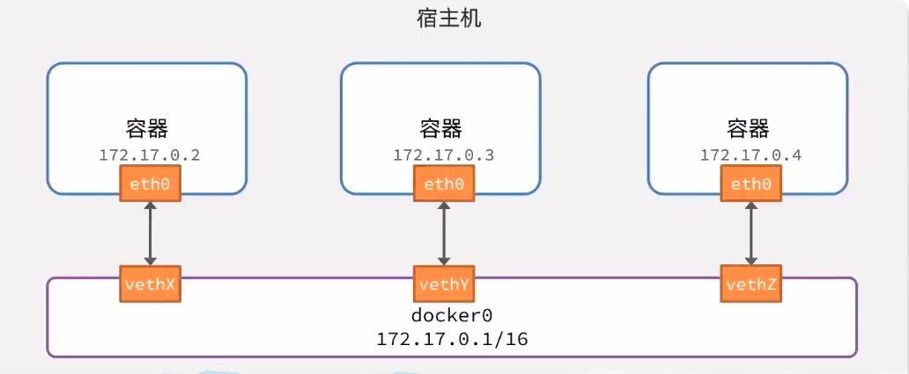
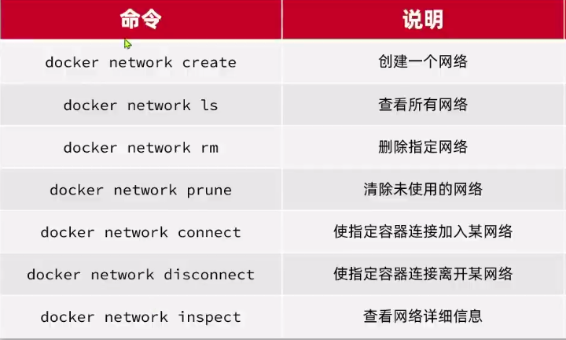
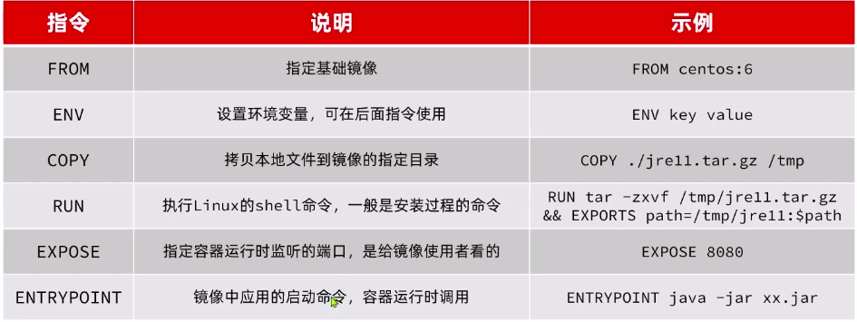

<details>
    <summary>参考笔记</summary>

## 12、创建docker镜像

### 1、创建Dockerfile

创建一个文件名为Dockerfile的文件，这个文件是没有后缀名的

```dockerfile
# 基础镜像
FROM openjdk:11.0-jre-buster
# 设定时区
ENV TZ=Asia/Shanghai
RUN ln -snf /usr/share/zoneinfo/$TZ /etc/localtime && echo $TZ > /etc/timezone
# 拷贝jar包
COPY hm-service.jar /app.jar
# 入口
ENTRYPOINT ["java", "-jar", "/app.jar"]
```

### 2、上传jar

上传我们准备好的springboot打好的包，在把Dockerfile上传到相同的目录下，注意，目录里不要有其它的文件。



### 3、执行命令

进入Dockerfile所在的目录中，执行命令

docker build -t 镜像名字（自己取的，不能有大写字母）:标签（可以省略，省略代表的是latest） 目录（用.，代表当前目录)

docker build -t testspringboot . 



-t：是给镜像添加一个标签

目录是Dockerfile所在目录

### 4、启动

docker run --name tsb -p 8898:8898 -d testspringboot

访问测试，测试地址：http://172.19.186.149:8898/start/test
</details>


---

> tips :
>
> 配置命令别名：超级用户编辑 /root/.bashrc 文件 
>
>  `alias ll = 'ls $LS_OPTIONS$ -l'`   
>
> `alias dps = 'docker ps --format "table {{.ID}}\t{{.Image}}\t{{.Ports}}\t{{.Status}}\t{{.Names}}"'`


> docker安装：https://docker-practice.github.io/zh-cn/install/debian.html
> 
> docker高版本更改数据存储位置: https://www.cnblogs.com/chentiao/p/17409226.html
>
> 修改/添加docker源： 修改/etc/docker/daemon.json文件，添加镜像站:
> 
```json
{
    "registry-mirrors": [     //配置源
      "https://hub-mirror.c.163.com",
      "https://mirror.baidubce.com"
    ],
    "data-root": "/home/docker/docker_data"   //自定义docker数据存储位置
  }
```

创建mysql容器：
```bash
docker run \
--name mysql-es \
-d \
-p 3306:3306 \
-v /home/joneelmo/docker/mysql-es/log:/var/log/mysql \
-v /home/joneelmo/docker/mysql-es/data:/var/lib/mysql \
-v /home/joneelmo/docker/mysql-es/conf:/etc/mysql/conf.d \
-e MYSQL_ROOT_PASSWORD=root \
mysql
```

创建nginx容器：
```bash
docker run \
-p 9001:80 \
--name nginx-sky \
-v /home/nginx/conf/nginx.conf:/etc/nginx/nginx.conf \
-v /home/nginx/conf/conf.d:/etc/nginx/conf.d \
-v /home/nginx/log:/var/log/nginx \
-v /home/nginx/html:/usr/share/nginx/html \
-d nginx
```

# 容器网络互联

默认情况下，所有容器都是以bridge方式连接到Docker的一个虚拟网桥上的




加入自定义网络的容器才可以通过容器名互相访问，Docker的网络操作命令如下：



两个容器加入同一个网络后，就可以通过容器名来进行通讯了，而不用输入其ip地址，再也不怕容器的ip改变了捏。

# 项目部署

## 后端部署

在正式的项目部署中，数据库的端口一般不会对外暴露，所以我们只能在docker内部进行访问，这样的话Java的数据库配置就要改变。

1. 在yaml配置文件中修改host参数为容器名称即可。

2. 打包jar包

3. 配置Dockerfile

   dockerfile常见指令：

   

   更加详细指令参考[官方文档](https://docs.docker.com/engine/reference/builder/)

   ```dockerfile
    # 基础镜像
    FROM openjdk:11.0-jre-buster
    # 设定时区
    ENV TZ=Asia/Shanghai
    RUN ln -snf /usr/share/zoneinfo/$TZ /etc/localtime && echo $TZ > /etc/timezone
    # 指定容器工作目录（命令将在该目录下运行）
    WORKDIR /app
    # 拷贝jar包 这一步是为了将宿主机jar包copy到容器中指定位置
    COPY gd.jar /app/app.jar
    # 曝露端口
    EXPOSE 8080
    # 入口
    ENTRYPOINT ["java", "-jar", "app.jar"]
   ```
    以上dockerfile构建的镜像，使用以下命令即可启动容器：
    ```bash
    docker runn -d --name gd -p 8080:8080 gd 
    ```
    这几乎是最简单的一个启动容器的命令了。但实际上我们更希望能够将容器运行产生的日志文件映射到宿主机上。此时就要修改我们的dockerfile了。具体的日志生产地址取决于项目的配置。这里假设我们的项目产生的日志文件位置在`/app/logs`下，我们的dockerfile只需要添加：
    ```dockerfile
    #创建日志存放目录（容器内）
    RUN mkdir -p /app/logs
    ```
    通常我们还希望将配置文件application.yaml映射到容器中，这样容器启动时就可以直接读取配置文件了。我们通常不需要显式地设置application.yaml的存放位置。只需要将配置文件放到jar同级目录下即可
    ```bash
    docker run -d --name gd -p 8080:8080 -v /自定义路径/application.yaml:/app/application.yaml -v /自定义路径/logs/:/app/logs/ gd
    ```

4. 构建镜像

   `-t`  （tag） :表示镜像名称

   `.`   : 表示docker构建的上下文路径，这是docker查找`dockerfile`的依据    `.` 表示当前目录

   ```bash
   docker build -t <镜像名> . 
   ```

5. Docker run部署应用

此时我们的云服务器docker已经跑起来了。这里我用的阿里云的ECS，我们还需要最后一步，就是在安全组中开放我们的80(http),443(https)以及我们的项目端口8080。这样，我们的项目才能真正被外网访问到。

## 前端部署

拉取nginx对象，创建容器，注意挂载卷映射路径。

还需要注意一点，配置文件中`proxy_pass` 后面跟的url中的host名应该为容器名，这样就可以容器间通信。

```conf
location /api {
    rewrite /api/(.*)  /$1 break;
    proxy_pass http://hm-test:8080;  
}
```

## DockerCompose

通过一个 单独的docker-compose.yaml模板文件来定义一组相关联的应用容器。帮助我们实现多个相关互联的docker容器的快速部署。

一般一个docker-compose.yaml文件对应一个完整的项目，其中一个模块对应一个服务，模板格式大致如下：

```yaml
version: "3.8"

services:
  mysql:                # 数据库服务
    image: mysql
    container_name: mysql  # 容器名
    ports:
      - "3306:3306"
    environment:
      TZ: Asia/Shanghai
      MYSQL_ROOT_PASSWORD: 123
    volumes:
      - "./mysql/conf:/etc/mysql/conf.d"
      - "./mysql/data:/var/lib/mysql"
      - "./mysql/init:/docker-entrypoint-initdb.d"
    networks:
      - hm-net
  hmall:                  # 后端服务
    build: 
      context: .
      dockerfile: Dockerfile
    container_name: hmall
    ports:
      - "8080:8080"
    networks:
      - hm-net
    depends_on:           # 依赖项
      - mysql
  nginx:                 # 前端服务
    image: nginx
    container_name: nginx
    ports:
      - "18080:18080"
      - "18081:18081"
    volumes:
      - "./nginx/nginx.conf:/etc/nginx/nginx.conf"
      - "./nginx/html:/usr/share/nginx/html"
    depends_on:          # 依赖项
      - hmall
    networks:
      - hm-net
networks:               # 网络配置
  hm-net:
    name: hmall  
```


将前端服务，后端服务的jar包，以及dockfile放到同一目录的下

配置完成后 使用 `docker compose` 命令进行部署  
