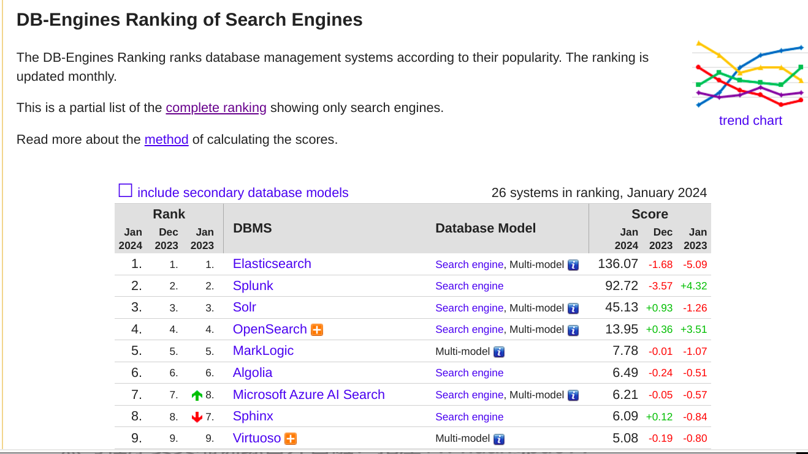
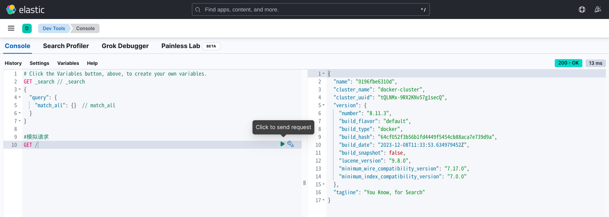
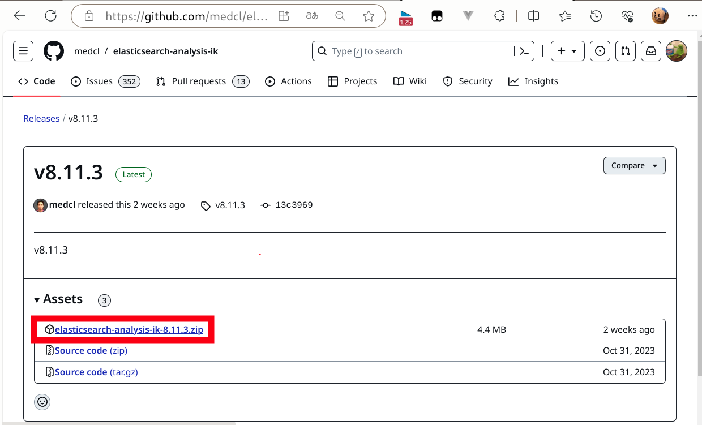
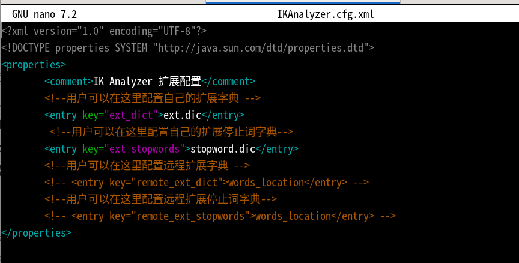
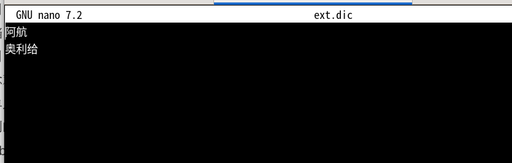
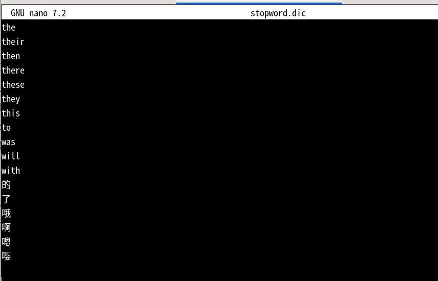

> Elasticsearch是一个基于**Apache Lucene**库实现的，Restful风格的，分布式搜索和数据分析引擎。基于**倒排索引**技术，实现了高性能的全文检索和数据分析功能。

# ES

elastic stack包含kibana, logstash, beats。 被广泛应用在日志数据分析，实时监控等领域

- es是 elastic stack的**核心**，负责存储，搜索，分析数据。

- logstash, beats 负责数据抓取
- kibana 负责数据可视化

刚才说了es是基于lucene实现的。lucene就是一个java语言的搜索引擎类库，是apache公司的顶级项目。

lucene的优势：

- 易扩展 （可进行二次开发）
- 高性能 （基于倒排索引）

lucene的缺点：

- 仅限java语言
- 不支持水平扩展

---

es就是基于lucene进行二次开发的成果。相比于lucene具有以下优势：

- 支持分布式，可水平扩展
- 提供RestFul接口，支持任何语言



## 正向索引和倒排索引

传统数据库（mysql）采用正向索引，对于大量数据的模糊匹配，效率比较差。

| **id（索引）** | **title**      | **price** |
| :------------- | :------------- | :-------- |
| 1              | 小米手机       | 3499      |
| 2              | 华为手机       | 4999      |
| 3              | 华为小米充电器 | 49        |
| 4              | 小米手环       | 49        |
| ...            | ...            | ...       |

es采用倒排索引：

- document（文档）: 每条数据就是一个document
- term（词条）: 文档**按照语义分成的词语**

| **词条（索引）** | **文档id** |
| :--------------- | :--------- |
| 小米             | 1，3，4    |
| 手机             | 1，2       |
| 华为             | 2，3       |
| 充电器           | 3          |
| 手环             | 4          |

> 正向索引是根据文档去找词条，而倒排索引是拿着词条去找文档。这个逻辑是相反的，因此叫做倒排索引

## 文档

es是面向文档存储的，可以是数据库中的一条商品信息，一个订单信息。

文档数据会被序列化为json格式后存储在es中。

```json
{
    "id": 1,
    "title": "小米手机",
    "price": 3499
}
{
    "id": 2,
    "title": "华为手机",
    "price": 4999
}
{
    "id": 3,
    "title": "华为小米充电器",
    "price": 49
}
{
    "id": 4,
    "title": "小米手环",
    "price": 299
}
```

## 索引

index（索引）： 相同类型的文档的集合

mapping（映射）：索引中文档的字段约束信息，类i四表的结构约束

## 概念对比

| **MySQL** | **Elasticsearch** | **说明**                                                     |
| :-------- | :---------------- | :----------------------------------------------------------- |
| Table     | Index             | 索引(index)，就是文档的集合，类似数据库的表(table)           |
| Row       | Document          | 文档（Document），就是一条条的数据，类似数据库中的行（Row），文档都是JSON格式 |
| Column    | Field             | 字段（Field），就是JSON文档中的字段，类似数据库中的列（Column） |
| Schema    | Mapping           | Mapping（映射）是索引中文档的约束，例如字段类型约束。类似数据库的表结构（Schema） |
| SQL       | DSL               | DSL是elasticsearch提供的JSON风格的请求语句，用来操作elasticsearch，实现CRUD |

# 部署单点ES

首先从docker hub上pull下es的镜像

创建es容器：

```bash
docker run -d \
  --name es \
  -e "ES_JAVA_OPTS=-Xms512m -Xmx512m" \
  -e "discovery.type=single-node" \
  -v es-data:/usr/share/elasticsearch/data \
  -v es-plugins:/usr/share/elasticsearch/plugins \
  --privileged \
  --network es-net \
  -p 9200:9200 \
  -p 9300:9300 \
  elasticsearch:8.11.3
```

> - `-e "ES_JAVA_OPTS=-Xms512m -Xmx512m"` 配置es堆内存
> - `-e "discovery.type=single-node"` es的运行模式：单点模式
> - ` -v es-data` 数据卷挂载： es数据
> - `-v es-plugins` 数据卷挂载：  es插件
> - ` -p 9200:9200` http协议端口，供用户访问
> - `-p 9300:9300`  es之后各节点互相访问的端口

## 遇到的问题

docker部署es后，无法访问9200端口，原因是es默认开启了ssl验证。通过https协议可以访问，但是需要账号密码，我又没设过账号密码，我怎么知道？所以干脆不要密码了，开启免密登陆！

配置文件在docker容器内 `~/config/elasticsearch.yml`中, 这个容器内部没有vim, 没有nano。不好编辑啊，所以只好在宿主机写一个配置文件，然后cp到容器内部了。配置文件内容可以去容器内拿，这里就不贴出来了。😜

需要更改的配置项：

```yml
# Enable security features
xpack.security.enabled: false  #改为false

# Enable encryption for HTTP API client connections, such as Kibana, Logstash, and Agents
xpack.security.http.ssl:
  enabled: false             # 改为false
  keystore.path: certs/http.p12
```

命令：

```bash
docker cp docker/es/elasticsearch.yml es:/usr/share/elasticsearch/config/elasticsearch.yml
```

之后重启容器就好了。<del>宿主机上的配置文件可以删掉了</del>

# 部署kibana

kibana为es提供图形化界面

```bash
docker run -d \
--name kibana \
-e ELASTICSEARCH_HOSTS=http://es:9200 \
--network=es-net \
-p 5601:5601  \
kibana:8.11.3
```

> `-e ELASTICSEARCH_HOSTS=http://es:9200 ` 设置es地址，这里用的是es容器名，因为在同一个网络中，所以可以直接使用容器名
>
> `--network=es-net` es要和kibana在同一个网络里
>
> `kibana:8.11.3` 注意kibana镜像版本要和es一致

使用kibana的Dev Tools工具编写DSL语句



# IK分词器

官方地址：https://github.com/medcl/elasticsearch-analysis-ik

## <a name="IK分词器安装">安装</a>

在官网下载ik分词器的压缩包，将其解压。

查看es容器的es-plugins数据卷挂载位置（`docker volume inspect es`），然后将解压后的ik分词器文件移动到该位置下，重启容器即可。



## 使用

ik分词器包含两种模式：

- `ik_smart` 智能切分
- `ik_max_word` 最细粒度切分

```json
#模拟请求
POST /_analyze
{
  "text": "中华人民共和国国歌",
  "analyzer": "ik_smart"
}
```

```json
# 运行结果
{
  "tokens": [
    {
      "token": "中华人民共和国",
      "start_offset": 0,
      "end_offset": 7,
      "type": "CN_WORD",
      "position": 0
    },
    {
      "token": "国歌",
      "start_offset": 7,
      "end_offset": 9,
      "type": "CN_WORD",
      "position": 1
    }
  ]
}
```

## 两种模式区别

`ik_max_word`: 会将文本做最细粒度的拆分，比如会将“中华人民共和国国歌”拆分为“中华人民共和国,中华人民,中华,华人,人民共和国,人民,人,民,共和国,共和,和,国国,国歌”，会穷尽各种可能的组合，适合 Term Query；

`ik_smart`: 会做最粗粒度的拆分，比如会将“中华人民共和国国歌”拆分为“中华人民共和国,国歌”，适合 Phrase 查询。

> 来自官方解释

## 拓展词典

修改ik分词器目录中`config`目录下的`IKAnalyzer.cfg.xml`，设置**拓展词典**或者**停用词典**



在拓展词库添加拓展词典：



在停用词典中添加不需要进行分词的词汇，如一些语气助词等无意义词汇：



重启es容器，拓展词典应用成功：


# 索引库操作

查看es中有多少索引库：

```json
GET /_cat/indices?v
```

## mapping属性

mapping是对索引库中文档的约束，常见的mapping属性包括：

- type： 字段数据类型，常见类型有：
  - 字符串: text（可分词的文本） , keyword（精确值，不可分）
  - 数值: long , integer , short , byte , double , float
  - 布尔: boolean
  - 日期: date
  - 对象: object
  - 地理坐标：
    - geo_point : 坐标点 例如：`"38.4567554,56.4567677"`
    - geo_shape ：几何区域 例如： `"LINESTRING(-77.678890 38.456789,-76.234567 39.456345)"`

- index : 是否创建索引，**默认为true**

- analyzer : 使用哪种分词器

- properties : 该字段的子字段

- copy_to : 将当前字段copy到指定字段

  ```json
  # 酒店的mapping
  PUT /hotel
  {
    "mappings": {
      "properties": {
        "name":{
          "type": "text",
          "analyzer": "ik_max_word",
          "copy_to": "all"
        },
        "brand":{
          "type": "keyword",
          "copy_to": "all"
        },
        "business":{
          "type": "keyword",
          "copy_to": "all"
        },
        "all":{
          "type": "text",
          "analyzer": "ik_max_word"
        }
      }
    }
  }
  ```

  > 将name, brand, business三个字段copy到 all 字段中，这样我们在搜索的时候，既可以单独根据这三个字段搜，也可以一起进行搜索。

## 索引库CRUD

创建索引库:

```json
# 创建索引库
PUT /ahang
{
  "mappings": {
    "properties": {
      "info": {
        "type": "text",
        "analyzer": "ik_smart"
      },
      "email": {
        "type": "keyword",  # 邮箱不可再分，否则无意义
        "index": false   # 不建立索引，因此无法进行搜索
      },
      "name": {
        "properties": {
          "firstName": {
            "type":"keyword"
          },
          "lastName":{
            "type":"keyword"
          }
        }
      }
    }
  }
}
```

查看：

```json
GET /索引库名称
```

删除:

```json
DELETE /索引库名称
```

**修改索引库：**

<span style="color:red">ES禁止直接修改索引库</span>，因为这可能造成严重的生产事故。

虽然无法直接修改其中的字段，但是可以新增字段：

```json
PUT /索引库名称/_mapping
{
    "properties":{
      "新字段":{
		    "type":"integer"
    	}
    }
}
```

# 文档操作

## 新增

```json
# 新增文档
# POST /索引库/_doc/字段id
POST /ahang/_doc/1
{
  "info":"屌爆了！",
  "email":"ttttest@gmail.com",
  "name":{
    "firstName":"嬴",
    "lastName":"政"
  }
}
```

## 查询

```json
GET /ahang/_doc/1
```

## 删除

```json
DELETE /ahang/_doc/1
```

## 修改

1. **全量修改**，会删除旧文档，添加新文档

   id如果存在就是修改，不存在就是新增操作。该操作可以取代上面的新增操作。

   ```json
   PUT /索引库/_doc/文档id
   {
       "字段1":"值1",
       "字段2":"值2"
   }
   ```

2. 增量修改，修改指定字段

   ```json
   POST /索引库/_update/文档id
   {
       "doc":{
           "字段名":"新值"
       }
   }
   ```

# DSL Query

## 概要

domain specific language 领域特定语言

常见查询类型包括：

- 查询所有：查询所有数据 
  - match_all
- 全文检索：利用分词器对用户输入内容分词，然后去索引库匹配
  - match
  - multi_match
- 精确查询：根据精确词条查找，一般查找keyword, 数值, 日期等
  - ids
  - range
  - term
- 地理查询：根据经纬度查询
  - geo_distance
  - geo_bounding_box
- 复合查询：将上述条件组合
  - bool
  - function_score

查询基本语法： 

```json
# DSL Query
GET /index名称/_search
{
  "query":{
    "查询方式": {参数体}
  }
}
```

## 全文检索

`match`

```json
# DSL Query
GET /hotel/_search
{
  "query":{
    "match": {
      "FIELD": "TEXT"
    }
  }
}
```

`multi_match` 

与match相似，但是允许同时查询多个字段

```json
# DSL Query
GET /hotel/_search
{
  "query":{
    "multi_match": {
      "query": "上海",
      "fields": ["name","brand"]
    }
  }
}
```

> 字段越多，查询的效率越低。因此如果想查询多字段，可以采用`copy_to`的方式构造一个多字段值。建议采用match查询而不是mult_match查询。

## 精确查询

`ids`

```json
# DSL Query
GET /hotel/_search
{
  "query":{
    "ids": {
      "values": [36934,38665]
    }
  }
}
```

`term`

```json
# DSL Query
GET /hotel/_search
{
  "query":{
    "term": {
      "FIELD": {
        "value": "VALUE"
      }
    }
  }
}
```

`range`

```json
// DSL Query
GET /hotel/_search
{
  "query":{
    "range": {
      "FIELD": {
        "gte": 10,
        "lte": 20
      }
    }
  }
}
```

## 地理查询

`geo_bounding_box `

查询geo_point值落在某个矩形范围内的所有文档

```json
// DSL Query
GET /hotel/_search
{
  "query":{
    "geo_bounding_box": {
      "FIELD": {
        "top_left": {
          "lat": 40.73,
          "lon": -74.1
        },
        "bottom_right": {
          "lat": 40.717,
          "lon": -73.99
        }
      }
    }
  }
}
```

`geo_distance`

查询到指定中心点小于某个距离值的所有文档

```json
// DSL Query
GET /hotel/_search
{
  "query":{
    "geo_distance": {
      "distance": 100,
      "FIELD": {
        "lat": 40.73,
        "lon": -74.1
      }
    }
  }
}
```

## 复合查询

### function score query

function score : 算分函数查询，可以控制文档相关性算分，控制文档排名。

match查询的文档会根据文档相关性计算分数，并按照降序返回结果。计算过程的一个重要指标就是**词条频率**
$$
TF(词条频率)=\frac{词条出现次数}{文档中词条总数}
$$
TF-IDF算法
$$
IDF(逆文档频率)=Log(\frac{文档总数}{包含词条的文档总数})
$$

$$
score = \sum_{i}^{n} TF*IDF
$$

BM25算法
$$
Score(Q,d) = \sum_{i}^{n}log(1+\frac{N-n+0.5}{n+0.5})\cdot\frac{f_i}{f_i+k_1\cdot(1-b+b\cdot\frac{dl}{avgdl})}
$$

>  表示看不懂 😅🖕

模板：

```json
// DSL Query
GET /hotel/_search
{
  "query":{
    "function_score": {
      "query": {}, 
      "functions": [
        {}
      ],
      "boost_mode": "multiply"
    }
  }
}
```

> `"query": {}, ` 正常进行查询，结果算作query_score
>
> `"functions": [{}]` 自定赋分函数，结果算作function_score
>
> `"boost_mode": "multiply"` 赋分模式 ，multiply表示query_score和function_score相乘

示例：

```json
GET /hotel/_search
{
  "query": {
    "function_score": {
      "query": {
        "match": {
          "all": "外滩"  //正常查询，查询all字段包含‘外滩‘的文档
        }
      },
      "functions": [
        {
          "filter": {   //过滤，对符合条件的文档进行functions赋分
            "term": {   
              "brand": "如家"  //对‘品牌‘包含‘如家‘的文档进行赋分
            }
          },
          "weight": 10   //常量赋分，10分
        }
      ],
      "boost_mode": "sum" //赋分模式是相加
    }
  }
}
```

### boolean query

布尔查询是一个或多个查询子句的组合。子查询组合方式有：

- must 与 ， **参与算分**
- should 或 ，**参与算分**
- must_not 非 ， **不参与算分**
- filter 必须匹配，**不参与算分**

<a name="booleanQuery"></a>

```json
// DSL Query
GET /hotel/_search
{
  "query": {
    "bool": {
      "must": [
        {
          "term": {
            "city": {
              "value": "上海"
            }
          }
        }
      ],
      "should": [
        {
          "term": {
            "brand": {
              "value": "皇冠假日"
            }
          }
        },
        {
          "term": {
            "brand": {
              "value": "华美达"
            }
          }
        }
      ],
      "must_not": [
        {
          "range": {
            "price": {
              "lte": 500
            }
          }
        }
      ],
      "filter": [
        {
          "range": {
            "score": {
              "gte": 45
            }
          }
        }
      ]
    }
  }
}
```

> 以上语句解释：
>
> 查询城市必须在‘上海‘，品牌是‘皇冠假日’或‘华美达’，价格高于500, 以及评分是在45分以上的酒店

# 搜索结果处理

## 排序

es默认按照相关度算分 ( _score ) 进行排序。支持排序的字段有数值类型，地理坐标类型，日期类型，keyword等

模板：

```json
// 简单类型排序
GET /hotel/_search
{
  "query": {
    "match_all": {} 
  },
  "sort": [
    {
      "FIELD": {
        "order": "desc"
      }
    }
  ]
}
```

```json
// 地理坐标排序
GET /hotel/_search
{
  "query": {
    "match_all": {}
  },
  "sort": [
    {
      "_geo_distance":{
        "FIELD": "VALUES",
        "order":"asc",
        "unit":"km"
      }
    }
  ]
}
```

示例：

```json
// 简单类型排序
GET /hotel/_search
{
  "query": {
    "match_all": {}
  },
  "sort": [
    {
      "score": {
        "order": "desc"
      }
    },{
      "price":{
        "order": "asc"
      }
    }
  ]
}
```

```json
// 地理坐标排序 121.61,31.03 升序
GET /hotel/_search
{
  "query": {
    "match_all": {}
  },
  "sort": [
    {
      "_geo_distance": {
        "location":{
          "lat": 31.03,
          "lon": 121.61
        },
        "order":"asc",
        "unit":"km"
      }
    }
  ]
}
```

> 需要注意的是，使用了排序之后，搜索出来的结果就没有`_score `值了，因为已经自定义了排序，赋分也变得无意义了。

## 分页

es默认只返回top10的数据。通过修改分页参数( `from`, `size`)来控制显示结果：

```json
// 分页查询
GET /hotel/_search
{
  "query": {
    "match_all": {}
  },
  "sort": [
    {
      "price": "asc"  // 按照价格升序排
    }
  ],
  "from": 10,     // 第二页
  "size": 10     // 单页大小10条数据
}
```

>  以上示例中：
>
> `"from" : 0` 从第一页开始展示
>
> `"from" : 10` 从第二页开始展示

### 深度分页

es是分布式的，因此会面临深度分页问题。比如获取from=990,size=10的数据步骤：

1. 在每个数据分片上查询前1000条文档
2. 将文档聚合，重新排序选出前1000条文档
3. 从这1000条文档中选取从990开始的10条文档

如果搜索页数过深，或者结果集(from+size)过大，对cpu和内存的消耗就会更大。因此es设定查询结果集上限是10000 (1万)

**我们应当在业务层面尽量避免深度分页**。不过es也给出了解决方案：

- search after
- scroll

## 高亮

对结果的高亮处理

实现步骤：

- 将结果中的关键字用标签标记
- 在页面中为标签添加高亮样式

```json
// 高亮查询
GET /hotel/_search
{
  "query": {
    "match": {
      "FIELD": "TEXT"    //全文检索
    }
  },
  "highlight": {
    "fields": {
      "FIELDS":{    //高亮字段
        "pre_tags": "<em>",  //前置标签
        "post_tags": "</em>"  //后置标签
      }
    }
  }
}
```

> 需要注意的是，默认情况下**搜索字段**和**高亮字段**必须一致，否则不会高亮。
>
> 可以通过属性`"require_field_match": "false"`来取消这种匹配。这样高亮字段可以不和搜索字段一致

```json
// 高亮查询
GET /hotel/_search
{
  "query": {
    "match": {
      "all": "上海"    //全文检索
    }
  },
  "highlight": {
    "fields": {
      "name":{    //高亮字段
        "pre_tags": "<em>",  //前置标签
        "post_tags": "</em>",  //后置标签
        "require_field_match": "false"
      }
    }
  }
}
```

# 数据聚合

[官方文档](https://www.elastic.co/guide/en/elasticsearch/reference/current/search-aggregations.html)

aggregations 实现对文档数据的统计，分析，运算。聚合常见有三类：

- bucket聚合：对文档做分组
  - TermAggregation：按照文档字段值分组
  - Date Histogram：按照日期阶梯分组，一周一组或一月一组等
- Metric聚合：用以计算一些特殊值。比如最大值，最小值等
  - avg：求平均值
  - max：求最大值
  - min：求最小值
  - stats：同时求max, min, avg, sum等

- pipeline聚合：其他聚合的结果为基础做聚合

## bucket聚合

bucket聚合默认聚合所有文档。但是我们可以通过query进行聚合范围限定

```json
GET /hotel/_search
{
  "query": {
    "range": {
      "price": {
        "lte": 200    //限定聚合范围：对价格高于200的文档进行聚合
      }
    }
  }, 
  "size": 0, //设置size为0,结果不包含文档，只包含聚合结果
  "aggs": {
    "brandAggs": {  //自定义聚合名称
      "terms": {  //聚合类型
        "field": "brand", //参与聚合的字段
        "size": 10,  //希望获取的聚合结果数目
      	"order": {
          "_count": "asc"  //结果按照‘_count‘字段升序排列
        }
      }
    }
  }
}
```

## metric聚合

```json
//metric聚合
GET /hotel/_search
{
  "size": 0,
  "aggs": {
    "brandAggs": {
      "terms": {
        "field": "brand",
        "size": 20,
        "order": {
          "scoreAggs.avg": "desc"
        }
      },
      "aggs": {
        "scoreAggs": {
          "stats": {
            "field": "score"
          }
        }
      }
    }
  }
}
```

# 自动补全

## 拼音分词器

[官方地址](https://github.com/medcl/elasticsearch-analysis-pinyin)

安装方式同[IK分词器安装](#IK分词器安装)

## 自定义分词器

> ik分词器可以进行分词，py分词器只会把拼音拆开，不会进行分词。因此单用拼音分词器无法满足我们需求，此时我们就可以自定义分词器，将ik分词器和拼音分词器组合使用。

es中分词器组成包含三部分

- character filters：在tokenizer之前对文本进行处理。例如删除字符，替换字符
- tokenizer：将文本按照一定规则切割成词条。例如keyword就是不分词
- tokenizer filter：将tokenizer输出的词条做进一步处理。例如大小写转换，同义词处理，拼音处理等

**创建索引时**，通过settings来配置自定义的analyzer (分词器) ：

```json
// 自定义拼音分词器
PUT /test
{
  "settings": {
    "analysis": {
      "analyzer": { 
        "my_analyzer": { 
          "tokenizer": "ik_max_word",
          "filter": "py"
        }
      },
      "filter": {
        "py": { 
          "type": "pinyin",
          "keep_full_pinyin": false,
          "keep_joined_full_pinyin": true,
          "keep_original": true,
          "limit_first_letter_length": 16,
          "remove_duplicated_term": true,
          "none_chinese_pinyin_tokenize": false
        }
      }
    }
  },
  "mappings": {   
    "properties": {
      "name":{   //新增字段
        "type": "text",
        "analyzer": "my_analyzer" //该字段使用自定义分词器解析
      }
    }
  }
}
```

拼音分词器适合在创建倒排索引时使用，不能在搜索时使用。因为如果在搜索时也使用，会搜到同音字，会让搜索结果失误。

因此我们需要在创建索引时和搜索时指定两个不同的分词器。在创建索引时使用自定义的分词器，在搜索时就使用ik分词器就好了。

```json
// 自定义拼音分词器
PUT /test
{
  "settings": {
    "analysis": {
      "analyzer": { 
        "my_analyzer": { 
          "tokenizer": "ik_max_word",
          "filter": "py"
        }
      },
      "filter": {
        "py": { 
          "type": "pinyin",
          "keep_full_pinyin": false,
          "keep_joined_full_pinyin": true,
          "keep_original": true,
          "limit_first_letter_length": 16,
          "remove_duplicated_term": true,
          "none_chinese_pinyin_tokenize": false
        }
      }
    }
  },
  "mappings": {
    "properties": {
      "name":{
        "type": "text",
        "analyzer": "my_analyzer",    //创建索引使用自定义分词器
        "search_analyzer": "ik_smart"  //搜索使用ik分词器
      }
    }
  }
}
```

> 这样搜中文就不会出现同音字文档干扰了。但是搜拼音还是可以得出多条结果。符合我们的预期。

## 实现自动补全

es中自动补全是基于 `Completion Suggester` 来实现的，ta对文档中字段类型有约束：

- 参与补全查询的字段**必须**是completion类型

  ```json
  // 自动补全的索引库
  PUT test2
  {
    "mappings": {
      "properties": {
        "title":{
          "type": "completion"
        }
      }
    }
  }
  ```

- 字段的内容一般是用来补全的多个词条组成的数组

  ```json
  POST test2/_doc
  {
    "title": ["Sony", "WH-1000XM3"]
  }
  ```

```json
// 自动补全查询
GET /test2/_search
{
  "suggest": {
    "titleSuggest": {
      "text": "s",
      "completion": {
        "field": "title",
        "skip_duplicates":true, 
        "size":10
      }
    }
  }
}
```

# es-mysql数据同步

es中的数据来自于mysql。因此我们需要保证es和mysql之间的数据同步。

1. 同步调用 （微服务间调用接口，可能会有阻塞问题。**高耦合**）
2. 异步通知 （使用rabbitmq。**低耦合**）
3. 监听binlog （使用alibaba-canal mysql增量订阅中间件。**完全解除耦合**）

## mq实现数据同步

**实现思路：**酒店管理微服务在收到新增，修改或添加请求时，给对应的mq队列发送消息。前台微服务监听对应的队列，收到消息后，操作es数据。

### 1. 消费者声明交换机和队列

```java
@Configuration
public class MqConfig {
    @Bean
    public TopicExchange topicExchange() {
        return new TopicExchange(MqConstants.HOTEL_EXCHANGE, true, false);
    }

    @Bean
    public Queue insertQueue() {
        return new Queue(MqConstants.HOTEL_INSERT_QUEUE, true);
    }

    @Bean
    public Queue deleteQueue() {
        return new Queue(MqConstants.HOTEL_DELETE_QUEUE, true);
    }

    @Bean
    public Binding insertQueueBinding() {
        return BindingBuilder.bind(insertQueue()).to(topicExchange()).with(MqConstants.HOTEL_INSERT_KEY);
    }

    @Bean
    public Binding deleteQueueBinding() {
        return BindingBuilder.bind(deleteQueue()).to(topicExchange()).with(MqConstants.HOTEL_DELETE_KEY);
    }
}
```

### 2. 生产者发送消息

示例： 生产者收到新增请求，先更新数据库，再给mq发消息通知前台微服务更新es数据

```java
@PostMapping
public void saveHotel(@RequestBody Hotel hotel) {
    hotelService.save(hotel);

    rbTemplate.convertAndSend(MqConstants.HOTEL_EXCHANGE, MqConstants.HOTEL_INSERT_KEY, hotel.getId());
}
```

### 3. 消费者监听消息并处理

```java
@RabbitListener(queues = MqConstants.HOTEL_INSERT_QUEUE)
public void listenHotelInsertOrUpdate(Long id) {
    hotelService.insertById(id);
}
```

```java
@Override
public void insertById(Long id) {
    Hotel hotel = getById(id);
    HotelDoc hotelDoc = new HotelDoc(hotel);
    IndexResponse response;
    try {
        response = esClient.index(idx -> idx
                .index("hotel")
                .id(String.valueOf(id))
                .document(hotelDoc)
        );
    } catch (IOException e) {
        log.info("新增或修改数据失败！");
        throw new RuntimeException(e);
    }
    log.info("新增或修改数据成功");
}
```

# ES集群

单机es做数据存储，会面临两个问题：海量数据存储、单点故障

- 海量数据问题： 将索引库从逻辑上拆分为多个分片（shard），存储到多个节点上
- 单点故障：将分片数据在不同节点备份（replica）同一分片的主数据和备份数据要在不同节点上，这样才能保证在一个节点挂了的时候，不会影响到整体数据完整性。

集群监控工具：**cerebro**

## 集群的节点角色

| 节点类型        | 配置参数                                  | 默认值 |                          职责                          |
| --------------- | ----------------------------------------- | ------ | :----------------------------------------------------: |
| master eligible | node.master                               | true   | 备选主节点：管理和记录集群状态，处理创建、删除库的请求 |
| data            | node.data                                 | true   |             数据节点：负责CRUD，数据操作等             |
| ingest          | node.ingest                               | true   |                  数据存储之前的预处理                  |
| coordinating    | 以上三个参数都为false,则为coorinating节点 | /      | 路由请求到其他节点，合并其他节点的处理结果并返回给用户 |

## 集群的脑裂问题

默认情况下，每个节点都是master eligible节点，因此一旦master节点因为网络问题**暂时**和其他master eligible节点失联，那么这些master eligible节点就会重新选举一个新的主节点出来。而失联的节点本身作为master eligible也会再次选举，但是由于只有自己一个出问题，所以就选举自己为主节点。

当之前的主节点**恢复**网络时，整个集群就会出现多个主节点，这就是**脑裂问题**。

为了避免脑裂，需要要求选票超过（eligible节点数量+1）/2 才能当选为主节点。

因此eligible节点数量一般是奇数个。对应的配置项是`discovery.zen.minimum_master_nodes`, 在es7之后，已经成为默认配置。因此一般不会发生脑裂问题。 

## 集群的分布式存储

新增文档时，应该保存到不同的分片，保证数据均衡。

coordinating node协调文档存储到哪个分片是由hash算法来进行计算得到的：

```tex
shard = hash(_routing) % number_of_shards
```

- _routing 默认是文档id
- 算法与分片数量有关。因此**一旦索引建立，分片数量不可修改**！

我们在分布式es集群中搜索数据时，可以加上  `explain`  参数来查看数据存储在哪个分片上：

```json
GET /hotel/_search
{
  "explain": true, 
  "query": {
    "match_all": {}
  }
}
```

## 集群的故障转移

集群中的master节点负责监控集群中的节点状态。如果发现有节点宕机，会立即将宕机节点的分片数据迁移到其他节点，保证数据完整性和安全。


# <del>Java客户端 (旧版|弃用)</del>

> RestClient 是es提供的用来操作es的包含各种语言的客户端。客户端本质是组装dsl, 通过http请求发送给es

地址：[java-rest-high]( https://www.elastic.co/guide/en/elasticsearch/client/java-rest/7.9/java-rest-high.html)

`elasticsearch-rest-high-level-client`客户端目前已经弃用。新的客户端是`elasticsearch-java`。

新版的流式编程是真的优雅，用的是真的爽！！！

## <del>初始化</del>

1. 引入依赖

   ```xml
   <dependency>
       <groupId>org.elasticsearch.client</groupId>
       <artifactId>elasticsearch-rest-high-level-client</artifactId>
   </dependency>
   ```

2. 覆盖掉springboot的旧版本

   ```xml
   <properties>
       <java.version>17</java.version>
       <elasticsearch.version>7.17.16</elasticsearch.version>
   </properties>
   ```

3.  初始化

   ```java
   private RestHighLevelClient client;
   
   @BeforeEach
   void setup(){
       this.client = new RestHighLevelClient(RestClient.builder(
               HttpHost.create("http://192.168.1.137:9200")
       ));
   }
   ```

## <del>索引库</del>

### `client.indices()`

创建索引库

```java
@Test
void createHotelIndex() throws IOException {
    //1. 创建request对象 这一步相当于  `PUT /hotel`
    CreateIndexRequest request = new CreateIndexRequest("hotel");
    //2. 准备请求的参数（dsl语句） 这一步就相当于dsl语句的请求体
    request.source(HotelConstants.MAPPING_TEMPLATE, XContentType.JSON);
    //3. 发送请求
    client.indices().create(request, RequestOptions.DEFAULT);
}
```

删除索引库

```java
@Test
void deleteIndexTest() throws IOException {
    client.indices().delete(new DeleteIndexRequest("hotel"),RequestOptions.DEFAULT);
}
```

判断索引库是否存在

```java
@Test
void isExistTest() throws IOException {
    GetIndexRequest request = new GetIndexRequest("hotel");
    boolean exists = client.indices().exists(request,RequestOptions.DEFAULT);
    System.err.println(exists ? "存在" : "不存在");
}
```

## <del>文档</del>

### CRUD

新增文档 `client.index()`

```java
@Test
void testAddDoc() throws IOException {

    Hotel hotel = hotelService.getById(61083L);

    HotelDoc hotelDoc = new HotelDoc(hotel);

    //1. 获取request对象
    IndexRequest request = new IndexRequest("hotel").id(hotelDoc.getId().toString());
    //2.准备资源
    request.source(JSON.toJSONString(hotelDoc),XContentType.JSON);
    //3.发送请求
    client.index(request,RequestOptions.DEFAULT);
}
```

查询文档 `client.get()`

```java
@Test
void testQueryDoc() throws IOException {
    //1.创建 request对象
    GetRequest request = new GetRequest("hotel","61083");
    //2.发送请求获取结果
    GetResponse response = client.get(request, RequestOptions.DEFAULT);
    //3. 解析结果
    String json = response.getSourceAsString();
    System.out.println(json);
}
```

修改文档 `client.update()`

```java
@Test
void testUpdateDoc() throws IOException {
    //1.创建 request对象
    UpdateRequest request = new UpdateRequest("hotel", "61083");
    //2.准备参数
    request.doc(
            "price","952",
            "starName","四钻"
    );
    //3.发送请求
    client.update(request, RequestOptions.DEFAULT);
}
```

删除文档 `client.delete()`

```java
@Test
void testDeleteDoc() throws IOException {
    DeleteRequest request = new DeleteRequest("hotel","61083");
    client.delete(request,RequestOptions.DEFAULT);
}
```

### 批量导入功能

主要是通过`BulkRequest`实现，`BulkRequest`可以添加多条request请求，然后调用`client.bulk()`一次性发送出去，就实现了批处理。

```java
@Test
void testBulkRequest() throws IOException {
    //批量查询数据
    List<Hotel> hotels = hotelService.list();
    //1.创建BulkRequest
    BulkRequest request = new BulkRequest();
    //2.添加多个request
    for (Hotel hotel : hotels) {
        //转为HotelDoc类型
        HotelDoc hotelDoc = new HotelDoc(hotel);
        //创建新增文档的request对象
        request.add(new IndexRequest("hotel")
                .id(hotelDoc.getId().toString())
                .source(JSON.toJSONString(hotelDoc), XContentType.JSON));
    }
    //3.发送请求
    client.bulk(request, RequestOptions.DEFAULT);
}
```

# Java客户端 (新版)

官方帮助文档：[doc](https://www.elastic.co/guide/en/elasticsearch/client/java-api-client/current/indexing-bulk.html)

因为我的es是最新版`8.11.3`，这里用到的依赖是：

```xml
<!-- https://mvnrepository.com/artifact/co.elastic.clients/elasticsearch-java -->
<dependency>
    <groupId>co.elastic.clients</groupId>
    <artifactId>elasticsearch-java</artifactId>
    <version>8.11.3</version>
</dependency>
<dependency>
  <groupId>com.fasterxml.jackson.core</groupId>
  <artifactId>jackson-databind</artifactId>
  <version>2.15.3</version>
</dependency>
```

新版api集成了序列化和反序列化json功能，更加方便了。

## 初始化

三个角色：`ElasticsearchClient` , `ElasticsearchTransport` , `RestClient`

```java
private final String SERVER_URL = "http://192.168.1.137:9200";

private ElasticsearchClient esClient ;

@BeforeEach
void contextLoads() {
    RestClient rsClient = RestClient.builder(HttpHost.create(SERVER_URL)).build();
    ElasticsearchTransport transport = new RestClientTransport(rsClient,new JacksonJsonpMapper());
    this.esClient = new ElasticsearchClient(transport);
}
```

## 索引库操作

### 创建索引

`esClient.indices().create()`

`create()`方法两种方式创建：

- 传统的传入一个`CreateIndexRequest`对象

  ```java
  CreateIndexRequest request = new CreateIndexRequest.Builder().index("new-index").build();
  esClient.indices().create(request);
  ```

- 流式编程

  ```java
  esClient.indices().create(i -> i.index("new-index2"));
  ```

### 删除索引

```java
@Test
void deleteIndex() throws IOException {
    esClient.indices().delete(i -> i.index("products"));
}
```

## 文档操作

### 添加文档

```java
@Test
void createIndex2() throws IOException {
    Product product = new Product("bk-1", "City bike", 123.0);
    IndexResponse response = esClient.index(i -> i.index("products")
            .id(product.getProNo())
            .document(product));
    System.out.println("index version:" + response.version());
}
```

### 获取文档

```java
/* 获取文档 */
@Test
void getDoc() throws IOException {
    GetResponse<Product> response = esClient.get(builder -> builder
            .index("products")
            .id("bk-1"), Product.class);
    System.out.println(response);
}
```

### 更新文档 

```java
/*更新文档*/
@Test
void updateDoc() throws IOException {
    Product product = new Product("bk-1", "Mountains bike", 999.0);
    esClient.update(u -> u
                    .index("products")
                    .id("bk-1")
                    .doc(product),
            Product.class
    );
}
```

### 删除文档

```java
/*删除文档*/
@Test
void deleteDoc() throws IOException {
    esClient.delete(d -> d
            .index("products")
            .id("bk-1")
    );
}
```

### bulk操作

实际上核心操作就是

```java
br.operations(op -> op
    .index(idx -> idx
        .index("logs")   //索引名
       	.id(...)        //id
        .document(data) //请求正文
    )
);
esClient.bulk(br.build)
```

1. 为对象编制索引

   ```java
   List<Product> products = fetchProducts();
   
   BulkRequest.Builder br = new BulkRequest.Builder();
   
   for (Product product : products) {
       br.operations(op -> op           
           .index(idx -> idx            
               .index("products")       
               .id(product.getSku())
               .document(product)
           )
       );
   }
   
   BulkResponse result = esClient.bulk(br.build());
   
   // Log errors, if any
   if (result.errors()) {
       logger.error("Bulk had errors");
       for (BulkResponseItem item: result.items()) {
           if (item.error() != null) {
               logger.error(item.error().reason());
           }
       }
   }
   ```

2. 为原始JSON编制索引

   ```java
   // List json log files in the log directory
   File[] logFiles = logDir.listFiles(
       file -> file.getName().matches("log-.*\\.json")
   );
   
   BulkRequest.Builder br = new BulkRequest.Builder();
   
   for (File file: logFiles) {
       FileInputStream input = new FileInputStream(file);
       BinaryData data = BinaryData.of(IOUtils.toByteArray(input), ContentType.APPLICATION_JSON);
   
       br.operations(op -> op
           .index(idx -> idx
               .index("logs")
               .document(data)
           )
       );
   }
   ```

3. 使用`BulkIngester`批量摄取者进行流式摄取

   ```java
   BulkIngester<Void> ingester = BulkIngester.of(b -> b
       .client(esClient)    //设置发送请求的es客户端
       .maxOperations(100)   //设置批量收集的最大操作数
       .flushInterval(1, TimeUnit.SECONDS) //设置刷新间隔 
   );
   
   for (File file: logFiles) {
       FileInputStream input = new FileInputStream(file);
       BinaryData data = BinaryData.of(IOUtils.toByteArray(input), ContentType.APPLICATION_JSON);
   
       ingester.add(op -> op   //向ingester添加批量操作
           .index(idx -> idx
               .index("logs")
               .document(data)
           )
       );
   }
   
   ingester.close();   //关闭ingester 释放资源
   ```

###### Bulk实操

```java
@Test
void testImportData2() throws IOException {
    /*从数据库获取数据*/
    List<Hotel> hotels = hotelService.list();
    List<BulkOperation> bulkList = new ArrayList<>();
    BulkRequest request = null;

    for (Hotel hotel : hotels) {
        /*将原始数据转为便于传输的数据格式*/
        HotelDoc hotelDoc = new HotelDoc(hotel);
        /*构造bulk操作变体，放入数据，id*/
        BulkOperationVariant variant = new CreateOperation.Builder<HotelDoc>().document(hotelDoc).id(String.valueOf(hotelDoc.getId())).build();
        BulkOperation bo = new BulkOperation(variant);
        /*循环将所有数据添加到list中*/
        bulkList.add(bo);

        System.out.println(bulkList);
    }
    /*bulk操作，一次性将list中的内容插入es数据库中*/
    request = new BulkRequest.Builder().index("hotel").operations(bulkList).build();
    BulkResponse response = esClient.bulk(request);
    System.out.println(response);
}
```

## 文档查询

流式编程很简单的啦，其实只要会DSL Query, 那么Java的API也是能举一反三，融会贯通的。

### 全文检索

match

```java
@Test
void testMatch() throws IOException {
    SearchResponse<HotelDoc> response = esClient.search(s -> s.index("hotel").query(
            q -> q.match(m -> m.field("name").query("上海"))
    ), HotelDoc.class);
    System.out.println(response);
}
```

matchAll

```java
@Test
void testMatchAll() throws IOException {
    MatchAllQuery matchAllQuery = new MatchAllQuery.Builder().build();
    SearchResponse<HotelDoc> response = esClient.search(s -> s.index("hotel").query(
            q -> q.matchAll(matchAllQuery)
    ), HotelDoc.class);
    System.out.println(response.hits().hits().get(0)); //获取第一条文档，默认单页是10条，get(0~9)
}
```

### 精确查找

term

```java
@Test
void testTerm() throws IOException {
    SearchResponse<HotelDoc> response = esClient.search(s -> s.index("hotel").query(
            q -> q.term(t -> t.field("name").value("上海"))
    ), HotelDoc.class);
    System.out.println(response.hits().hits());
    System.out.println(response.hits().total());
}
```

range

```java
@Test
void testRange() throws IOException {
    SearchResponse<HotelDoc> response = esClient.search(s -> s.index("hotel").query(
            q -> q.range(r -> r.field("price").gte(JsonData.of(1000)))
    ), HotelDoc.class);
    System.out.println(response.hits().hits());
    System.out.println(response.hits().total());
}
```

### Bool查找

流式编程 ，太优雅了！！

```java
@Test
void testBool() throws IOException {
    SearchResponse<HotelDoc> response = esClient.search(s -> s.index("hotel").query(q -> q.bool(
            b -> b.must(m -> m.term(t -> t.field("city").value("上海")))
                    .should(sh -> sh.term(t -> t.field("brand").value("华美达").value("皇冠假日")))
                    .mustNot(mn -> mn.range(r -> r.field("price").lte(JsonData.of(500))))
                    .filter(fl -> fl.range(ran -> ran.field("score").gte(JsonData.of(45))))
    )), HotelDoc.class);
    System.out.println(response.hits().hits());
    System.out.println(response.hits().total());
}
```

以上示例是[boolean query](#booleanQuery)中示例的Java实现。

## 结果处理

### 排序&&分页

```java
@Test
void testPageOut() throws IOException {
    int page = 2;
    int size = 5;

    SearchResponse<HotelDoc> response = esClient.search(s -> s.index("hotel")
                    .from((page - 1) * size)
                    .size(size)
                    .query(q->q.match(m->m.field("name").query("上海")))
                    .sort(ss->ss.field(ff->ff.field("price").order(SortOrder.Asc)))
            , HotelDoc.class);
    Long totalValue = response.hits().total().value();
    System.out.println("共查到"+totalValue+"条数据");
    System.out.println(response.hits().hits());

}
```

以上代码对应的DSL语句是：

```json
GET /hotel/_search
{
  "query": {
    "match": {
      "name": "上海"
    }
  },
  "sort": [
    {
      "price": {
        "order": "asc"
      }
    }
  ], 
  "from": 5,
  "size": 5
}
```

**多个排序字段**：

```java
@Test
void testSort() throws IOException {

    SortOptions priceSort = new SortOptions.Builder().field(f->f.field("price").order(SortOrder.Asc)).build();
    SortOptions scoreSort = new SortOptions.Builder().field(f -> f.field("score").order(SortOrder.Desc)).build();

    SearchResponse<HotelDoc> response = esClient.search(s -> s
                    .index("hotel")
                    .query(
                            q -> q.term(t -> t.field("name").value("上海"))
                    )
                    .sort(priceSort,scoreSort)  //创建多个SortOptions
            , HotelDoc.class);

    System.out.println(response.hits().total());
    System.out.println(response.hits().hits());
}
```

以上代码对应dsl语句：

```json
GET /hotel/_search
{
  "query": {
    "term": {
      "name": "上海"
    }
  },
  "sort": [
    {
      "price": {
        "order": "asc"
      }
    },
    {
      "score": {
        "order": "desc"
      }
    }
  ]
}
```

### 高亮

```java
@Test
void testPageOut() throws IOException {
    int page = 2;
    int size = 5;

    SearchResponse<HotelDoc> response = esClient.search(s -> s.index("hotel")
                    .from((page - 1) * size)
                    .size(size)
                    .query(q->q.match(m->m.field("name").query("上海")))
                    .sort(ss->ss.field(ff->ff.field("price").order(SortOrder.Asc)))
                    .highlight(
                            high->high.encoder(HighlighterEncoder.Html)
                                    .fields("name", builder -> builder)
                    )
            , HotelDoc.class);
    Long totalValue = response.hits().total().value();
    System.out.println("共查到"+totalValue+"条数据");
    System.out.println(response.hits().hits());
}
```

以上代码对应的DSL语句是：

```json
GET /hotel/_search
{
  "query": {
    "match": {
      "name": "上海"
    }
  },
  "sort": [
    {
      "price": {
        "order": "asc"
      }
    }
  ], 
  "from": 5,
  "size": 5,
  "highlight": {
    "fields": {
      "name": {}
    }
  }
}
```

## 传统编程方式

流式编程固然优雅方便，但是在某些特定场合就不合适了，比如需要*根据查询条件改变查询方式的情况*。这里提供一个传统编程方式的示例

```java 
@Test
void tsetClienttt() throws IOException {
    QueryVariant variant;

    String key = "";
    if (key==null || "".equals(key)){
        /*matchAll 如果key没值就查询所有*/
        variant = new MatchAllQuery.Builder().build();
    }else {
        /*match 如果key有值就查 ‘name‘ = ‘key‘ 的数据*/
        variant = new MatchQuery.Builder().field("name").query(key).build();
    }

    SearchRequest searchRequest = new SearchRequest.Builder().index("hotel").query(new Query(variant)).build();   

    SearchResponse<HotelDoc> response = esClient.search(searchRequest, HotelDoc.class);

    System.out.println(response.hits().total());
    System.out.println(response.hits().hits());
}
```

> 记住查询的时候要指定索引哈（`...Builder().index("hotel")...`）。 如果没指定索引，会查询所有的索引中的文档。这样如果索引之间的字段不一样，那么就会出现response的json解析错误。

## 数据聚合

基本就是DSL语句怎么写，Java代码就怎么写。一样的。

```java
//流式编程
@Test
void testAggregation() throws IOException {
    SearchResponse<HotelDoc> response = esClient.search(s -> s.size(0).index("hotel")
                    .aggregations("brandAggs",a->a.terms(t->t
                            .field("brand")
                            .size(10)
                            .order(NamedValue.of("_count",SortOrder.Asc))))
            , HotelDoc.class);
    System.out.println(response.hits().total());
    System.out.println(response.hits().hits());
    System.out.println(response.aggregations());
}
```

```java
//传统编程
@Test
void testAggregation() throws IOException {

    AggregationVariant variant = new TermsAggregation.Builder().field("brand").size(10).order(NamedValue.of("_count",SortOrder.Asc)).build();

    SearchRequest request = new SearchRequest.Builder().index("hotel").size(0).aggregations("brandAggs",new Aggregation(variant)).build();

    SearchResponse<HotelDoc> response = esClient.search(request, HotelDoc.class);
	//解析结果
    List<StringTermsBucket> brandAggs = response.aggregations().get("brandAggs").sterms().buckets().array();
    for (StringTermsBucket brandAgg : brandAggs) {
        System.out.println(brandAgg.key().stringValue());
    }
}
```

## 自动补全查询

很简单，DSL怎么写，java就怎么写。

```java
//流式变成
@Test
void testSuggestions() throws IOException {
    /*查询的值*/
    String key = "sd";

    SearchResponse<HotelDoc> response = esClient.search(
            s -> s.suggest(
                    sug -> sug.text(key)
                            .suggesters("suggestion",
                                    sugg -> sugg.completion(
                                            com -> com.field("suggestion")
                                                    .skipDuplicates(true)
                                                    .size(10)
                                    )
                            )
            )
            , HotelDoc.class);

    System.out.println(response.suggest());
}
```

