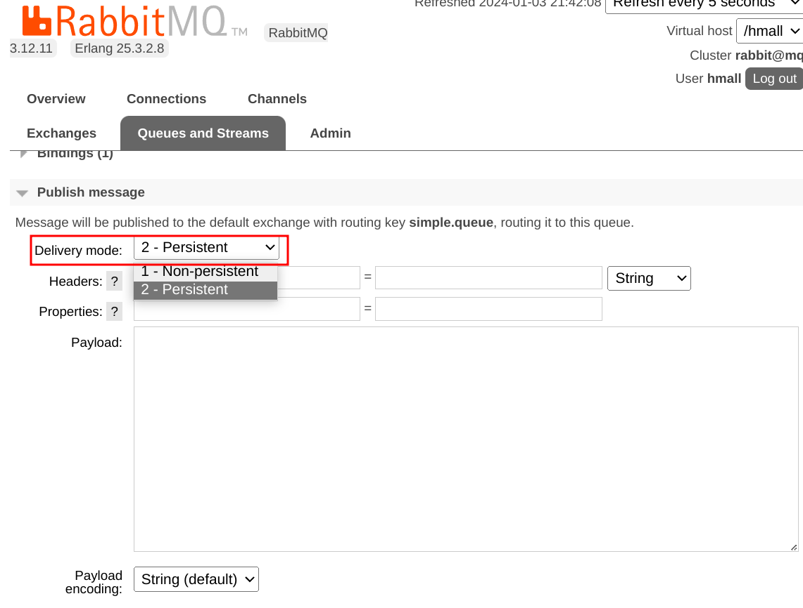

> RabbitMQ笔记

---

# 异步调用

异步调用就是消息通知，包含三个角色

- 消息发布者
- 消息代理者
- 消息接受者

# MQ

mq就是消息队列，也就是异步调用中的Broker ( 代理 )

|        | RabbitMQ             | ActiveMQ                      | RocketMQ | Kafka      |
| ------ | -------------------- | ----------------------------- | -------- | ---------- |
| 社区   | Rabbit               | Apache                        | Alibaba  | Apache     |
| 语言   | Erlang               | Java                          | Java     | Scala&Java |
| 协议   | AMQP,XMPP,SMTP,STOMP | OpenWire,STOMP,REST,XMPP,AMQP | /        | /          |
| 可用性 | 高                   | 一般                          | 高       | 高         |
| QPS    | 一般                 | 差                            | 高       | 非常高     |
| 延迟   | 微妙级               | 毫秒级                        | 毫秒级   | 毫秒       |
| 可靠性 | 高                   | 一般                          | 高       | 一般       |

## RabbitMQ架构

- virtual-host  虚拟主机，隔离数据
- publisher  发布者
- consumer  消费者
- queue  队列，存储消息
- exchange  交换机，负责路由消息


## 安装RabbitMQ

docker安装rabbitmq, 首先拉取rabbitmq镜像。

`docker pull rabbitmq`

创建rabbitmq容器

```bash
docker run \ 
 -e RABBITMQ_DEFAULT_USER=username \   
 -e RABBITMQ_DEFAULT_PASS=password \
 -v mq-plugins:/plugins \
 --name mq \
 --hostname mq \
 -p 15672:15672 \
 -p 5672:5672 \
 --network network\
 -d \
 rabbitmq
```

> -e ：配置环境变量
>
> -v ：挂载rabbitmq插件库
>
> 15672 ：rabbitmq图形化客户端端口号
>
> 5672 : rabbitmq消息收发端口号

## 出现的问题记录

### 无法访问图形化界面

如果容器创建完毕后**无法访问**`localhost:15672` 图形化界面，是因为没有启用rabbitmq_management插件。进入容器启用插件即可。

命令如下：

```bash
docker exec -it mq rabbitmq-plugins enable rabbitmq_management
```

### 图形化界面没有统计折线图

进入容器内部，执行命令

```bash
docker exec -it mq bash
cd /etc/rabbitmq/conf.d
# 修改 management_agent.disable_metrics_collector = false
echo management_agent.disable_metrics_collector = false > management_agent.disable_metrics_collector.conf
```

解决方案参考: [CSDN](https://blog.csdn.net/weixin_43641651/article/details/89848530),[CNBlogs](https://www.cnblogs.com/echo-7s/p/16446479.html)

# Spring-AMQP

1. 引入依赖

   ```xml
   <!--AMQP依赖，包含RabbitMQ-->
   <dependency>
       <groupId>org.springframework.boot</groupId>
       <artifactId>spring-boot-starter-amqp</artifactId>
   </dependency>
   ```

2. 配置mq

   ```yaml
   spring:
     rabbitmq:
       host: 192.168.1.137
       port: 5672
       virtual-host: #虚拟主机地址
       username: #用户名
       password: #密码
   ```

3. 用RabbitTemplate发消息

   ```java
   @SpringBootTest
   public class SpringAmqpTest {
       @Autowired
       private RabbitTemplate rabbitTemplate;
   
       @Test
       void testSendMessage2Queue(){
           String queueName = "simple.queue";
           String msg = "hello little rabbit 2222222 !";
         rabbitTemplate.convertAndSend(queueName,msg);
       }
   }
   ```

4. 用@RabbitListener监听消息

   ```java
   @Slf4j
   @Component
   public class MQListener {
       @RabbitListener(queues = "simple.queue")
       public void listenSimpleQueue(String msg){
           log.info("收到的消息是："+msg);
       }
   }
   ```

## WorkQueue

一条队列绑定多个消费者

MQ在这种情况下默认是**轮询机制**，也就是一人投递一个消息，并不会考虑消费者的消费能力。

设置preFetch属性 (预抓取), 设置为1, 确保同一时刻最多投递给消费者一条消息

```yaml
spring:
  rabbitmq:
    listener:
      simple:
        prefetch: 1
```

## Fanout交换机

交换机有以下三种类型：

- Fanout: 广播
- Direct: 定向
- Topic: 话题

fanout交换机会将消息广播到绑定的每一条队列中，所以也叫**广播路由**。

## Direct交换机

direct交换机会将接收到的消息路由到指定的消息队列，所以也叫**定向路由**

- 每个queue都与交换机设置一个bindingkey
- 发布消息时，指定消息的routingkey
- 交换机将消息路由到bindingkey与routingkey一致的队列

## Topic交换机

topic交换机与direct交换机类似，区别在于routingkey可以是多个单词的列表，并以 `.` 分割

queue与exchange指定bindingkey时可以使用通配符：

- `#` 代指0个或多个单词
- `*` 代指一个单词

> topic交换机是最为灵活的一个

 ## Java声明队列和交换机

SpringAMQP提供了一些类来声明队列和交换机以及他们的绑定关系：

- Queue 声明队列，可以用`QueueBuilder`构建
- Exchange 声明交换机，可以用`ExchangeBuilder`构建
- Binding 声明队列和交换机的绑定关系，可以用`BindingBuilder`构建

### 基于bean方式声明

```java
@Configuration
public class FanoutConfiguration {
    @Bean
    public FanoutExchange fanoutExchange(){
//        return new FanoutExchange("hmall.fanout2");
        return ExchangeBuilder.fanoutExchange("hmall.fanout2").build();
    }

    @Bean
    public Queue fanoutQueue(){
//        return new Queue("fanout.queue3"); //默认就是持久化队列
        return QueueBuilder.durable("fanout.queue3").build(); //持久化队列(数据持久化)
    }

    @Bean
    public Binding binding() {   
        return BindingBuilder.bind(fanoutQueue()).to(fanoutExchange());   //直接传入方法  加了Bean注解的方法都会被动态代理
    }

//    @Bean
//    public Binding binding1(Queue fanoutQueue, FanoutExchange fanoutExchange) {   //参数注入
//        return BindingBuilder.bind(fanoutQueue()).to(fanoutExchange());
//    }
 
    @Bean
    public Binding directQueueBinding(Queue directQueue1,DirectExchange directExchange){
        return BindingBuilder.bind(directQueue1).to(directExchange).with("red");
    }
}
```

### 基于注解方式声明

基于`@RabbitListener`注解声明队列和交换机

```java
@RabbitListener(bindings = @QueueBinding(
        value = @Queue(name = "direct.queue1", durable = "true"),
        exchange = @Exchange(name = "hmall.direct", type = ExchangeTypes.DIRECT),
        key = {"red", "blue"}
))
public void directqueue1(String msg) {
    System.out.println("no.1收到的消息是：" + msg);
}

@RabbitListener(bindings = @QueueBinding(
        value = @Queue(name = "direct.queue2", durable = "true"),
        exchange = @Exchange(name = "hmall.direct", type = ExchangeTypes.DIRECT),
        key = {"red", "yellow"}
))
public void directqueue2(String msg) {
    System.out.println("no.2收到的消息是：" + msg);
} 
```

## 消息转换器

在用消息队列传输**非字节**数据时，AMQP会使用基于JDK的`ObjectOutputStream`实现对数据的序列化。序列化后的数据可能存在安全风险，并且体积会更大。因此我们需要使用其他序列化方式来对数据进行序列化。

采用JSON序列化代替JDK的序列化

1. 引入jackson依赖

   ```xml
   <!--jackson-->
   <dependency>
       <groupId>com.fasterxml.jackson.dataformat</groupId>
       <artifactId>jackson-dataformat-xml</artifactId>
   </dependency>
   ```

2. 在发布者和消费者中配置`MessageConverter`

   ```java
   @Bean
   public MessageConverter jacksonMessageConvertor(){
       return new Jackson2JsonMessageConverter();
   }
   ```

3. 之后通过MQ发布的对象就可以被转为JSON格式的数据了。

# 消息可靠性

## 生产者消息可靠性

### 生产者重连

当生产者**连接mq失败**时，通过以下配置，可以进行重连

配置重连机制：

```yaml
spring:
  rabbitmq:
    connection-timeout: 1s # 设置MQ的连接超时时间
    template:
      retry:
        enabled: true # 开启超时重试机制
        initial-interval: 1000ms # 失败后的初始等待时间
        multiplier: 1 # 失败后下次的等待时长倍数，下次等待时长 = initial-interval * multiplier
        max-attempts: 3 # 最大重试次数
```

值得注意的是，这种重试机制是**阻塞式**的，比较影响整体性能。

### 生产者确认

RabbitMQ提供**publisher confirm**和**publisher return**两种确认机制。开启确认机制后，MQ成功收到生产者的消息后会返回确认消息：

- MQ收到消息，但是路由失败。此时通过**publisher return**返回路由异常原因，然后返回<span style="color: green;">**ACK**</span>，告知投递成功
- *临时消息*投递MQ，并入列成功，返回<span style="color: green;">**ACK**</span>，告知投递成功
- *持久消息*投递MQ，并入列成功且完成持久化，返回<span style="color: green;">**ACK**</span>，告知投递成功
- 其他情况返回<span style="color: red;">**NACK**</span>，告知投递失败

1. 在生产者中配置：

   ```yaml
   spring:
     rabbitmq:
       publisher-returns: true # 开启publisher return机制
       publisher-confirm-type: correlated # 开启publisher confirm机制
   ```

   > publisher-confirm-type三种模式：
   >
   > - none: 关闭confirm机制
   > - simple: 同步阻塞式等待回执
   > - correlated: 异步回调式返回回执

2. 每个RabbitTemplate只能配置一个ReturnCallback

   ```java
   @Slf4j
   @Configuration
   public class MqConfimConfig implements ApplicationContextAware {
       @Override
       public void setApplicationContext(ApplicationContext applicationContext) throws BeansException {
           RabbitTemplate rabbitTemplate = applicationContext.getBean(RabbitTemplate.class);
           //配置回调
           rabbitTemplate.setReturnsCallback(new RabbitTemplate.ReturnsCallback() {
               @Override
               public void returnedMessage(ReturnedMessage returnedMessage) {
                   log.debug("收到消息的return callback. exchange:{},routingkey:{},message:{},replycode:{},replytext:{}",
                           returnedMessage.getExchange(),returnedMessage.getRoutingKey(),
                           returnedMessage.getMessage(),returnedMessage.getReplyCode(),
                           returnedMessage.getReplyText());
               }
           });
       }
   }
   ```

3. 发送消息，指定消息id, 消息ConfirmCallback

   ```java
   @Test
   void testConfirmCallback() throws InterruptedException {
       //1.创建cd
       CorrelationData cd = new CorrelationData(UUID.randomUUID().toString());//指定消息id
       //2.添加ConfirmCallback
       cd.getFuture().addCallback(new ListenableFutureCallback<CorrelationData.Confirm>() {
           @Override
           public void onFailure(Throwable ex) {
               log.error("消息回调失败",ex);
           }
   
           @Override
           public void onSuccess(CorrelationData.Confirm result) {
               log.debug("受到confirm callback回执");
               if (result.isAck()){ //消息发送成功
                   log.debug("消息发送成功，收到ack");
               }else { //消息发送失败
                   log.error("消息发送失败，收到nack，原因：{}",result.getReason());
               }
           }
       });
       rabbitTemplate.convertAndSend("router.directt","reddd","hello",cd);
       Thread.sleep(2000);
   }
   ```

## MQ消息可靠性

默认情况下，mq将消息保存在内存中来提高性能，减少延迟，这就导致了两个问题：

- mq如果宕机，会出现消息丢失的情况
- 内存空间不足，会导致消息积压，引发mq阻塞
  - 消息积压后，rabbitmq会将消息存到物理存储中，这个过程就是`page out`，是阻塞式的

### 数据持久化

rabbitmq数据持久化包括三个部分：

- 交换机持久化
- 队列持久化
- 消息持久化

> 交换机持久化和队列持久化在控制台添加时可以设置。在spring中，创建的交换机或队列都是默认持久化的。


消息持久化：



### Lazy Queue

rabbitmq `3.6`版本后，新增了lazy queue的概念。也就是懒队列。具有以下特征：

- 接收到消息后直接存入磁盘而非内存，内存中保存最近的**2048**条消息
- 消费者要消费消息时才会从磁盘中读取并加载到内存
- 支持数百万条的消息存储

从`3.12`版本后，所有队列默认都是lazy queue模式，无法更改。

指定x-queue-mode属性为lazy即可开启lazy queue模式

1. 基于bean方式声明

   ```java
   @Bean
   public Queue lazyQueue(){
       return QueueBuilder.durable("lazy.queue")
           .lazy() //开启lazy queue模式
           .build();
   }
   ```

2. 基于注解方式声明

   ```java
   @RabbitListener(queuesToDeclare =@Queue(
           name = "lazy.queue",
           durable = "true",
           arguments = @Argument(name = "x-queue-mode",value = "lazy")
   ))
   public void listenLazyQueue(String msg){
       log.info(msg);
   }
   ```

## 消费者消息可靠性

### 消费者确认机制

消费者处理消息结束后，应该给mq一个回执，告知mq自己消息处理的状态。回执有三个值可选：

- **ack**: 成功处理消息。mq应删除消息
- **nack**:  消息处理失败。mq应尝试再次投递消息
- **reject**:  消息处理失败并拒绝该消息。mq应删除消息

---

SpringAMQP已经实现了消息确认功能。我们可以通过配置文件选择ack处理方式。有三种方式：

- none: 不处理。消息投递给消费者后立马返回ack，消息会立即从mq中删除。
- manual: 手动模式。程序员自己在业务中调用api，来决定发送ack或者reject。
- auto: 自动模式。SpringAMQP会自动判断，当业务正常执行时返回ack,当业务出现异常时：
  - 业务异常返回nack
  - 消息处理或校验异常返回reject

```yaml
spring:
  rabbitmq:
    listener:
      simple:
        acknowledge-mode: auto  #消息确认机制
```

### 消息失败处理策略

当消费者出现异常，消息会不断的投递，如果异常一直存在，那么会陷入死循环，非常吃性能。

利用rabbitmq的retry机制，在消费者出现异常时，先在本地进行重试，而不是无限的requeue到mq队列：

```yaml
spring:
  rabbitmq:
    listener:
      simple:
        prefetch: 1
        acknowledge-mode: auto  #消息确认机制
        retry:
          enabled: true #开启重试机制
          initial-interval: 1000ms
          multiplier: 1
          max-attempts: 3
          stateless: true
```

开启重试模式后，如果重试次数耗尽，消息依然失败，则需要有`MessageRecoverer` ( 消息回收者 ) 接口来处理，其包含三种不同的实现：

- `RejectAndDontRequeueRecoverer` 重试耗尽，直接reject, 丢弃消息。**默认模式**
- `ImmediateRequeueMessageRecoverer` 重试耗尽，返回nack, 消息重新入列
- `RepublishMessageRecoverer` 重拾耗尽，将失败消息重新投递到指定交换机(我愿称之为异常交换机)

#### 使用RepublishMessageRecoverer策略

1. 首先声明接受发送失败消息的交换机和队列及其绑定关系

2. 定义RepublishMessageRecoverer

   ```java
   @Configuration
   @ConditionalOnProperty(prefix = "spring.rabbitmq.listener.simple.retry"
           ,name = "enabled",havingValue = "true")
   // 设置配置类生效条件：当开启了消费者重试机制时，这个配置类才生效。
   public class ErrorConfiguration {
       @Bean
       public DirectExchange errorExchange(){
           return new DirectExchange("error.dierct");
       }
   
       @Bean
       public Queue errorQueue(){
           return new Queue("error.queue");
       }
   
       @Bean
       public Binding errorBinding(){
           return BindingBuilder.bind(errorQueue()).to(errorExchange()).with("error");
       }
   
       @Bean
       public MessageRecoverer messageRecoverer(RabbitTemplate rabbitTemplate){
           return new RepublishMessageRecoverer(rabbitTemplate,"error.direct","error");
       }
   }
   ```

3. 接下来发送消息，如果出现异常，消息重试后失败，就会执行republish策略，将消息投递到异常队列中。方便我们后期的排查和维护。

   

### 业务幂等性

幂等： `f(x)=f(f(x))` 

指的是同一个业务，执行一次或执行多次对业务状态的影响是一致的。

像查询，删除这些业务就是幂等的。像下单，退款这种业务就是非幂等的。

####  唯一消息id

1. 每个消息都生产一唯一的id，与消息一起投递给消费者
2. 消费者收到消息后进行业务处理，处理成功后将消息id保存到数据库
3. 如果下次收到相同消息，到数据库判断id是否存在，如果存在则为重复消息，放弃处理

```java
@Bean
public MessageConverter jacksonMessageConvertor() {
    Jackson2JsonMessageConverter jjmc = new Jackson2JsonMessageConverter();
    //配置自动创建消息id，可以识别不同消息，也可以判断是否重复消息
    jjmc.setCreateMessageIds(true);
    return jjmc;
}
```

> 这种方案让业务不能专注于自己的业务逻辑，存在业务侵入。

#### 业务判断

结合业务逻辑，基于业务本身做判断。

要在支付后修改订单状态为已支付，应该在修改订单状态前先查询订单状态，判断状态是否是未支付。只有未支付的订单才需要修改，其他状态不做处理。


# 延迟消息

生产者发送消息时指定一个时间，消费者不会立刻收到消息。而是在指定时间后收到消息。


## 死信交换机

一个队列中的消息满足以下三个情况之一时，就会成为<span style="color:red;">**死信**</span>

- 消费者使用basic.reject或basic.nack声明消费失败，并且消息的requeue参数设置为false
- 消息是一个过期消息，超时无人消费
- 要投递的队列消息堆积满了，最早的消息可能成为<span style="color:red;">**死信**</span>

如果队列通过`dead-letter-exchange`属性指定了一个**死信交换机**，那么该队列中的死信就会投递到该 **死信交换机** (DLX) 中。


1. 声明死信交换机和死信队列

2. 通过`dead-letter-exchange`属性为普通队列指定死信交换机

3. 发送延迟消息

   - ```java
     //通过后置消息处理器 ✅
     @Test
     void testSendTTLMessage() {
         rabbitTemplate.convertAndSend("simple.direct", "hi", "hello", new MessagePostProcessor() {
             @Override
             public Message postProcessMessage(Message message) throws AmqpException {
                 message.getMessageProperties().setExpiration("5000"); //设置过期时间为5s
                 return message;
             }
         });
         log.info("消息发送成功");
     }
     ```

   - ```java
     //通过消息构造器 ❎
     @Test
     void testSendTTLMessage() {
         Message msg = MessageBuilder.withBody("hello".getBytes())
                 .setExpiration("1000*5") //设置过期时间为5s
                 .setDeliveryMode(MessageDeliveryMode.NON_PERSISTENT) //设置发送模式为非持久化消息
                 .build();
         rabbitTemplate.convertAndSend("simple.direct","hi",msg);
         log.info("消息发送成功");
     }
     ```

## 延迟消息插件

基于死信交换机实现的延迟消息使用较为复杂，而且死信交换机初衷也不是为了实现消息延迟的。RabbitMQ官方提供一个消息延迟插件`DelayExchange`。

官方地址：[Github](https://github.com/rabbitmq/rabbitmq-delayed-message-exchange)

1. 下载插件

2. 下载完成后，将插件挂载到mq容器的插件数据卷下。

   查看mq-plugins数据卷的位置

   ```bash
   docker volume inspect mq-plugins
   或 docker inspect mq | grep Mounts -A 10
   ```

   将下载好的插件移动到该位置。

3. 启用插件

   ```bash
   docker exec -it mq rabbitmq-plugins enable rabbitmq_delayed_message_exchange
   ```

4. 声明延迟交换机

   - 基于注解方式：

     ```java
     @RabbitListener(bindings = @QueueBinding(
             value = @Queue(name = "delay.queue",durable = "true"),
             exchange = @Exchange(name = "delay.direct",delayed = "true"), //开启消息延迟
             key = "hi"
     ))
     public void listenDelayMessage(String msg){
         log.info("监听到的delay消息是: "+msg);
     }
     ```

   - 基于bean方式：

     ```java
     @Slf4j
     @Configuration
     public class DelayExchangeConfig {
     
         @Bean
         public DirectExchange delayExchange(){
             return ExchangeBuilder
                     .directExchange("delay.direct") // 指定交换机类型和名称
                     .delayed() // 设置delay的属性为true
                     .durable(true) // 持久化
                     .build();
         }
     
         @Bean
         public Queue delayedQueue(){
             return new Queue("delay.queue");
         }
         
         @Bean
         public Binding delayQueueBinding(){
             return BindingBuilder.bind(delayedQueue()).to(delayExchange()).with("hi");
         }
     }
     ```

5. 发送延迟消息

   采用后置消息处理器来设置延迟时间

   ```java
   @Test
   void testDelayMessage(){
       rabbitTemplate.convertAndSend("delay.direct", "hi", "hello,delay!!", message -> {
           message.getMessageProperties().setDelay(10000); //设置延迟时间10s
           return message;
       });
   }
   ```
