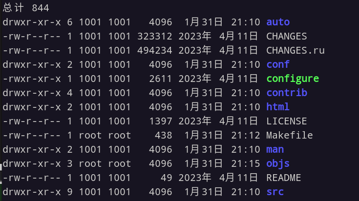
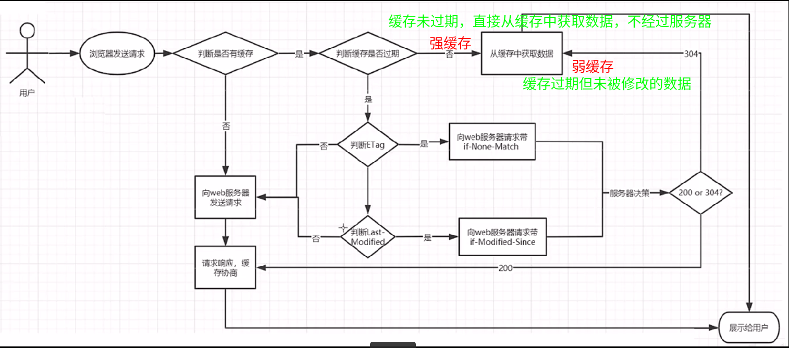
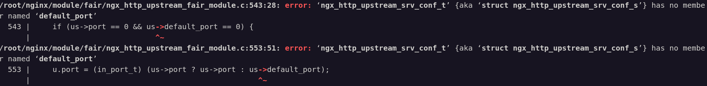
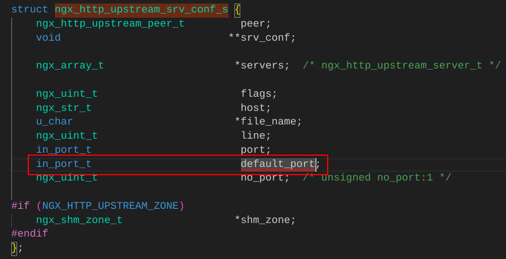
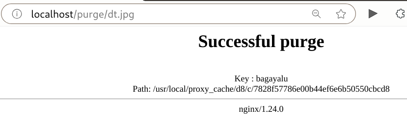
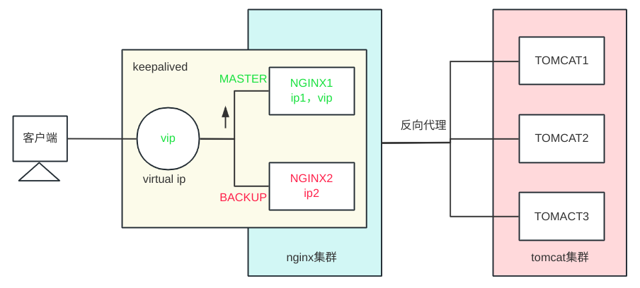

# 基础

## Nginx

nginx可以充当以下协议的服务器

1. WEB

2. HTTP

3. POP3/SMTP/IMAP

   POP3(Post Offic Protocol 3) 邮局协议第三个版本

   SMTP(Simple Mail Transfer Protocol) 简单邮件传输协议

   IMAP(Internet Maill Access Protocol) 交互式邮件存取协议

nginx可以作为邮箱服务的代理服务器

## 常用功能模块

Nginx的核心组成

1. nginx二进制可执行文件
2. nginx.conf配置文件
3. error.log错误的日志记录
4. access.log访问日志记录

## 安装

- 通过源码安装
- 通过yum安装

### 前置准备

安装前需要做一些准备工作，以下展示是centos系统命令。debian系统使用apt 和 dpkg。 

centos的yum相当于debian的apt , rpm 相当于 dpkg . 

1. GCC

   Nginx是C语言编写的，因此想要运行Nginx源码就需要有编译器

   `yum install -y gcc` 安装gcc编译器

   `gcc --version` 查看gcc版本

2. PCRE

   Nginx在编译过程中需要使用PCRE（兼容正则表达式）库

   `yum install -y pcre pcre-devel` 

   `rpm -qa pcre pcre-devel`

3. zlib

   提供了开发人员的压缩算法

   `yum install -y zlib zlib-devel`

   `rpm -qa zlib zlib-debel`

4. OpenSSL

   开放源代码的软件库包，应用程序使用这个包进行安全通信，避免被窃听

   `yum install -y openssl openssl-devel` 

   `rpm -qa openssl openssl-devel`

### 下载

#### 编译源码安装

进入官网，找到需要下载的版本。然后复制下载链接

通过wget命令下载nginx源码：

```bash
wget https://nginx.org/download/nginx-1.24.0.tar.gz
```

解压缩：

```bash
tar -xzf nginx-1.24.0.tar.gz
```

进入资源文件，发现./configure 

```bash
./configure
```

编译

```bash
make    # make是c语言命令
```

安装

```bash
make install
```

经过以上步骤，nginx被安装到了`/usr/local/nginx`目录下。我们通过`sbin/nginx`就可以启动nginx服务了

#### 包管理器安装

依据[官网指引](https://nginx.org/en/linux_packages.html)按步骤执行命令

源码目录结构



- `auto` 和编译相关的很多脚本文件
- `CHANGES` 记录nginx不同版本的变更记录
- `CHANGES.ru` 俄文版nginx不同版本的变更记录
- `conf` 核心配置文件
- `configure` nginx软件自动脚本程序 ( C语言编写的程序都会有 )
- `contrib` 存放了几个特殊的脚本文件
- `html` 显示的试图页面
- `LICENSE`  许可证
- `man` 帮助文档
- `Makefile`, `objs` 源码编译后生成的文件
- `src` nginx源代码

### 源码复杂安装

通过 `./configure --help` 查看帮助文档，里面罗列了所有相关配置项的含义和用法。

#### 卸载nginx

通过`whereis nginx`找到nginx相关目录全部要删除掉

```bash
rm -rf /usr/local/nginx
```

到nginx源代码目录下 清除编译后的文件

```bash
make clean
```

#### 复杂安装

<a name="复杂安装"></a>

添加配置参数

```bash
./confugure --prefix=/usr/local/nginx --sbin-path=/usr/local/nginx/sbin/nginx --modules-path=/usr/local/nginx/modules --conf-path=/usr/local/nginx/conf/nginx.conf --error-log-path=/usr/local/nginx/logs/error.log --http-log-path=/usr/local/nginx/logs/access.log --pid-path=/usr/local/nginx/logs/nginx.pid --lock-path=/usr/local/nginx/logs/nginx.lock --with-http_gzip_static_module --with-http_ssl_module --add-module=/root/nginx/module/fair_module
```

编译并安装

```
make & make install
```

## 软件目录结构

```bash
/usr/local/nginx
├── client_body_temp
├── conf
│   ├── fastcgi.conf #fastcgi配置文件
│   ├── fastcgi.conf.default #配置文件副本(备份)
│   ├── fastcgi_params 
│   ├── fastcgi_params.default
│   ├── koi-utf #编码、转换
│   ├── koi-win #编码、转换
│   ├── mime.types
│   ├── mime.types.default
│   ├── nginx.conf
│   ├── nginx.conf.default
│   ├── scgi_params
│   ├── scgi_params.default
│   ├── uwsgi_params
│   ├── uwsgi_params.default
│   └── win-utf #编码、转换
├── fastcgi_temp
├── html
│   ├── 50x.html
│   └── index.html
├── logs
│   ├── access.log
│   ├── error.log
│   └── nginx.pid
├── proxy_temp
├── sbin
│   └── nginx
├── scgi_temp
└── uwsgi_temp
```

- `conf`  存放nginx配置文件
  
  > CGI ( common gateway interface ) ，主要解决的问题是从客户端发送一个请求，服务端获取到请求和数据后可以调用CGI程序处理及相应结果返回给客户端的一种标准规范
  
  - `mime.types` 消息内容类型
  - `nginx.conf` **核心配置文件**

- `html` 存放静态页面
  - `index.html` 默认首页
  - `50x.html` 出现50x异常时访问的页面

- `logs` 日志目录
  - `access.log` 访问日志
  - `error.log` 错误日志
  - `nginx.pid` nginx进程的pid

- `sbin` 可执行文件目录
  - `nginx` **二进制可执行文件，nginx服务的执行入口**

## 系统服务

centos系统服务配置：`/usr/lib/systemd/system/nginx.service`

debian系统服务配置: `/lib/systemd/system/nginx.service`

nginx.service内容：

```nginx
[Unit]
Description=nginx web service
Documentation=http://nginx.org/en/docs/
After=network.target

[Service]
Type=forking
PIDFile=/usr/local/nginx/logs/nginx.pid
ExecStartPre=/usr/local/nginx/sbin/nginx -t -c /usr/local/nginx/conf/nginx.conf
ExecStart=/usr/local/nginx/sbin/nginx
ExecReload=/usr/local/nginx/sbin/nginx -s reload
ExecStop=/usr/local/nginx/sbin/nginx -s stop
PrivateTmp=true

[Install]
WantedBy=default.target 
```

## 环境变量

全局修改就`/etc/profile`

单用户修改就`~/.zshrc`或`~/.bashrc`

```shell
export PATH=$PATH:/usr/local/nginx/sbin
```

修改完记得

```shell
source /etc/profile
source ~/.zshrc
```

## 服务启停

### 信号控制 

信号控制是借助linux的kill命令的信号

向master进程发送信号来控制


- 信号

  | signal | function                                    |
  | ------ | ------------------------------------------- |
  | USER1  | 重新打开日志文件，用来进行日志切割          |
  | USER2  | 平滑升级到最新版nginx                       |
  | WINCH  | 平缓停止worker进程，用于nginx服务器平滑升级 |

  ```shell
  kill -TERM 37434 # 正常退出
  kill -KILL 37434 # 杀死
  kill -HUP 37434 # 重载
  ```

平滑升级nginx服务器过程：

1. 对旧服务器发送USER2信号。此时系统中会出现2份master进程和worker进程
2. 关闭旧的服务，服务将恢复1份master和worker进程。这样可以做到平滑升级

### 命令行控制

通过nginx可执行文件命令操作。`ningx -help` 查看参数详细信息。这种方式呢底层也是将发送信号到master进程进行了一层封装。

我以下写法**前提**是将nginx可执行文件**加入了环境变量**，否则只能去nginx安装目录下sbin中执行可执行文件。

```shell
nginx -t # 测试nginx.conf有无语法错误
nginx -T # 测试nginx.conf并dump(内容输出到控制台)
    nginx -s stop # 快速停止
    nginx -s quit # 优雅停止
    nginx -s reopen # 重新打开日志文件
    nginx -s reload # 重载，相当于HUP信号
nginx -c # 设置配置文件位置 (默认：/usr/local/nginx/conf/nginx.conf)
nginx -g # 在配置文件之外设置全局指令
```

## 服务升级

服务升级底层步骤：

1. 将新版本的nginx的二进制可执行文件copy到 `/usr/local/nginx/sbin`下

2. 发送平滑升级信号 ( `USER2` ) 到当前运行的nginx进程 

   ( pid位于`/usr/local/nginx/logs/nginx.pid` ) 

   ( 执行完毕后变为**旧进程**，pid将存放于`/usr/local/nginx/logs/nginx.pid.oldbin` ) 

3. 关闭**旧进程**的服务

### 更快捷的方式

<a name="平滑升级"></a>

通过 `make upgrade` 来升级服务

想要添加模块，记得先使用 `nginx -V` 查看nginx目前有哪些配置，然后copy这些配置，之后加上我们要的模块再编译。

1. [将新版本的nginx的二进制可执行文件 ( 位于新版本源码编译后的`objs`目录下 ) copy到 `/usr/local/nginx/sbin`下](#复杂安装)
2. **在源码安装目录下**执行 `make upgrade` 即可

> 添加第三方模块参数： `--add-module = /path/... `

>此处平滑升级报错：make: *** [Makefile:22：upgrade] 错误 1
>
>解决办法：[csdn](https://blog.csdn.net/Jo_Andy/article/details/98482090) : 使用绝对路径来启动nginx : `/usr/local/nginx/sbin/nginx`，再重新升级即可

## nginx.conf

结构分为三大块：

- 全局块 ： 设置服务器运行指令
- events块 :  配置网络连接相关内容
- http块 ： 配置服务 可配置多个server块, server块可配置多个location块 .

```nginx
worker_processes  1;  # 指令名worker_processes,值1

events {
    worker_connections  1024;
}

http {
    include       mime.types;
    default_type  application/octet-stream;
    sendfile        on;
    keepalive_timeout  65;
    server {
        listen       80;
        server_name  localhost;
        
        location / {
            root   html;
            index  index.html index.htm;
        }
        
        error_page   500 502 503 504  /50x.html;
        location = /50x.html {
            root   html;
        }
    }
}
```

## 全局块

### user

用于配置运行nginx的worker进程的用户和用户组

```
语法： user [user] [group];
默认值: nobody
```

user指令指定启动服务时运行工作进程的用户及用户组 

worker_processes

***master_process***：用来指定是否开启worker进程

```
语法: master_process [on|off];
默认值: on
```

***worker_processes***:  用来指定生成的worker进程的数量 通常建议将该值设为机器的内核数

```
语法: worker_processes [num|auto];
默认值: 1
```

### daemon

daemon: 设定nginx是否以守护进程模式启动

```
语法: daemon [on|off];
默认值: on
```

### pid

pid: 用来指定nginx当前master进程pid的存储路径

```
语法: pid [path];
默认值： /usr/local/nginx/logs/nginx.pid
```

### error_log

<a name="error_log"></a>

error_log: 配置nginx的错误日志存放路径

```
语法: error_log [path] [level]
默认值: logs/error.log error
位置：全局块, http块, server块, location块
```

日志级别有:  debug|info|notice|warn|error|crit|alert|emerg

### include

include: 用来引入其他配置文件

```
语法：include [path];
默认值: 无
位置: 任何位置
```

## events块

### accept_mutex

accept_mutex: 设置nginx网络连接序列化

```
语法： accept_mutex [on|off];
默认值: on
```

解决 ‘惊群’ 问题：

值为off, master进程在接收到请求后会同时唤醒多个worker进程，让他们去争夺资源，最终只会有一个进程获取到资源，这会造成资源浪费，影响nginx性能。

值为on, master进程在接收到请求后会**按序列**进行唤醒，避免worker线程互相争夺资源

### multi_accept

multi_accpet: 是否允许worker进程**同时**接收多个网络请求

```
语法：multi_accpet [on|off]
默认值：off
```

### worker_connections

worker_connections: 配置单个worker进程最大连接数

```
语法：worker_connections [num]
默认值：512
```

不要超过操作系统支持的最大文件句柄数量！

### use

use: 设置服务器选择哪种事件驱动来处理网络消息

```
语法：use [method]
默认值：操作系统决定
```

method可选值有: select|poll|epoll|kqueue等

## http块

### 定义mime-type

nginx服务器内置的mime-type配置是：

```nginx
include       mime.types;
default_type  application/octet-stream;
```

`application/octet-stream`： 以二进制流的形式读取数据，浏览器会下载文件

- default_type: 配置默认mime类型

  ```
  示例:default text/plain 
  ```
  

text/plain: 纯文本

text/html: html页面

### 自定义服务日志

nginx支持对日志格式，大小，输出进行设置。需要用到两个指令：`access_log ` 和 `log_format`

- access_log: 设置用户访问日志的相关属性

  ```
  语法：access_log [path][format[buffer=size]]
  默认值：logs/access.log combined
  ```

- log_format: 指定日志输出格式

  ```
  语法：log_format [name][[escape=deafult|json|none]|[string][...]];
  默认值：combined ...;
  ```

### sendfile

sendfile: 是否使用sendfile()传输文件，可以提高处理静态资源的性能

```
语法: sendfile [on|off]
默认值: off
```

### keepalive_timeout

keepalive_timeout：设置长连接的超时时间

```
语法：keepalive_timeout [time]
默认值：75
```

### keepalive_requests

keepalive_requests: 设置一个keep-alive连接可以被使用的次数

```
语法：keepalive_requests [count]
默认值: 100
```

## 静态资源部署

### listen

listen: 用来配置监听端口

```
语法: listen [address:port] [default_server] | listen [port] [default_server]
示例：
listen 8000;
listen *:8000;
listen localhost:8000;
```

default_server: 如果没有指定该属性，当请求地址无法匹配当前server_name时 ( 前提是端口正确 ) ，nginx会自动将请求代理到第一个server中。指定该属性即可改变默认的server

```nginx
server{
    listen 8080 default_server; #设置为默认服务器
    server_name _;
    default_type text/plain;
    return 444 'not found server!';
}

```

### server_name

设定虚拟主机服务名

```
语法: server_name [name] ...;
默认： server_name "";
```

server_name配置支持正则匹配，通配符匹配。

当访问域名同时满足精确匹配、正则匹配、通配符匹配时，他们之间的优先级：

```
精确匹配 > 通配符匹配 > 正则匹配 > default_server ( 没指定的话就找第一个server )
```

#### 正则规则

>  正则以 `~` 开始

```
^ 匹配输入字符串的起始位置
$ 匹配输入字符串的结束位置
. 匹配除\n之外任何单个字符
\ 转义字符
[xyz] 字符集，与任意一个其中字符匹配
[a-z] 字符范围，匹配指定范围内的字符
\w 匹配大小写英文字母，数字字符，等效于[A-Za-z0-9]
\d 数字字符匹配，等效[0-9]
{n} 匹配n次
{n,} 至少匹配n次
{n,m} 匹配n到m次
* 至少匹配0次，等效于{0,}
+ 至少匹配1次,等效于{1,}
? 匹配0次或1次，等效于{0,1}
```

### location

设置请求的url

```
语法： location [ = | ~ | ~* | ^~ | @] uri{...}
> url支持通配符匹配和正则匹配
```

1. 不带符号，必须**以指定uri开始**：

   ```nginx
   location /abc {
           default_type text/plain;
           return 200 "访问成功!";
   }
   ```

   >  访问localhost:80/abc 可以，访问localhost:80/abcdefef 也可以。

2.  `= `符号，用于不包含正则的uri。**必须精确匹配**：

   ```nginx
   location = /abc {
           default_type text/plain;
           return 200 "访问成功!";
   }
   ```

3.  `~ ` 表示当前uri包含正则, 区分大小写

   `~*` 表示当前uri包含正则, **不区分**大小写

   ```nginx
   location ~^/abc\w$ {
           default_type text/plain;
           return 200 "访问成功!";
   }
   ```

4. `^~` 用于不包含正则的uri, 和不带符号一样。区别是一旦模式匹配就停止后续的匹配

   ```nginx
   location ^~/abc {
           default_type text/plain;
           return 200 "访问成功!";
   }
   ```

### root | alias

root: 设置请求的根目录

```
语法：root [path]
示例：root page/html;
```

```
语法: alias [path]
示例: alias page/html/imgs;
```

考虑如下语句：

图片位置：`/usr/local/nginx/html/imgs/headphoto.jpg`

```nginx
# root:
location /imgs {
        root html;  # 指定根目录
}
# alias:
location /imgs {
        alias html/imgs;  #纯替换文本
}
```

> root的处理结果是： root路径+location路径
>
> alias的处理结果是：alias路径

> 总的来说，root就是指定一个根目录，根据location位置在这个根目录里找资源，
>
> alias就是纯纯把loaction位置替换掉了。

### index

设置地址的默认访问资源

```
语法: index [file] ...;
示例: index index.html index.htm;
```

```nginx
location /imgs {
        alias html/imgs;
        index headphoto.jpg;
}
```

### error_page

设置网站错误页面

[帮助文档](https://nginx.org/en/docs/http/ngx_http_core_module.html#error_page)

1. 指定具体跳转地址

   ```nginx
   error_page 404 https://www.baidu.com;
   ```

   当后端响应状态码是404时，跳转到`https://www.baidu.com`

2. 指定重定向地址

   ```nginx
   error_page   500 502 503 504 404 /50x.html;
   location = /50x.html {
       root   html;
   }
   ```

   当出现如上响应码时，uri重定向到`/50x.html`, 这个uri又精确匹配了html中的50x.html。

3. 使用@完成错误信息展示

   ```nginx
   error_page 404 @jump_to_error;  #收到后端404状态码做的处理
   location @jump_to_error {
           default_type text/plain;
           return 404 "Not Found html page!!!"; #给浏览器反一个404码
   }
   ```

4. [=response]的作用就是更改状态码

   ```nginx
   error_page 404 =200 @jump;
   location @jump {
           default_type text/plain;
           return 200 "not found!";
   }
   ```

   > 注意：`404`和`=`之间**有空格**，`=`和`200`之间**没有空格**！

### 静态资源优化配置

1. sendfile 开启高效文件传输模式

   sendfile开启后，应用程序给内核发送sendfile()指令，指定了socket缓冲区。操作系统内核缓冲区可以直接和socket缓冲区进行通信，不经过应用程序缓冲区，减少了磁盘I/O, 提高了文件传输效率。

   ```
   语法 sendfile on|off;
   默认 sendfile off
   ```

2. tcp_nopush 提升网络包传输效率 前提是开启sendfile

   缓存填满了再发送

   ```
   语法 tcp_nopush on|off;
   默认 tcp_nopush off;
   ```

3. tcp_nodelay 提高网络包传输实时性 前提是连接得是keep-alive长连接

   实时发送

   ```
   语法 tcp_nodelay on|off;
   默认 tcp_nodelay on;
   ```

> 这俩配置看起来是互斥，但是linux内核进行了兼容。所以建议都开启。

### 静态资源压缩

nginx安装时内置了ngx_http_gzip_moudule 模块，该模块包含资源压缩指令

1. gzip 开启或关闭gzip功能

   ```
   语法 gzip on|off;
   默认 gzip off;
   ```

2. gizp_types 根据响应页的mime类型选择性地开启gzip压缩

   ```
   语法 gzip_types mime-type ...;
   默认 gzip_types text/html;
   示例 gzip_types *;
   ```

3. gzip_comp_level 设置gzip压缩程度 ( 1-9 ) 级别越高压缩程度越高，但是更吃cpu性能。

   ``` 
   语法 gzip_comp_level level;
   默认 gzip_comp_level 1;
   示例 gzip_comp_level 9;
   ```

4. gzip_vary 设置压缩后是否携带`Vary:Accept-Encoding`头域的响应头部。主要告诉接收方，所发送的数据经过了gzip压缩处理

   ```
   语法 gzip_vary on|off;
   默认 gzip_vary off;
   ```

5. gzip_buffers 处理请求压缩的缓冲区数量和大小

   ```
   语法 gzip_buffers num size;
   默认 gzip_buffers 32 4k; 或 gzip_buffers 16 8k;
   ```

6. gzip_disable 针对不同种类客户端，选择性开启或关闭gzip功能

   ```
   语法 gzip_disable regex...;
   ```

   regex： 根据浏览器标志( user-agent )来设置。一般用来排除那些不支持gzip的浏览器。

   ```nginx
   gzip_diable "Mozilla/5.0.*";
   ```

7. gzip_http_version 针对不同http版本，选择性开启或关闭gzip功能

   ```
   语法 gzip_http_version 1.0|1.1;
   默认 gzip_http_version 1.1;
   ```

8. gzip_min_length 针对传输数据大小，选择性开启或关闭gzip功能

   ```
   语法 gzip_min_length length;
   默认 gzip_min_length 20;  #20bytes
   ```

   实际上是通过和响应头中的`Content-Length`来作比较的

9. gzip_proxied 是否对服务器返回的结果进行gzip压缩

   ```
   语法 gzip_proxied off|expired|no-cache|no-store|private|no_last_modified|no_etag|auth|any;
   默认 gzip_proxied off;
   ```

   > 参数解释：
   >
   > off 关闭压缩 any无条件开启压缩
   >
   > 剩下的参数就是看响应头是否包含这些参数，包含就启用压缩

#### gzip和sendfile冲突问题

开启sendfile后，静态资源不经过应用程序缓冲区，是直接在操作系统内核缓冲中操作。但是我们的gzip又是应用程序的操作，所以这里就产生了冲突，即sendfile开启后，gzip会失效。

ngx_http_gzip_static_module模块通过gzip_static指令解决了这个问题。

1. 添加`ngx_http_gzip_static_module`模块

   编译nginx源码的时候，在原先基础上再添加参数：

   ```shell
   ./configure --with-http_gzip_static_module
   ```

​	[nginx平滑升级](#平滑升级)

2. gzip_static 检查与访问资源同名的.gz文件，response中以gzip相关的header返回.gz文件内容

   ```
   语法 gzip_static on|off|always;
   默认 gzip_static off;
   ```

3. 将静态资源压缩成.gz文件

   ```shell
   gzip <文件名>
   ```

## 缓存

浏览器缓存执行流程



### expires

控制页面缓存。通过该指令控制http response中的`Expire`s 和` Cache-Control`

```
语法 expires [modified] time;
	expires epoch|max|off;
默认 expires off;
```

`time`: 整数，可以为正也可以为负。若为负，Cache-Control则为`no-chache` ( 会去服务端校验变化，是**弱缓存** )，若为正或0, 则Cache-Control值为`max-age=time` ( 直接走缓存，是**强缓存** ) ;

`epoch`: 指定Expires值为`1 January,1970,00:00:01 GMT`, Cache-Control为`no-cache`

`max`: 指定Expires值为`31 December2037 23:59:59GMT`, Cache-Control为10年

`off`: 不缓存

### add_header

添加指定的响应头和响应值

```
语法 add_header name value [always];
```

`Cache-control` 响应头的参数：

| 指令             | 说明                                           |
| ---------------- | ---------------------------------------------- |
| must-revalidate  | 可缓存但必须再向服务器确认                     |
| no-cache         | 缓存前必须确认其有效性                         |
| no-store         | 不缓存请求或响应的任何内容                     |
| no-transform     | 代理不可更改媒体类型                           |
| public           | 可向任意方提供响应的缓存                       |
| private          | 仅向特定用户返回响应                           |
| proxy-revalidate | 要求中间缓存服务器对缓存的响应有效性再进行确认 |
| max-age=<秒>     | 响应最大age值                                  |
| s-maxage=<秒>    | 公共缓存服务器响应的最大age值                  |

## 跨域

**同源策略：**是浏览器最核心也最基本的安全功能。指的是**协议**、**域名**(IP)、**端口**相同。

服务器a：

```nginx
server {
    listen       80;
    server_name  localhost;
    location / {
        root   html;
        index  index.html index.htm;
    }
}
```

服务器a请求服务器b时会出现无法跨域访问的问题

### 解决跨域问题

通过add_header指令添加连个头信息：

- `Access-Control-Allow-Origin`  允许跨域访问的ip地址，可以设置多个，也可以设为`*`
- `Access-Control-Allow-Methods`  允许跨域访问的请求方式 

在服务器b中添加两个头信息：

```nginx
server {
    listen 8080;
    server_name localhost;
    location /getUser {
            add_header Access-Control-Allow-Origin *;
            add_header Access-Control-Allow-Methods GET,POST;
            default_type application/json;
            return 200 "{'id':1,'name':'ahang','age':22}";  
    }
}
```

这样，跨域问题就解决了。

## 防盗链

http头信息的Referer属性，用来标识该请求的来源

因此我们可以让服务器获取Referer属性值，来判断是否是自己信任的网站，如果是则放行，如果不是则拒绝访问，从而实现防盗链的效果。

### valid_referers

有效的引用。nginx会比较`Referer`的值。变量 $invalid_referer 表示非法引用。

[帮助文档](https://nginx.org/en/docs/http/ngx_http_referer_module.html#valid_referers)

```nginx
location ~.*\.(png|jpg|gif)$ {
        valid_referers none blocked www.baidu.com; #这些引用是有效的
        if ($invalid_referer){
           return 403;
        }

        root html/imgs;
}
```

> 以上代码就表示对于直接访问图片地址的和从百度网站访问该图片地址的请求放行，允许访问。从其他地方发来的请求都会被返回一个403码。

### ngx_http_accesskey_module

该模块可以实现访问密钥。必须有密钥才能访问相应资源。

## Rewrite

nginx使用 ngx_http_rewrite_module 模块来解析和处理rewirte功能的配置

[帮助文档](https://nginx.org/en/docs/http/ngx_http_rewrite_module.html)

通过`set $variable value ` 指令可以设置变量。但是变量名不可以和nginx内置参数重名。这些内置参数还可以用在**日志格式**中。

### 常见nginx内置参数

- `$args` url地址携带的参数，等价于`$query_string`
- `$http_user_agent`  用户代理信息

- `$host`  你所访问的服务器的server_name值
- `$document_uri`   当前访问地址的uri

- `$document_root`  当前请求对应location的root值
- `$content_length` 请求头中Content-Length的值
- `$content_type` 请求头中的Content-Type值
- `$http_cookie` cookie信息
- `$limit_rate` nginx对网络连接速度的限制
- `$remote_addr` 客户端ip地址
- `$remote_port` 客户端端口
- `$remote_user` 客户端的用户名
- `$scheme` 访问协议
- `$server_addr` 服务端地址
- `server_port` 
- `server_name`
- `server_protocol`
- `request_body_file` 本地资源文件名
- `request_method` 请求方式
- `request_filename` 请求的资源文件路径名

### if

| Syntax:  | **if**  (*condition*) { ... } |
| :------- | ----------------------------- |
| Default: | —                             |
| Context: | `server`, `location`          |

```nginx
location /testif {
    set $username "ahang";
    default_type text/plain;
    if ($username){
        return 200 "$username is not empty";
    }
    return 200 "args is empty";
}
```

if支持正则匹配

```nginx
if ($http_user_agent ~* safari){ 
    return 200 "Chrome";
}
# ~*不区分大小写   ~区分大小写
```

判断请求的文件是否存在 `-f` `!-f`

```nginx
location / {
    if (!-f $request_filename){
        return 200 "file not exists!";
    }
    root html;
}
```

### break

- 中断**同一个作用域**的其他nginx配置

- 终端当前匹配，并把当前的uri在本location进行**重定向**访问处理

### return

| Syntax:  | **return** *code* [*text*];` `**return** *code* *URL*;` `**return** *URL*;` |
| :------- | ------------------------------------------------------------ |
| Default: | —                                                            |
| Context: | `server`, `location`, `if`                                   |

```nginx
location /testreturn {
    # return https://www.baidu.com; 
    return 302 https://www.baidu.com; #等价于上条指令
}
```

### rewrite

| Syntax:  | **rewrite** *regex* *replacement* [*flag*];` |
| :------- | -------------------------------------------- |
| Default: | —                                            |
| Context: | `server`, `location`, `if`                   |

```nginx
location /rewrite {
    rewrite ^/rewrite/url\w*$ https://www.google.com;
    rewrite ^/rewrite/(test)\w*$ /$1;
    rewrite ^/rewrite/(demo)\w*$ /$1;
}
location /test {
    default_type text/plain;
    return 200 test_success!;
}
location /demo {
    default_type text/plain;
    return 200 demo_success!;
}
```

> - 访问`/rewrite/url**`, uri将被重定向到 https://www.google.com;
>
> - 访问`/rewrite/test**`, uri将被重定向到 `/test`
> - 访问`/rewrite/demo/**` , uri将被重定向到`/demo`

flag四个参数：`last`,`break`,`redirect`,`permanent`，参考官方文档。

### rewrite_log

| Syntax:  | **rewrite_log** on \| off;         |
| :------- | ---------------------------------- |
| Default: | `rewrite_log off;`                 |
| Context: | `http`, `server`, `location`, `if` |

开启后，会以notice级别将日志输出到error_log中。

值得注意的是，notice级别是很低的日志级别。error_log默认级别是error级别。因此默认情况下error_log中输出的notice级别内容非常简略。想要获取更详细的notice级别日志，应该[将error_log的日志级别设置为notice或更低](#error_log)。

### rewrite防盗链

当出现盗链情况后，通过rewrite将资源重定向到预设的资源上。提升用户体验

```nginx
location ~.*\.(png|jpg|gif)$ {
    valid_referers none blocked www.baidu.com;
    if ($invalid_referer){
        #return 403;
        rewrite ^/ /dt.jpg break;
    }
    root html/imgs;
}
```

当用户访问`/imgs`下的png, jpg, gif格式文件时，若是无效引用，则资源重定向到`/imgs`下的 `dt.jpg` 图片上。

# RP

反向代理：被代理的是**服务端**，用来隐藏服务端身份，提供负载均衡等能力

正向代理：被代理的是**客户端**，用来客户端隐私，绕过防火墙等限制

[帮助文档](https://nginx.org/en/docs/http/ngx_http_proxy_module.html)

## proxy_pass

[帮助文档](https://nginx.org/en/docs/http/ngx_http_proxy_module.html#proxy_pass)

设置被代理服务器 ( 服务端 ) 的地址

- 如果**使用URI**指定proxy_pass指令，则proxy_pass会替换掉location匹配地址。

- 如果在**没有指定URI**的情况下指定proxy_pass指令，则最终只会将location匹配的地址拼接在proxy_pass后面

## proxy_set_header

[帮助文档](https://nginx.org/en/docs/http/ngx_http_proxy_module.html#proxy_set_header)

客户端 -> 代理服务器 -> 服务端

就是让代理服务器发的请求带上自定义的头头

## proxy_redirect

[帮助文档](https://nginx.org/en/docs/http/ngx_http_proxy_module.html#proxy_redirect)

用于修改头信息中的`Location`和`Refresh`的值

**避免**在反向代理的过程中，客户端**直接发现**服务端的ip地址。

## proxy_buffering

[帮助文档](https://nginx.org/en/docs/http/ngx_http_proxy_module.html#proxy_buffering)

开启或关闭代理缓冲区

## proxy_buffers

[帮助文档](https://nginx.org/en/docs/http/ngx_http_proxy_module.html#proxy_buffers)

指定缓冲区的数量和大小

## proxy_buffer_size

[帮助文档](https://nginx.org/en/docs/http/ngx_http_proxy_module.html#proxy_buffer_size)

设置用于读取从代理服务器收到的响应的第一部分的缓冲区的大小。

# 安全控制

## 安全隔离

在反向代理之前设置一个防火墙，仅留一个入口共反向代理服务器访问。

## 使用SSL对流量加密

实际上就是使用 `https` 协议 = `http` + `SSL/TLS`

向让nginx使用ssl加密，需要引入 `ngx_http_ssl_module` 模块

**[平滑升级](#平滑升级), 添加：**

```
--with-http_ssl_module
```

### ssl模块指令

[帮助文档](https://nginx.org/en/docs/http/ngx_http_ssl_module.html)

1.  `ssl` 开启ssl

   使用listen指令的ssl参数来开启

   ```nginx
   server{
       listen 443 ssl;
   }
   ```

2. `ssl_certificate`  指定一个证书

   | Syntax:  | **ssl_certificate** *file*;` |
   | :------- | ---------------------------- |
   | Default: | —                            |
   | Context: | `http`, `server`             |

3. `ssl_session_cache`  配置ssl会话缓存

   | Syntax:  | **ssl_session_cache** off \| none \| [builtin[:*size*]] [shared:*name*:*size*]; |
   | :------- | ------------------------------------------------------------ |
   | Default: | `ssl_session_cache none;`                                    |
   | Context: | `http`, `server`                                             |

4. `ssl_ciphers`  指定允许的密码，必须是openssl支持的格式

   | Syntax:  | **ssl_ciphers** *ciphers*;`     |
   | :------- | ------------------------------- |
   | Default: | `ssl_ciphers HIGH:!aNULL:!MD5;` |
   | Context: | `http`, `server`                |

### 生成证书

1. 阿里云/腾讯云购买证书

2. openssl生成证书

   查看openssl版本

   ```shell
   openssl version
   ```

   生成证书

   ```shell
   mkdir /root/cert
   cd /root/cert
   openssl genrsa -des3 -out server.key 2048   #私钥
   openssl req -new -key server.key -out server.csr #证书签名请求csr
   cp server.key server.key.org
   openssl rsa -in server.key.org -out server.key
   #使用私钥和csr生成自签名证书
   openssl x509 -req -days 365 -in server.csr -signkey server.key -out server.crt
   ```

### 开启SSL实例

```nginx
#HTTPS server
server {
    listen       443   default_server   ssl; #
    server_name  localhost;

    ssl_certificate      "/root/cert/server.crt";
    ssl_certificate_key  "/root/cert/server.key";

    ssl_session_cache    shared:SSL:1m; #5MB
    ssl_session_timeout  5m; #5minutes

    ssl_ciphers  HIGH:!aNULL:!MD5;
    ssl_prefer_server_ciphers  on;

    location / {
        root   html;
        index  index.html index.htm;
    }
}
```

### 通过rewrite让网站默认走https协议

```nginx
server {
    listen      80    ;
    server_name  localhost;
    location / {
        rewrite ^(.*) https://localhost$1;
    }
}

#HTTPS server
server {
    listen       443  ssl;
    server_name  localhost;

    ssl_certificate      "/root/cert/server.crt";
    ssl_certificate_key  "/root/cert/server.key";

    ssl_session_cache    shared:SSL:1m; #5MB
    ssl_session_timeout  5m; #5minutes

    ssl_ciphers  HIGH:!aNULL:!MD5;
    ssl_prefer_server_ciphers  on;

    location / {
        root   html;
        index  index.html index.htm;
    }
}
```

> 当用户访问localhost的80端口时，会被重定向到https协议的443端口服务上。这样用户进入网站就会是https协议的了。

# LB

## 常见的处理方式

1. 用户手动选择

   就比如有些资源下载网站，会在下载地址中提供多条下载链接供用户选择。

2. DNS轮询

   利用dns在服务器集群中轮询选择

3. 4/7层负载均衡

   OSI七层模型：物理层，数据链路层，网络层，***传输层***，会话层，表示层，***应用层***

   - 传输层： 基于ip+port的负载均衡 (LVS, Nginx)
   - 应用层： 基于虚拟的url或主机ip的负载均衡 (Nginx, Hayproxy)

## 🔶七层LB

nginx负载均衡是在nginx的反向代理的基础上把用户请求根据指定算法分发到一组 **upstream虚拟服务池** 中。

1. upstream

   [帮助文档](https://nginx.org/en/docs/http/ngx_http_upstream_module.html#upstream)

   定义一组服务器。 服务器可以监听不同的端口。 

2. server

   [帮助文档](https://nginx.org/en/docs/http/ngx_http_upstream_module.html#server)

   用来指定服务器名称和一些参数

```nginx
upstream backend {
    server localhost:8081;
    server localhost:8082;
    server localhost:8083;
}
# load balancer
server {
    listen      80    ;
    server_name  localhost;

    location /api {
        proxy_pass http://backend;
    }
}
# server1
server {
    listen 8081;
    server_name localhost;
    default_type text/html;
    location / {
        return 200 "this is server1:8081";
    }
}
# server2
server {
    listen 8082;
    default_type text/html;
    server_name localhost;
    location / {
        return 200 "this is server2:8082";
    }
}
# server3
server {
    listen 8083;
    default_type text/html;
    server_name localhost;
    location / {
        return 200 "this is server3:8083";
    }
}
```

## 服务器状态

- down 当前server暂时**不参与**负载均衡
- backup 预留的备份服务器 ( 只有当主服务器无法使用时，才会启用备份服务器 )
- max_fails 允许请求失败的次数
- fail_timeout 经过max_fails失败后，服务暂停的时间。时间过后会恢复服务
- max_conns 限制最大的连接接收数

```nginx
upstream backend {
    server localhost:8081 down;
    server localhost:8082 backup;
    server localhost:8083;
}
```

## LB策略

1. 轮询 - 默认方式

   ```nginx
   upstream backend {
       server localhost:8081;
       server localhost:8082;
       server localhost:8083;
   }
   ```

2. weight - 加权 ✅

   weight越大，权重越高，被分配到请求的概率越大

   ```nginx
   upstream backend {
       server localhost:8081 weight=1;
       server localhost:8082 weight=2;
       server localhost:8083 weight=7;
   }
   ```

3. ip_hash - 根据ip进行hash ❎

   不同服务器的session不共享，会导致用户体验很差。通过iphash, 同一个ip的请求在同一个服务器上处理，避免这种问题。

   ```nginx
   upstream backend {
       ip_hash;
       server localhost:8081;
       server localhost:8082;
       server localhost:8083; 
   }
   ```

4. least_conn - 最少连接

   ```nginx
   upstream backend {
       least_conn;
       server localhost:8081;
       server localhost:8082;
       server localhost:8083; 
   }
   ```

5. url_hash - 根据url进行hash  ❎

   让访问同一个资源的请求可以到同一服务器中获取文件缓存。

   ```nginx
   upstream backend {
       hash $request_uri; #根据$request_uri来计算hash
       server localhost:8081;
       server localhost:8082;
       server localhost:8083; 
   }
   ```

   > 如果hash后跟的是一个具体的值`hash 123;`，那么所有请求都会被发送到一个具体的服务器上。因为一个具体的值的hash无论如何计算都是不会改变的。

6. fair - 根据响应时间

   根据页面大小，加载时间**智能**地负载均衡。fair是第三方模块`nginx-upstream-fair` 中的指令

   - [github地址](https://github.com/gnosek/nginx-upstream-fair)下载源码，解压
   - [平滑升级](#平滑升级)，添加第三方模块 ( 第三方模块位置一般为`/root/nginx/module/`)

   ```nginx
   upstream backend {
       fair;
       server localhost:8081;
       server localhost:8082;
       server localhost:8083; 
   }
   ```

### fair升级报错

添加模块遇到这个报错：



解决：

- 进入nginx源码目录 src/http/ 下 ， 编辑`ngx_http_upstream.h` 文件

- 找到`ngx_http_upstream_srv_conf_s` 方法块，添加属性

  

## 🔷四层LB

四层lb需要用到stream模块。stream模块用法和http类似，我们可以配置一组TCP或UDP协议的监听，通过proxy_pass转发请求，通过upstream定义多个后端服务器，实现lb

### 添加stream模块支持

- [平滑升级](#平滑升级)， 添加参数`--with-stream`

## 指令

- stream 用法同http ( 和http同级 )

[帮助文档](https://nginx.org/en/docs/stream/ngx_stream_core_module.html#stream)

```nginx
stream {

    upstream redisbackend {
        server 127.0.0.1:6379;
        server 127.0.0.1:6378;
    }

    server {
        listen 81;
        proxy_pass redisbackend;
    }
}
```

# 缓存集成

[doc](https://nginx.org/en/docs/http/ngx_http_proxy_module.html)

## proxy_cache_path

[doc](https://nginx.org/en/docs/http/ngx_http_proxy_module.html#proxy_cache_path)

设定缓存文件存放路径

```nginx
proxy_cache_path /usr/local/proxy_cache levels=2:1 keys_zone=ahang:200m max_size=20g;
```

## proxy_cache

[doc](https://nginx.org/en/docs/http/ngx_http_proxy_module.html#proxy_cache)

开启或关闭代理缓存。开启需要指定**缓存区**(keys_zone)

```nginx
proxy_cache ahang;
```

## proxy_cache_key

[doc](https://nginx.org/en/docs/http/ngx_http_proxy_module.html#proxy_cache_key)

设置缓存的key值

```nginx
proxy_cache_key "$host$request_uri $cookie_user";
```

## proxy_cache_valid

[doc](https://nginx.org/en/docs/http/ngx_http_proxy_module.html#proxy_cache_valid)

设置不同响应代码的缓存时间

```nginx
proxy_cache_valid 200 302 10m;
proxy_cache_valid 404 1m;
```

## proxy_cache_min_uses

[doc](https://nginx.org/en/docs/http/ngx_http_proxy_module.html#proxy_cache_min_uses)

设置资源被访问多少次后才缓存

## proxy_cahe_methods

[doc](https://nginx.org/en/docs/http/ngx_http_proxy_module.html#proxy_cache_methods)

设置缓存哪些http方法

---

```nginx

proxy_cache_path /usr/local/proxy_cache levels=2:1 keys_zone=ahang:200m inactive=1 max_size=20g;

upstream backend {
    server localhost:8080;
}

# proxy server
# url: http://localhost/dt.jpg
server {
    listen       80;
    server_name  localhost;
    proxy_cache ahang;
    proxy_cache_key $scheme$proxy_host$request_uri;
    proxy_cache_valid 200 5d;
    proxy_cache_valid 404 20s;
    proxy_cache_valid any 1m;
    add_header nginx-cache "$upstream_cache_status";
    location / {
        proxy_pass http://backend;
    }

}

# backend server
# url: http://localhost:8080/dt.jpg
server {

    listen 8080;
    server_name localhost;
    location / {
        root html/imgs;
    }
}
```

## 清除缓存

- 直接删除对应的缓存目录

- 添加第三方模块`ngx_cache_purge`

  [平滑升级](#平滑升级) : 源码在[github](https://github.com/FRiCKLE/ngx_cache_purge)上，下载，编译，升级

```nginx
server {
    listen       80;
    server_name  localhost;
    proxy_cache ahang; # 缓存区
    proxy_cache_key bagayalu; # 缓存key
    proxy_cache_valid 200 5d; # 200状态码的资源存5天
    proxy_cache_min_uses 1; 
    add_header nginx-cache "$upstream_cache_status";

    location / {
        proxy_pass http://backend;
    }

    location ~/purge(/.*) {
        proxy_cache_purge ahang bagayalu; # 该模块可以清除指定的缓存
    }

}
```

> 输入： `localhost/purge/dt.jpg` ，清除了dt.jpg的数据缓存。



## 不缓存

### proxy_no_cache

[doc](https://nginx.org/en/docs/http/ngx_http_proxy_module.html#proxy_no_cache)

用以定义**不将数据进行缓存**的条件

### proxy_cache_bypass

[doc](https://nginx.org/en/docs/http/ngx_http_proxy_module.html#proxy_cache_bypass)

用以定义**不从缓存中获取数据**的条件

```nginx
proxy_no_cache $cookie_nocache $arg_nocache$arg_comment;
proxy_no_cache $http_pragma    $http_authorization;
```

以上变量说明：

- `$cookie_nocache`  cookie中key为nocache的值
- `$arg_nocache` 路径参数中key为nocache的值

- `$http_pragma` http请求头中key为pragam的值

# 动静分离

：将静态资源部署在nginx上，将动态资源部署在后端服务器 ( tomcat )上 。

实现原理就是将静态资源部署自nginx的html中，然后动态资源通过nginx反向代理给代理到后端服务器上。

```nginx
upstream webservice {
    server localhost:8080;
}

#nginxRP
server {
    listen 80;
    server_name localhost;

    #动态资源代理
    location /demo {
        proxy_pass http://webservice;
    }
    #静态资源
    location ~/.*\.(png|jpg|gif|js) {
        root html/web;
    }

    location / {
        root html/web/;
    }
}
```

# Nginx高可用

现在可以通过nginx来部署tomcat集群，提高了后端服务的可用性。但是nginx自身的可用性如何保证？万一nginx宕机，后端集群就一点用都没有了。

所以我们可以尝试搭建nginx集群。但这样一来又有一个问题，客户端怎么知道该访问哪台nginx服务器呢？keepalived可以解决这个问题：

## Keepalived

keepalived通过**VRRP协议**实现高可用。

### VRRP

VRRP( virtual route redundancy protocol ), 

VRRP协议将多台路由设备虚拟成一个设备，对外提供虚拟路由IP ( 自己配置的虚拟IP ) ，而在路由器组内部，只有**Master**主机才会将虚拟ip写到自己的网卡上。**Master**实现各种网络功能。**Backup**主机除了接收**Master**主机的VRRP状态消息外，不执行对外的网络功能。当**Master**失效时，**Backup**就会接管**Mster**的位置。



### 安装

[官方地址](https://keepalived.org/download.html)

下载后解压，然后对keepalived进行配置，编译和安装

```shell
./configure --sysconf=/etc --prefix=/usr/local
```

```shell
make && make install
```

安装完成后，在`/usr/local/sbin/`下会出现keepalived的可执行文件。在`/etc/keepalived/`下会有keepalived的配置文件.

```nginx
global_defs {    #全局配置块
   notification_email {  #通知列表(主从切换时会通知)
     acassen@firewall.loc
     failover@firewall.loc
     sysadmin@firewall.loc
   }
   notification_email_from Alexandre.Cassen@firewall.loc #发出通知的邮箱
   smtp_server 192.168.200.1 #smtp服务地址
   smtp_connect_timeout 30  #smtp
   #路由id(nginx服务器的标识)
   router_id LVS_DEVEL
   #vrrp相关配置
   vrrp_skip_check_adv_addr
   vrrp_strict
   vrrp_garp_interval 0
   vrrp_gna_interval 0
}
#vrrp实例
vrrp_instance VI_1 {
    #该实例的身份(master | backup)
    state MASTER
    interface eth0 #主机的网卡
    virtual_router_id 51 #虚拟路由id(0-255)同一个集群中的主机 该值应该相同
    priority 100 #竞选master节点的优先级
    advert_int 1 #发送vrrp通告时间间隔(心跳机制 /sec)
    authentication { 
        auth_type PASS #认证类型：密码认证
        auth_pass 1111 #密码
    }
    virtual_ipaddress { #虚拟ip地址
        192.168.200.16
        192.168.200.17
        192.168.200.18
    }
}
```

### vrrp_script

keepalived只能做到对网络故障和keepalived本身的监控，无法监控nginx服务器的状态。因此我们需要通过脚本来对nginx状态进行监控 

1. 编写shell脚本

   `ck_nginx.sh`

   ```sh
   num=$(ps -C nginx --no-header | wc -l)
   if [ $num -eq 0 ];then
       /usr/local/nginx/sbin/nginx
       sleep 2
       if [ $(ps -C nginx --no-header | wc -l) -eq 0 ]; then
           killall keepalived
       fi
   fi
   ```

2. 在keepalived.conf中配置

   ```nginx
   vrrp_script ck_nginx {
     script "/etc/keepalived/ck_nginx.sh" #脚本位置
     interval 2 #执行间隔
     weight -20  #计算权重
   }
   ```

3. 在`vrrp_instance VI_1{}`块中添加：

   ```nginx
   track_script{
       ck_nginx
   }
   ```

### 思考

如果master挂掉，backup就会变成master。但是当master服务恢复后，就会又和这个backup抢占vip, 这样就会发生两次切换。对于业务繁忙的网站来说是不友好的。因此我们需要在配置中设置master的 nopreempt 非抢占，但是这个参数只能用于状态为backup的服务器，所以我们在一开始最好就不设置master，将所有服务器都设为backup,让其通过propertiy来竞争master资格。

# 制作下载站点

模块：`ngx_http_autoindex_module`

该模块处理以 '/' 结尾的请求，并生成目录列表

## autoindex

[doc](https://nginx.org/en/docs/http/ngx_http_autoindex_module.html#autoindex)

启用或者禁用目录列表输出

## autoindex_exact_size

[doc](https://nginx.org/en/docs/http/ngx_http_autoindex_module.html#autoindex_exact_size)

对应html格式，指定是否在目录列表展示文件的详细大小

## autoindex_format

[doc](https://nginx.org/en/docs/http/ngx_http_autoindex_module.html#autoindex_format)

设置目录列表的格式

## autoindex_localtime

[doc](https://nginx.org/en/docs/http/ngx_http_autoindex_module.html#autoindex_localtime)

对应html格式，是否在目录列表展示时间

---

```nginx
#download config
location /download {
    root /usr/local/nginx;
    autoindex on;
    autoindex_exact_size off;
    autoindex_format html;
    autoindex_localtime off;
}
```

# 用户认证

通过[ngx_http_auth_basic_module](https://nginx.org/en/docs/http/ngx_http_auth_basic_module.html)实现的

## auth_basic

是否使用http基本认证协议启用用户名和密码的验证

## auth_basic_user_file

指定用户名和密码所在文件

---

```nginx
#download config
location /download {
    root /usr/local/nginx;
    autoindex on;
    autoindex_exact_size off;
    autoindex_format html;
    autoindex_localtime off;
    auth_basic "input HmEJ!";
    auth_basic_user_file htpasswd;
}
```

## httpd-tools

httpd-tools是apache 的一个工具包，提供`ab`(压测)工具，`htpasswd`(密码生成工具)等

centos安装：

```shell
yum intall httpd-tools
```

debian安装：

```shell
apt install apache2-utils
```

参数：

```
-c 创建passwdfile.如果passwdfile 已经存在,那么它会重新写入并删去原有内容.
-n 不更新passwordfile，直接显示密码
-m 使用MD5加密（默认）
-d 使用CRYPT加密（默认）
-p 使用普通文本格式的密码
-s 使用SHA加密
-b 命令行中一并输入用户名和密码而不是根据提示输入密码，可以看见明文，不需要交互
-D 删除指定的用户
-v 验证指定用户的密码
```

# ngx_lua

## 安装

openresty是一个基于nginx和lua的高性能web平台。其内部继承了大量精良的lua库，第三方模块以及大多数的依赖项。因为openresty内部已经集成了nginx和lua, 所以我们用起来会很方便。

[官方地址](https://openresty.org/en/download.html)下载源码，解压，编译，安装

```shell
./configure
```

```shell
make && make install
```

openresty最终会被安装在`/usr/local/openresty`下

## 使用

使用lua编写nginx脚本的基本构建块是指令。用于指定何时运行用户的lua代码以及如何使用结果

```nginx
location /getByGender {
    default_type text/html;
    #set_by_lua
    set_by_lua $param "
        -- get url args: name && gender
        local uri_args = ngx.req.get_uri_args()
        local name = uri_args['name']
        local gender = uri_args['gender']
        if gender == '1' then
            return name..'boy'
        elseif gender == '0' then
            return name..'girl'
        else 
            return name
        end
    ";
    charset utf-8;
    return 200 $param;
}
```

## 操作redis

nginx支持3中方式访问redis：

- HttpRedis模块
- HttpRedis2Module
- lua-resty-redis库 ✅

api参考[官方github说明](https://github.com/openresty/lua-resty-redis?tab=readme-ov-file#new)

1. new
2. connect
3. set_timeout
4. close

```nginx
location /testRedis {
    default_type text/html;
    content_by_lua_block{
        local redis = require "resty.redis"
        local redisObj = redis:new()
        redisObj:set_timeout(1000)
        local ok,err = redisObj:connect("127.0.0.1",6379)
        if not ok then 
            ngx.say("failed to connect redis",err)
            return
        end
        ok,err = redisObj:set("username","ROSE")
        if not ok then
            ngx.say("failed to set username",err)
            return
        end
        local res,err = redisObj:get("username")
        ngx.say(res)
        redisObj:close()
    }
}
```

## 操作mysql

在ngx_lua中，mysql有两种访问模式：

- `ngx_lua `模块  和 `lua-resty-mysql`模块 ✅
- `drizzle_nginx_module`模块

api参考[官方github说明](https://github.com/openresty/lua-resty-mysql?tab=readme-ov-file#readme)

1. new 创建mysql实例
2. connect 连接mysql
3. set_timeout 设置超时时间
4. close 关闭连接
5. send_query 发送sql语句
6. read_result 读取sql语句执行结果
7. query 发送sql语句，可以直接通过返回值读取sql执行结果

```nginx
location /testMySQL{
    default_type text/html;
    content_by_lua_block{
        local cjson = require "cjson"
        local mysql = require "resty.mysql"
        local db,err = mysql:new()

        if not db then
            ngx.say("failed to instantiate mysql: ", err)
            return
        end

        local ok,err = db:connect{
            host="127.0.0.1",
            port=3306,
            database="sky_take_out",
            user="root",
            password="root"
        }
        if not ok then
            ngx.say("failed to connect: ", err, ": ", errcode, " ", sqlstate)
            return
        end

        db:set_timeout(1000)
        db:send_query("select * from employee")

        local res,err,errcode,sqlstate = db:read_result()

        if not res then
            ngx.say("bad result: ", err, ": ", errcode, ": ", sqlstate, ".")
            return
        end

        ngx.say(cjson.encode(res))

        db:close()
    }
}
```

## 引入cjson来处理数据

```lua
local cjson = require "cjson"
```

对结果进行编码，转为json格式数据:

```lua
cjson.encode(res)
```

初始化lua块时引入cjson，防止代码冗余

```nginx
init_by_lua_block{
    cjson = require "cjson"
}
```

