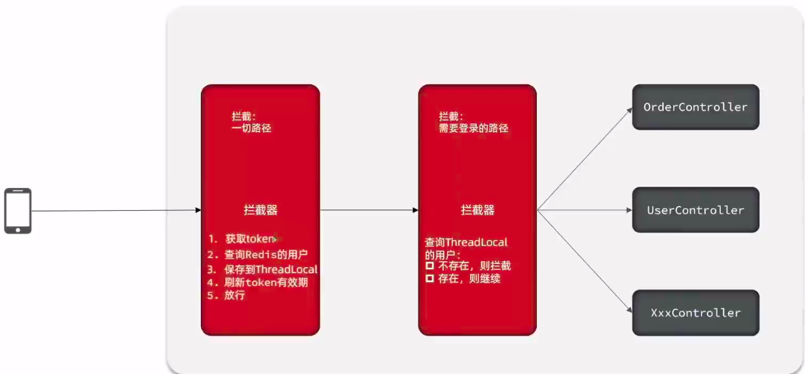
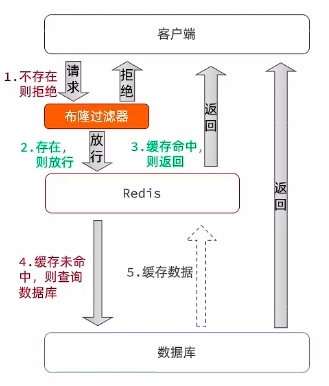
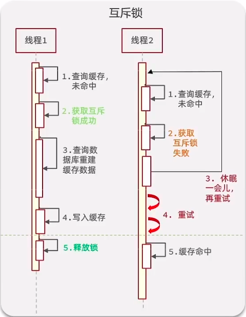
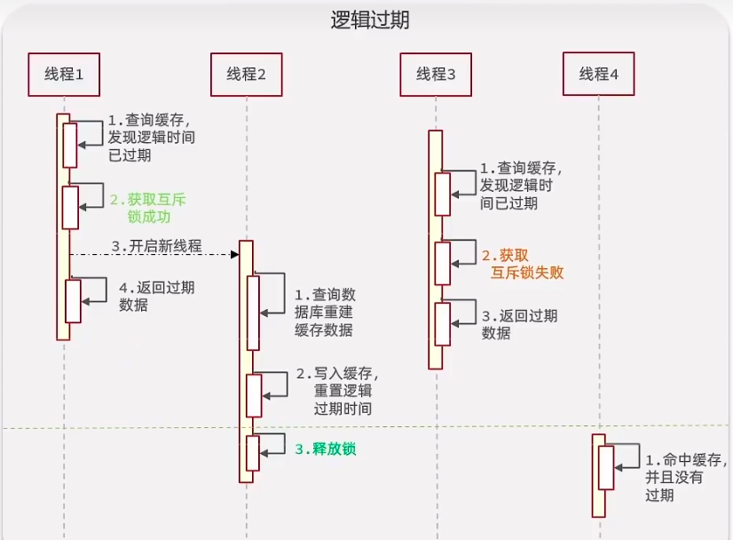
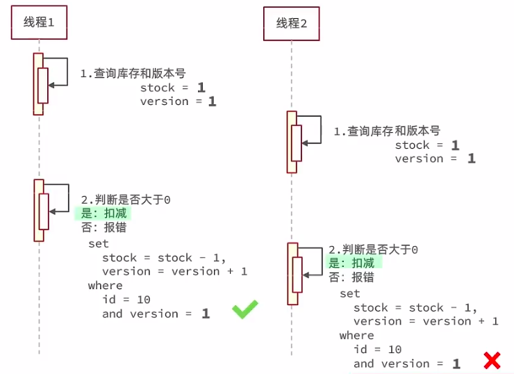
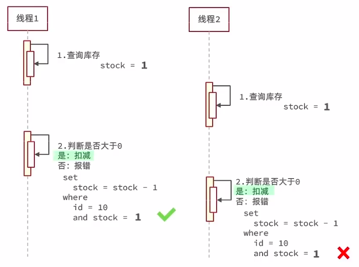
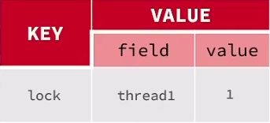
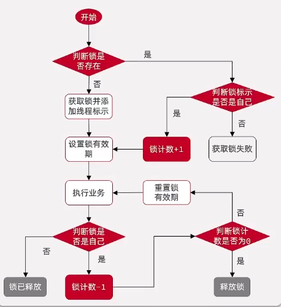

# 客户端

redis命令行客户端：

启动： `redis-cli [options] [values]`

options包括: 

- -h 主机  `redis-cli -h 127.0.0.1`  指定主机方式启动
- -p 端口 `redis-cli -p 6380`  指定端口方式启动
- -a 密码 `redis-cli -a 123456`  指定密码方式启动

# 数据结构

redis是一个key-value形式数据库，key一般就是String类型，不过value类型有很多：

- String
- Hash
- List
- Set
- SortedSet
- GEO
- BitMap
- HyperLog

官网（https://redis.io/commands/）对redis操作命令进行了分组，可以帮助学习。

同时，在redis-cli中，也可以使用`help <@group>`命令来查看不同分组的命令帮助文档。

# 通用

1. `keys` <pattern> 通配符查询符合条件的所有key  例如： `keys *`
2. `del`   删除指定的key
3. `exists` 判断key是否存在
4. `expire` 给一个key设置有效期
5. `ttl` 查看一个key的剩余有效期

# String

value数据结构是字符串，但是根据字符串格式的不同，分为3类：

- String 普通字符串
- int 整型，可自增自减
- float 浮点型，可自增自减

不管是那种类型，底层都是字节数组形式存储，只是编码方式不同。字符串最大空间不能超过512M

## 命令

- `set` 添加 k-v

- `get` 根据key获取value

- `mset` 批量添加
- `mget` 批量获取

- `incr` 自增

- `incrby` 指定步长自增 
- `incrbyfloat` 让浮点型数字按指定步长自增

- `setnx` 不存在key时新增 ( 组合命令，相当于set + nx )
- `setex` 设置指定有效期的key ( 组合命令，相当于set+ex)

# Hash

Hash类型，也叫散列，其value是一个无序字典。类似HashMap的结构

String结构value如果存储一个JSON字符串，想要修改单个字段不方便

Hash结构可以将对象中的字段单独存储，针对单个字段做CRUD

<table style="text-align: center;">
    <tr style="color: red">
        <td rowspan=2>KEY</td>
        <td colspan=2>VALUE</td>
    </tr>
    <tr style="color: green">
        <td>field</td>
        <td>value</td>
    </tr>
    <tr>
        <td rowspan=3>com:user:1</td>
    </tr>
    <tr>
        <td>name</td>
        <td>joneelmo</td>
    </tr>
    <tr>
        <td>age</td>
        <td>21</td>
    </tr>
</table>

## 命令

类比String类型的常见命令，很容易理解

- `hset` key field value
- `hget` key field
- `hmset`
- `hmget`
- `hgetall` 类似于java中的entryset
- `hkeys` 类似于java中的keyset
- `hvals`
- `hincrby`
- `hsetnx` 为key添加一个不存在的**字段**

# List

类似于java中的LinkedList, 是一个双向链表，支持正向检索和反向检索。

具备以下特征：

- **有序**
- 元素可以重复
- 插入和删除快 
- 查询速度一般

## 命令

- `lpush` key element  在列表左侧插入一个或多个元素

- `lpop` key 移除并返回列表左侧第一个元素，没有则返回nil

- `rpush` key element  在列表右侧插入一个或多个元素
- `rpop` key 移除并返回列表右侧第一个元素，没有则返回nil
- `lrange` key start stop 返回一段角标范围内的所有元素
- `blpop` & `brpop`  阻塞式pop，与lpop和rpop类似，只不过在没有元素时等待指定时间，而不是直接返回nil

# Set

与java中HashSet类似。具备以下特征：

- 无序
- 元素不可重复
- 查找快
- 支持交集、并集、差集等功能

## 命令

- `sadd` key member **向set中添加一个或多个元素**
- `srem` key member **移除set中指定元素**
- `scard` key **返回set中元素个数**

- `sismember` key member  **判断一个元素是否存在set中**

- `smembers` **获取set中所有元素**

- `sinter` key1 key2 **求key1和key2的交集**
- `sdiff` key1 key2 **求key1和key2的差集**
- `sunion` key1 key2 **求key1和key2的并集**

# SortedSet

排序的集合。类似java中的TreeSet。但是底层数据结构不一样。SortedSet中每一个元素自带一个score属性，可以基于score属性对元素排序，底层实现是一个跳表(SkipList)加hash表

SortedSet具备以下特性：

- 可排序
- 元素不重复
- 查询速度快

## 命令

- `zadd` key score member
- `zrem`  key member
- `zscore` key member 获取指定元素的score值
- `zrank` key member 获取指定元素的排名
- `zcard` 获取元素个数
- `zcount` key min max 统计score值在给定范围内的所有元素的个数
- `zincrby` key increment member
- `zrange` key min max 按照score排序后，获取指定范围内的元素
- `zrangebyscore` 按照score排序后，获取指定score范围内的元素
- `zdiff `& `zinter` &` zunion` 差集、交集、并集

> **注意**: 所有排名**默认都是升序**，如果需要**降序**则**在命令的Z后面添加REV** （reverse 反转）即可 

# Java客户端

## docker

首先配置redis.conf文件，这个可以到官网下载，网上也找的到

主要配置以下几点：

- `bind 127.0.0.1` #注释掉这部分，使redis可以外部访问
-  `daemonize no`#不使用守护进程
-  `requirepass 你的密码`#给redis设置密码
-  `appendonly yes`#redis持久化　　默认是no
-  `tcp-keepalive 300` #防止出现远程主机强迫关闭了一个现有的连接的错误 默认是300

---

docker中执行：

```bash
docker run -d --name redis -p 6379:6379 -v /home/gd/redis/redis.conf:/etc/redis/redis.conf -v /home/gd/redis/data:/data redis redis-server /etc/redis/redis.conf
```

> 命令详解：
>
> -d 容器在后台运行(detached 模式)
>
> --name 设置容器名 此处设为redis_study
>
> -p 配置端口映射，此处表示将宿主机的6380端口映射到容器的6379端口
>
> -v 用于挂载数据卷，此处我们使用自定义的redis配置，因此将宿主机上的redis.conf挂载到容器内部
>
> redis:latest 使用的镜像 此处使用redis:latest镜像
>
> redis-server /etc/redis/redis.conf  => [command] [arg...] 容器执行的命令

## 客户端对比

1. **Jedis** 

   以Redis命令作为方法名称，学习成本低，简单使用。线程不安全，多线程环境下需要配合线程池来使用

2. **Lettuce** 

   基于Netty实现，支持同步异步和响应式编程方式，是线程安全的。支持Redis哨兵模式，集群模式和管道模式

3. **Redisson** 

   基于Redis实现的分布式，可伸缩的java数据结构集合，包含了诸如Map, Queue, Lock, Semaphore, AtomicLong等强大功能

# Jedis

官方github仓库地址：https://github.com/redis/jedis

1. 引入依赖

```xml
<dependency>
    <groupId>redis.clients</groupId>
    <artifactId>jedis</artifactId>
    <version>5.0.0</version>
</dependency>
```

2. 建立连接

```java
@BeforeEach
void setUp(){
    //1. 建立连接
    jedis = new Jedis("127.0.0.1",6379);
    //2. 设置密码
    jedis.auth("123456");   //如果不需要密码可以省略
    //3. 选择库（默认总共16个库）
    jedis.select(0);
}
```

3. 操作redis

```java
@Test
void testHash(){
    jedis.hset("user:1", "name", "Jack");
    jedis.hset("user:1", "age", "21");
    jedis.hset("user:1", "sex", "male");
    Map<String, String> map = jedis.hgetAll("user:1");
    System.out.println(map);
}
```

4. 释放连接

```java
@AfterEach
void tearDown(){
    if (jedis!=null){
        jedis.close();
    }
}
```

# Jedis连接池

```java
public class JediConnectionFactory {
    private static final JedisPool jedisPool;
    static {
        // 配置连接池
        JedisPoolConfig poolConfig = new JedisPoolConfig();
        //最大连接
        poolConfig.setMaxTotal(8);
        //最大空闲连接
        poolConfig.setMaxIdle(8);
        //最小空闲连接
        poolConfig.setMinIdle(0);
        //等待时长
        poolConfig.setMaxWait(Duration.ofSeconds(1));
        //创建连接池对象
        jedisPool = new JedisPool(poolConfig,"127.0.0.1",6380, 1000, "joneelmo");
    }
    public static Jedis getJedis(){
        return jedisPool.getResource();
    }
}
```

在使用的时候只需要调用该工具类的`getJedis()`方法即可获取redis实例

# SpringDataRedis

SpringData是Spring中数据操作的模块，包含对各种数据库的集成

官网地址：https://spring.io/projects/spring-data-redis

SpringDataReids默认使用的是Lettuce的连接池.

yaml配置：

```yaml
spring:
  data:
    redis:
      host: localhost
      port: 6379
      password: redis
      lettuce:
        pool:
          max-active: 8
          max-idle: 8
          min-idle: 0
          max-wait: 100
```

装配redisTemplate：

```java
@Bean
public RedisTemplate redisTemplate(RedisConnectionFactory redisConnectionFactory){
    RedisTemplate redisTemplate = new RedisTemplate();
    redisTemplate.setConnectionFactory(redisConnectionFactory);
    redisTemplate.setKeySerializer(new StringRedisSerializer()); //key一般用string类型的序列化
    return redisTemplate;
}
```

> 对于value的序列化,一般也用string类型, 而不用 Json 类型的. 因为用string类型的序列化器会有更高的性能. 但是在存储和取数据的时候, 就需要程序员来手动序列化和反序列化了.  
>
> 实际使用过程中**干脆直接用StringRedisTemplate**. 这个redisTemplate默认是string序列化器的实现.

使用redis：

```java
@Resource
private RedisTemplate redisTemplate;
@Test
public void testRedisTemplate(){
    System.out.println(redisTemplate.opsForValue().get("name"));
}
```

# 短信登陆

## 基于session登陆

流程: 

1. 服务器根据手机号生成验证码, 调用阿里云短信服务接口发送给用户, 同时将验证码**保存到session**.

2. 客户端输入验证码, 传到服务器, 服务器进行校验比对 ( 将客户端**传过来的**验证码同**session中的**进行对比 ). 
3. 对比通过, 到数据库查询用户信息, 若存在则返回用户信息到客户端. 若不存在, 新增用户, 并返回给客户端. 最后都要**将用户信息存入session**


服务器通过处理器拦截器 ( HandlerInterceptor ), 从session获取用户信息, 并保存到ThreadLocal 

```java
public class LoginInterceptor implements HandlerInterceptor {

    @Resource
    private IUserService userService;

    @Override
    public boolean preHandle(HttpServletRequest request, HttpServletResponse response, Object handler) {
        HttpSession session = request.getSession();
        Object user = session.getAttribute("user"); //session有值,说明用户经过认证,放行
        if (user == null ){  //session没值,说明用户未登陆,拦截
            response.setStatus(401);
            return false;
        }
        UserDTO userDTO = BeanUtil.copyProperties(user, UserDTO.class);
        //保存到threadLocal
        UserHolder.saveUser(userDTO);
        return true;
    }

    @Override
    public void postHandle(HttpServletRequest request, HttpServletResponse response, Object handler, ModelAndView modelAndView) {
        UserHolder.removeUser();
    }
}
```

然后通过WebMvcConfigurer添加该拦截器

```java
@Configuration
public class MvcConfig implements WebMvcConfigurer {
    @Override
    public void addInterceptors(InterceptorRegistry registry) {
        registry.addInterceptor(new LoginInterceptor())
                .excludePathPatterns("/user/code","/user/login","/blog/hot","/shop/**","/shop-type/**","/voucher/**");
    }
}
```

## session共享问题

> 多台服务器并不共享session存储空间, 当请求切换到不同服务器时导致数据丢失

解决方案: 通过redis缓存中间件解决

## 基于redis登陆

采用这种方案, 我们就不把数据保存到session了, 而是直接保存在redis中.

 

- 服务器生成token后会返回给客户端, **客户端将token保存在sessionStorage中**. 

前端请求如何携带token呢?

- 通过**axios的拦截器**实现, 在每次请求的时候都会从sessionStorage中获取token, 将token放到请求头中 ( key一般为 ' **authorization** ', ).

 ```js
 let token = sessionStorage.getItem('token');
 axios.interceptors.request.use(
 	config => {
         if (token) config.headers['authorization'] = token
         return config
     },
     error => {
         console.log(error)
         return Promise.reject(error)
     }
 )
 ```

## 登陆拦截器优化

 

```java
@Override
public void addInterceptors(InterceptorRegistry registry) {
    registry.addInterceptor(new RefreshTokenInterceptor(stringRedisTemplate))
            .addPathPatterns("/**").order(0);

    registry.addInterceptor(new LoginInterceptor())
            .excludePathPatterns("/user/code", "/user/login", "/blog/hot", "/shop/**", "/shop-type/**", "/voucher/**").order(1);
}
```

# 缓存更新策略

|        | 内存淘汰                                                     | 超时剔除                          | 主动更新                             |
| ------ | ------------------------------------------------------------ | --------------------------------- | ------------------------------------ |
| 说明   | 利用redis内存淘汰机制, 当内存不足时自动淘汰部分数据. 下次查询时更新缓存 | 给缓存数据添加TTL, 到期后自动删除 | 编写业务逻辑, 在更新数据库时更新缓存 |
| 一致性 | 差 ( 不可控 )                                                | 一般 ( 可控 )                     | 好                                   |
| 成本   | 无维护成本 ( redis自动执行 )                                 | 低                                | 高                                   |

## 主动更新

主动更新考虑一下几个问题:

1. 更新缓存还是删除缓存?
   - 删除缓存 ( 懒汉式 )
2. 保证缓存与数据库操作的原子性 
   - 事务和分布式事务
3. 先更新数据库, 再删除缓存 ✅

# 缓存穿透

客户端请求的数据在缓存和数据库中都不存在, 这样缓存永远都不会生效, 所有请求都会打到数据库上. 

## 解决方案

- 缓存空对象

  - 简单实现, 维护方便
  - 但是会造成内存的浪费, 以及数据的短期不一致性

- 布隆过滤 ( 没有什么问题是加一层解决不了的... 😏)

  - 内存占用少
  - 由于哈希冲突, 可能存在误判

   

# 缓存雪崩

在同一时间段**大量的key失效**, 或者**redis服务宕机**, 导致大量的数据直接打到数据库上, 造成数据库的压力

## 解决方案

- 随机TTL
- redis集群
- 服务降级
- 多级缓存

# 缓存击穿

**热点key**失效, 重建缓存的过程中大量的请求直接打到数据库上. 造成数据库压力过大.

因此我们需要**避免在缓存重建的过程中**, 大量请求直接打到数据库上的这种情况

## 解决方案

- 互斥锁

  **使用redis的nx作为互斥锁**

  加锁就是设置一个setnx lock xxx , 释放锁就是del lock . 对应java客户端的api就是 

  ```java
  stringRedisTemplate.opsForValue().setIfAbsent()
  stringRedisTemplate.delete()
  ```

   

- 逻辑过期

  | key          | value                                             |
  | ------------ | ------------------------------------------------- |
  | cache:user:1 | {"name":"zhangsan","age":18,"expire":12314435345} |

   

# 全局唯一ID

生成策略:

- UUID

- Redis自增 ( 自定义一个自增的格式 ) 

  ```java
  @Component
  public class RedisIdWorker {
  
      /**
       * 起始时间戳
       */
      private final static long BEGIN_TIMESTAMP = 1640995200L;
      /**
       * 序列号的位数
       */
      private final static int COUNT_BITS = 32;
  
      @Resource
      private StringRedisTemplate stringRedisTemplate;
  
      public long nextId(String keyPrefix){
          //生成时间戳
          LocalDateTime now = LocalDateTime.now();
          long nowSecond = now.toEpochSecond(ZoneOffset.UTC);
          long timeStamp = nowSecond - BEGIN_TIMESTAMP;
          //获取当前日期,精确到天
          String date = now.format(DateTimeFormatter.ofPattern("yyyy:MM:dd"));
          //生成序列号
          long count = stringRedisTemplate.opsForValue().increment("icr:" + keyPrefix + ":" + date);
          //拼接并返回 
  //0 00000000 00000000 00000000 00000000 00000000 00000000 00000000 00000000
  // 1bit符号位  4byte时间戳  4byte序列号 ( 自定义id格式 )
          return (timeStamp << COUNT_BITS) | count;
      }
      
  }
  ```

- 雪花算法

- 数据库自增 ( 专门维护一张自增表 )

Redis自增ID策略:

- 每天一个key, 方便统计

- ID结构:  时间戳 + 序列号

# 超卖

## 乐观锁

- 版本号

   

- CAS ( compare and swap )

   

单体架构下解决超卖问题就是加锁. 我们通过悲观锁和乐观锁的方式保证线程安全问题.

```java
@Service
public class VoucherOrderServiceImpl extends ServiceImpl<VoucherOrderMapper, VoucherOrder> implements IVoucherOrderService {

    @Resource
    private ISeckillVoucherService secKillVoucherService;

    @Resource
    private RedisIdWorker redisIdWorker;

    @Override
    public Result secKillVoucher(Long voucherId) {
        //1.查询优惠券信息
        SeckillVoucher voucher = secKillVoucherService.getById(voucherId);
        //2.判断秒杀是否开始
        if (voucher.getBeginTime().isAfter(LocalDateTime.now())) {
            return Result.fail("秒杀未开始");
        }
        //3.判断是否结束
        if (voucher.getEndTime().isBefore(LocalDateTime.now())) {
            return Result.fail("秒杀已经结束");
        }
        //4.判断库存是否充足
        Integer stock = voucher.getStock();
        if (stock < 1) {
            return Result.fail("库存不足");
        }

        Long userId = UserHolder.getUser().getId();
        //使用用户id作为锁监视器
        synchronized (userId.toString().intern()) {
            /* 事务失效,先获取代理对象 (需要在启动类上暴露代理对象) */
            IVoucherOrderService proxy = (IVoucherOrderService) AopContext.currentProxy();
            return proxy.createVoucherOrder(voucherId, stock);
        }
    }

    @Transactional
    public Result createVoucherOrder(Long voucherId, Integer stock) {
        //一人一单  查询订单
        Long userId = UserHolder.getUser().getId();

        int count = lambdaQuery().eq(VoucherOrder::getUserId, userId)
                .eq(VoucherOrder::getVoucherId, voucherId)
                .count();
        //判断订单是否存在
        if (count > 0) {
            return Result.fail("不能重复购买");
        }

        //5.扣减库存
        boolean success = secKillVoucherService.lambdaUpdate()
                .set(SeckillVoucher::getStock, stock - 1)
                .eq(SeckillVoucher::getVoucherId, voucherId)
                .gt(SeckillVoucher::getStock, 0)  //cas机制
                .update();

        if (!success) {
            return Result.fail("库存不足");
        }
        //6.创建订单
        long orderId = redisIdWorker.nextId("order");
        VoucherOrder voucherOrder = VoucherOrder.builder()
                .voucherId(voucherId)
                .userId(userId)
                .id(orderId)
                .build();
        save(voucherOrder);
        //7.返回订单id
        return Result.ok(orderId);
    }
}
```

> 关于事务失效, 除了上述通过获取代理对象的方法外, 还可以注入自身来解决.  [参考](https://blog.csdn.net/hanjiaqian/article/details/120501741#t6)

但是这种方式无法解决分布式架构下的线程安全问题. 想要解决, 这里要用到分布式锁

# 分布式锁

满足分布式系统或集群模式下, **多进程可见**并且**互斥**的锁.

- 多进程可见
- 互斥
- 高可用
- 高性能
- 安全性

## 实现思路
- 利用set nx ex 获取锁，设置过期时间，保存线程标识
- 释放锁时，先判断线程标识是否一致，再删除key 

以上思路中, 判断线程标识是否一致的操作, 和删除key的操作**并不是一个原子操作**, 因此仍然有可能产生并发安全问题. 

我们可以利用lua脚本来使这两个操作成为一个原子操作

lua中操作redis的api : 

```lua
redis.call('命令名称','key','其他参数',...)
```

在redis中执行lua脚本 :  

```lua
 eval "return redis.call('set','KEYS[1]','ARGV[1]')" 1 name zhangsan
```

unlock.lua脚本内容：

```lua
if (redis.call('get',KEYS[1]) == ARGV[1]) then
    -- 释放锁
    return redis.call('del',KEYS[1])
end
return 0
```

java中调用lua脚本

```java
//定义lua脚本
private static final DefaultRedisScript<Long> UNLOCK_SCRIPT;

----------------
//初始化lua脚本,读取classpath中 unlock.lua的内容
static {
    UNLOCK_SCRIPT = new DefaultRedisScript<>(); 
    UNLOCK_SCRIPT.setLocation(new ClassPathResource("unlock.lua"));  //读取lua脚本
    UNLOCK_SCRIPT.setResultType(Long.class);  //设置返回值
}

----------------
    
@Override
public void unlock() {
    //调用lua脚本
    stringRedisTemplate.execute(UNLOCK_SCRIPT, Collections.singletonList(KEY_PREFIX+name), ID_PREFIX + Thread.currentThread().getId())
}
```


特性：
- 利用set nx满足互斥性
- 利用set ex实现过期释放 ( 出现故障依然能释放锁，避免死锁，提高安全性 )
- 利用redis集群保证高可用性和高并发性

# Redisson

[redisson](https://github.com/redisson/redisson#redisson---easy-redis-java-clientwith-features-of-an-in-memory-data-grid)是一个在redis基础上实现的java分布式工具包，支持锁、同步、分布式、集群、看门狗等

```xml
<dependency>
    <groupId>org.redisson</groupId>
    <artifactId>redisson</artifactId>
    <version>3.24.3</version>
</dependency>
```
## 配置

```java
@Configuration
public class RedisConfig {
    @Bean
    public RedissonClient redissonClient() {
        Config config = new Config();
        config.useSingleServer().setAddress("redis://127.0.0.1:6379").setPassword("redis");
        
        return Redisson.create(config);
    }
}
```
## 使用

- redissonClient.getLock() 获取锁对象
- tryLock() 获取锁
- unLock() 释放锁

```java
//上锁：
Rlock lock = redissonClient.getLock("lockName");
boolean isLock = lock.tryLock(1,10,TimeUnit.SECONDS);
if(isLock){
    try{
        //...执行业务    
    }final {
        //释放锁
        lock.unlock();
    }
}
```

## 可重入原理

我们之前自定义的redis分布式锁, 是通过redis 的nx特性实现的. 他的key是 前缀 + 用户id, value是 UUID + 线程id. 这样的锁是不可重入的.

redisson可重入锁的原理是当同一个线程去再次尝试获取锁的时候, 会判断该线程是否和锁中存储的线程是同一线程, 如果是同一线程, 就允许获取锁.

所以redisson可重入锁 在redis中的数据结构是一个hash结构. value中存储了 **线程标识** 和 其维护的一个**计数器**, 每当线程tryLock该计数器 +1, unLock该计数器 -1. 直到计数器为0, redisson才会释放最外层的锁.

数据结构:

 

执行流程图:

 

如此复杂的流程, java代码必不能保证其原子性. 因此redisson可重入锁底层也是通过lua脚本来实现的.

## 总结

1. 不可重入redis分布式锁
   - 原理: 利用setnx的互斥性. 利用ex避免死锁. 释放锁时判断线程标识防止误删
   - 缺陷: 不可重入, 无法重试, 锁超时失效

2. 可重入redis分布式锁
   - 原理: 利用hash, 记录线程标识和重入次数. 利用watchdog延续锁的过期时间. 利用信号量和pubsub ( 发布订阅 ) 控制锁的重试等待
   - 缺点: redis宕机引起锁失效问题

3. redisson的multiLock
   - 原理: 多个独立的redis节点, 必须在所有节点都获取锁, 才算获取锁成功
   - 缺点:  运维成本高, 实现复杂

# 消息队列

redis提供三种不同的方式实现消息队列

- list结构 
  - 基于list结构模拟消息队列
- pubsub 
  - 基本的点对点消息模型
- stream 
  - 比较完善的消息队列模型

## list

左进右出, 或者右进左出

- **lpush**和**rpop** 

- **rpush**和**lpop**

当队列中没有消息时会返回nil . 并像jvm的阻塞队列 ( `BlockingQueue` ) 那样等待消息. 想要实现jvm阻塞队列的效果, 可以使用 **brpop** 或 **blpop**

优点:

1. 利用redis存储, 不受限于jvm的内存上限
2. 基于redis持久化机制, 安全保障
3. 满足消息有序性

缺点:

1. 无法避免消息丢失
2. 只支持单消费者

## publish&subscribe

- **subscribe** channel ... 订阅频道
- **publish** channel message 向频道发布消息
- **psubscribe** pattern 订阅与pattern格式匹配的频道

优点:

1. 采用发布订阅模型, 支持多生产, 多消费

缺点:

1. 不支持消息持久化
2. 无法避免消息丢失
3. 消息堆积有上限, 超出时数据丢失

## stream

- **xadd**  发布消息
- **xread**  读取消息

读取最新消息 ( `$` ) :

```shell
xread count 1 streams s1 $
```

## 消费者组

将多个消费者划分到同一个组中, 监听同一个队列.

- **xgroup** CREATE key group id|& [MKSTREAM]

- **xreadgroup** 

# 关注推送

关注推送也叫**feed流**, 为用户提供沉浸式的体验, 通过无限下拉获取最新信息

feed流产品两种常见模式:

- TimeLine
  - 拉模式, 推模式, 推拉结合模式
- 智能排序

[RSS](https://zh.wikipedia.org/wiki/RSS)

# 滚动分页

使用redis的sortedset实现. 

- 基于score值的排序查询 : `ZRANGEBYSCORE`

每次查询的时候都记住最小/最大score值, 然后下次查询从该score值开始查询, 就可以保证不重复的获取值

前端传过来offset ( 偏移量 ) 和lastId ( 当前时间戳 )的值, 

```java
public Result queryBlogOfFollow(Long max, Integer offset) {
    //1.获取当前用户
    Long userId = UserHolder.getUser().getId();
    //2.查询收件箱
    String key = RedisConstants.FEED_KEY + userId;
    Set<ZSetOperations.TypedTuple<String>> typedTuples = stringRedisTemplate.opsForZSet()
            .reverseRangeByScoreWithScores(key, 0, max, offset, 2);
    //非空判断
    if (typedTuples == null || typedTuples.isEmpty()) {
        return Result.ok();
    }
    //3.解析数据 blogId, minTime(时间戳), offset(偏移量)
    List<Long> ids = new ArrayList<>(typedTuples.size());
    long minTime = 0;
    int os = 1;
    for (ZSetOperations.TypedTuple<String> typedTuple : typedTuples) {
        //获取id
        ids.add(Long.valueOf(typedTuple.getValue()));
        //获取分数
        long time = typedTuple.getScore().longValue();
        if (time == minTime) {
            os++;  //通过offset来跳过相同分数的数据,避免出现重复数据
        } else {
            minTime = time;
            os = 1;
        }
    }
    //4.根据id查询blog数据
    String idJoin = StrUtil.join(",", ids);
    List<Blog> list = lambdaQuery().in(Blog::getId, ids).last("order by field(id," + idJoin + ")").list();
    //5.封装返回
    ScrollResult scrollResult = ScrollResult.builder()
            .list(list)
            .minTime(minTime)
            .offset(os)
            .build();
    return Result.ok(scrollResult);
}
```

# 用户签到

使用 BitMap 实现

Redis中利用string类型数据结构实现bitmap, 因此最大上限是512M, 转换为bit是2^32个bit位

- SETBIT 
- GETBIT
- BITCOUNT
- BITFIELD
- BITOP
- BITPOS

bitmap允许你在任意一个位置上将bit值置0或置1. 因此用来记录用户的签到情况是再合适不过的了.

# HyperLogLog

- UV 
  - 全称Unique Visitor , 也叫独立访客量, 是指通过互联网访问和浏览这个网页的自然人. 1天内, 同一个用户多次访问该网站, 只记录一次.
- PV
  - 全称Page View , 也叫页面访问量或点击量, 用户每访问网站里的一个页面, 记录一次PV, 用户多次打开页面, 则记录多次PV. 往往用来衡量网站的流量.

HLL是从Loglog算法派生出的概率算法, 用于确定非常大的集合的基数, 而不需要存储所有值.

Redis中的HLL是基于string结构实现的, 单个HLL的内存永远小于16KB, 内存占用非常低, 但是结果会有一定的误差. 

## 实现UV统计

HyperLogLog天生就适合用来做UV统计. 

插入数据:

```java
stringRedisTemplate.opsForHyperLogLog().add("hll2", values);
```

统计数据:

```java
stringRedisTemplate.opsForHyperLogLog().size("hll2");
```


