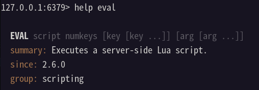

# Redis笔记

## install redis from source

1. 下载源码，解压

   ```shell
   wget https://download.redis.io/redis-stable.tar.gz
   tar -zxf redis-stable.tar.gz
   ```

2. 编译并安装  ( 指定安装目录 ) 包含redis-cli, redis-server等指令

   ```shell
   make PREFIX=/usr/local/redis install
   ```

3. 启动redis服务

   进入redis安装目录 bin 下

   根据指定redis.conf文件启动redis服务

   ```shell
   ./redis-server ../redis.conf
   ```

4. 操作redis客户端

   ```shell
   ./redis-cli -h 127.0.0.1 -p 6379 -a 1234
   ```

   > -h: host 主机地址
   >
   > -p: port 端口
   >
   > -a: 密码

## Redis数据结构

redis是一个key-value形式数据库，key一般就是String类型，不过value类型有很多：

- String
- Hash
- List
- Set
- SortedSet
- GEO
- BitMap
- HyperLog

官网（https://redis.io/commands/）对redis操作命令进行了分组，可以帮助学习。

同时，在redis-cli中，也可以使用`help <@group>`命令来查看不同分组的命令帮助文档。

## Redis通用命令

1. `keys` <pattern> 通配符查询符合条件的所有key  例如： `keys *`
2. `del`   删除指定的key
3. `exists` 判断key是否存在
4. `expire` 给一个key设置有效期
5. `ttl` 查看一个key的剩余有效期

## String类型

### 简介

value数据结构是字符串，但是根据字符串格式的不同，分为3类：

- String 普通字符串
- int 整型，可自增自减
- float 浮点型，可自增自减

不管是那种类型，底层都是字节数组形式存储，只是编码方式不同。字符串最大空间不能超过512M

### 常见命令

- `set` 添加 k-v

- `get` 根据key获取value

- `mset` 批量添加
- `mget` 批量获取

- `incr` 自增

- `incrby` 指定步长自增 
- `incrbyfloat` 让浮点型数字按指定步长自增

- `setnx` 不存在key时新增 ( 组合命令，相当于set + nx )
- `setex` 设置指定有效期的key ( 组合命令，相当于set+ex)

## Hash类型

### 简介

Hash类型，也叫散列，其value是一个无序字典。类似HashMap的结构

String结构value如果存储一个JSON字符串，想要修改单个字段不方便

Hash结构可以将对象中的字段单独存储，针对单个字段做CRUD

<table style="text-align: center;">
    <tr style="color: red">
        <td rowspan=2>KEY</td>
        <td colspan=2>VALUE</td>
    </tr>
    <tr style="color: green">
        <td>field</td>
        <td>value</td>
    </tr>
    <tr>
        <td rowspan=3>com:user:1</td>
    </tr>
    <tr>
        <td>name</td>
        <td>joneelmo</td>
    </tr>
    <tr>
        <td>age</td>
        <td>21</td>
    </tr>
</table>

### 常见命令

类比String类型的常见命令，很容易理解

- `hset` key field value
- `hget` key field
- `hmset`
- `hmget`
- `hgetall` 类似于java中的entryset
- `hkeys` 类似于java中的keyset
- `hvals`
- `hincrby`
- `hsetnx` 为key添加一个不存在的**字段**

## List类型

### 简介

类似于java中的LinkedList, 是一个双向链表，支持正向检索和反向检索。

具备以下特征：

- **有序**
- 元素可以重复
- 插入和删除快 
- 查询速度一般

### 常用命令

- `lpush` key element  在列表左侧插入一个或多个元素

- `lpop` key 移除并返回列表左侧第一个元素，没有则返回nil

- `rpush` key element  在列表右侧插入一个或多个元素
- `rpop` key 移除并返回列表右侧第一个元素，没有则返回nil
- `lrange` key start stop 返回一段角标范围内的所有元素
- `blpop` & `brpop`  阻塞式pop，与lpop和rpop类似，只不过在没有元素时等待指定时间，而不是直接返回n il

## Set类型

### 简介

与java中HashSet类似。具备以下特征：

- 无序
- 元素不可重复
- 查找快
- 支持交集、并集、差集等功能

### 常见命令

- `sadd` key member **向set中添加一个或多个元素**
- `srem` key member **移除set中指定元素**
- `scard` key **返回set中元素个数**

- `sismember` key member  **判断一个元素是否存在set中**

- `smembers` **获取set中所有元素**

- `sinter` key1 key2 **求key1和key2的交集**
- `sdiff` key1 key2 **求key1和key2的差集**
- `sunion` key1 key2 **求key1和key2的并集**

## SortedSet类型

### 简介

排序的集合。类似java中的TreeSet。但是底层数据结构不一样。SortedSet中每一个元素自带一个score属性，可以基于score属性对元素排序，底层实现是一个跳表(SkipList)加hash表

SortedSet具备以下特性：

- 可排序
- 元素不重复
- 查询速度快

### 常用命令

- `zadd` key score member
- `zrem`  key member
- `zscore` key member 获取指定元素的score值
- `zrank` key member 获取指定元素的排名
- `zcard` 获取元素个数
- `zcount` key min max 统计score值在给定范围内的所有元素的个数
- `zincrby` key increment member
- `zrange` key min max 按照score排序后，获取指定范围内的元素
- `zrangebyscore` 按照score排序后，获取指定score范围内的元素
- `zdiff `& `zinter` &` zunion` 差集、交集、并集

> **注意**: 所有排名**默认都是升序**，如果需要**降序**则**在命令的Z后面添加REV** （reverse 反转）即可 

## Redis的Java客户端

### Docker配置Redis容器

首先配置redis.conf文件，这个可以到官网下载，网上也找的到

主要配置以下几点：

- `bind 127.0.0.1` #注释掉这部分，使redis可以外部访问
-  `daemonize no`#不使用守护进程
-  `requirepass 你的密码`#给redis设置密码
-  `appendonly yes`#redis持久化　　默认是no
-  `tcp-keepalive 300` #防止出现远程主机强迫关闭了一个现有的连接的错误 默认是300

---

docker中执行：

```bash
docker run -d --name redis -p 6379:6379 -v /home/gd/redis/redis.conf:/etc/redis/redis.conf -v /home/gd/redis/data:/data redis redis-server /etc/redis/redis.conf
```

> 命令详解：
>
> -d 容器在后台运行(detached 模式)
>
> --name 设置容器名 此处设为redis_study
>
> -p 配置端口映射，此处表示将宿主机的6380端口映射到容器的6379端口
>
> -v 用于挂载数据卷，此处我们使用自定义的redis配置，因此将宿主机上的redis.conf挂载到容器内部
>
> redis:latest 使用的镜像 此处使用redis:latest镜像
>
> redis-server /etc/redis/redis.conf  => [command] [arg...] 容器执行的命令

### 客户端对比

1. **Jedis** 

   以Redis命令作为方法名称，学习成本低，简单使用。线程不安全，多线程环境下需要配合线程池来使用

2. **Lettuce** 

   基于Netty实现，支持同步异步和响应式编程方式，是线程安全的。支持Redis哨兵模式，集群模式和管道模式

3. **Redisson** 

   基于Redis实现的分布式，可伸缩的java数据结构集合，包含了诸如Map, Queue, Lock, Semaphore, AtomicLong等强大功能

## Jedis

官方github仓库地址：https://github.com/redis/jedis

1. 引入依赖

```xml
<dependency>
    <groupId>redis.clients</groupId>
    <artifactId>jedis</artifactId>
    <version>5.0.0</version>
</dependency>
```

2. 建立连接

```java
@BeforeEach
void setUp(){
    //1. 建立连接
    jedis = new Jedis("127.0.0.1",6379);
    //2. 设置密码
    jedis.auth("123456");   //如果不需要密码可以省略
    //3. 选择库（默认总共16个库）
    jedis.select(0);
}
```

3. 操作redis

```java
@Test
void testHash(){
    jedis.hset("user:1", "name", "Jack");
    jedis.hset("user:1", "age", "21");
    jedis.hset("user:1", "sex", "male");
    Map<String, String> map = jedis.hgetAll("user:1");
    System.out.println(map);
}
```

4. 释放连接

```java
@AfterEach
void tearDown(){
    if (jedis!=null){
        jedis.close();
    }
}
```

## Jedis连接池

```java
public class JediConnectionFactory {
    private static final JedisPool jedisPool;
    static {
        // 配置连接池
        JedisPoolConfig poolConfig = new JedisPoolConfig();
        //最大连接
        poolConfig.setMaxTotal(8);
        //最大空闲连接
        poolConfig.setMaxIdle(8);
        //最小空闲连接
        poolConfig.setMinIdle(0);
        //等待时长
        poolConfig.setMaxWait(Duration.ofSeconds(1));
        //创建连接池对象
        jedisPool = new JedisPool(poolConfig,"127.0.0.1",6380, 1000, "joneelmo");
    }
    public static Jedis getJedis(){
        return jedisPool.getResource();
    }
}
```

在使用的时候只需要调用该工具类的`getJedis()`方法即可获取redis实例

## SpringDataRedis

SpringData是Spring中数据操作的模块，包含对各种数据库的集成

官网地址：https://spring.io/projects/spring-data-redis

yaml配置：

```yaml
redis:
    port: 6379
    password: joneelmo
    database: 0
    host: 127.0.0.1
```

装配redisTemplate：

```java
@Configuration
@Slf4j
public class RedisConfiguration {
    @Bean
    public RedisTemplate redisTemplate(RedisConnectionFactory factory){
        RedisTemplate redisTemplate = new RedisTemplate();
        log.info("开始创建redisTemplate对象...");
        //设置redis的连接工厂对象
        redisTemplate.setConnectionFactory(factory);
        //设置redis中的序列化器
        redisTemplate.setKeySerializer(new StringRedisSerializer());
        /*redisTemplate.setValueSerializer(new StringRedisSerializer());
        redisTemplate.setHashKeySerializer(new StringRedisSerializer());
        redisTemplate.setHashValueSerializer(new StringRedisSerializer());*/
        return redisTemplate;
    }
}
```

使用redis：

```java
@SpringBootTest
public class SpringDataRedisTest {
    @Autowired
    private RedisTemplate redisTemplate;

    @Test
    public void testRedisTemplate(){
//        System.out.println(redisTemplate);
        System.out.println(redisTemplate.opsForValue().get("name"));
    }
}
```


---

## 超卖问题-分布式锁

超卖问题指的是在高并发情况下，多个请求同时对某一件商品进行购买，导致商品数量出现负数的情况，这种情况在生产中是不允许出现的。

解决超卖问题思路：
1. 在单机环境下，可以是用锁来解决（乐观锁CAS是更好的解决办法）
2. 在分布式环境下，可以利用redis的分布式锁来解决

### 基于redis的分布式锁的实现思路：
- 利用set nx ex 获取锁，设置过期时间，保存线程标识
- 释放锁时，先判断线程标识是否一致，再删除key （使用lua脚本来保证原子性，解决因为超时释放锁导致的一个线程释放了另一个线程的锁的问题）

redis执行脚本的命令：



`eval "return redis.call('set','KEYS[1]','ARGV[1]')" 1 name zhangsan `

unlock.lua脚本内容：

```lua
-- lua释放锁的脚本（保证比较和释放操作的原子性）
-- 比较线程标识与锁中的标识是否一致
-- 1.从redis中获取锁的标识
-- 2.与传进来的参数比较，如果相等，说明这个锁是我自己的锁，就进行释放。否则不允许释放其他线程的锁。
if (redis.call('get',KEYS[1]) == ARGV[1]) then
    -- 释放锁
    return redis.call('del',KEYS[1])
end
return 0

```

java中调用lua脚本

```java
private static final DefaultRedisScript<Long> UNLOCK_SCRIPT;
----------------
static {
    UNLOCK_SCRIPT = new DefaultRedisScript<>(); 
    UNLOCK_SCRIPT.setLocation(new ClassPathResource("unlock.lua"));  //读取lua脚本
    UNLOCK_SCRIPT.setResultType(Long.class);  //设置返回值
}
----------------
@Override
public void unlock() {
    //调用lua脚本
    stringRedisTemplate.execute(UNLOCK_SCRIPT, Collections.singletonList(KEY_PREFIX+name), ID_PREFIX + Thread.currentThread().getId())
}
```


特性：
- 利用set nx满足互斥性
- 利用set ex实现过期释放（出现故障依然能释放锁，避免死锁，提高安全性）
- 利用redis集群保证高可用性和高并发性

## Redisson
redisson是一个在redis基础上实现的java分布式工具包，支持锁、同步、分布式、集群、看门狗等

### 引入依赖
```xml
<!-- https://mvnrepository.com/artifact/org.redisson/redisson -->
<dependency>
    <groupId>org.redisson</groupId>
    <artifactId>redisson</artifactId>
    <version>3.24.3</version>
</dependency>
```
### 配置Redisson客户端

```java
import org.redisson.Redisson;
import org.redisson.config.Config;
import org.springframework.context.annotation.Bean;

@Configuration
public class RedisConfig {
    @Bean
    public RedissonClient redissonClient() {
        Config config = new Config();
        config.useSingleServer().setAddress("redis://....:6379").setPassword("...");
        return Redisson.create(config);
    }
}
```
### 使用Redisson

```java
//上锁：
Rlock lock = redissonClient.getLock("lockName");
boolean isLock = lock.tryLock(1,10,TimeUnit.SECONDS);
if(isLock){
    try{
        //...执行业务    
    }final {
        //释放锁
        lock.unlock();
    }
}
```


---

