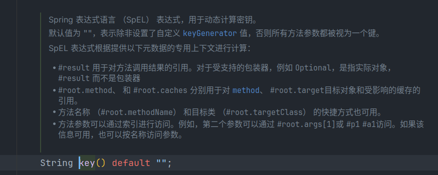
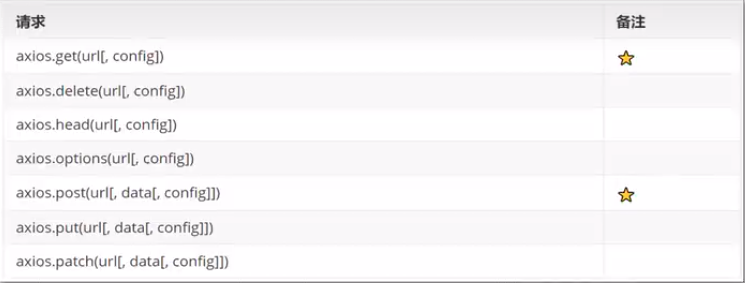

[TOC]

# nginx

示例代码：

```yaml
# 负载均衡 策略：轮询(默认)、权重、ip哈希、url哈希等
upstream webservers{
  server 192.168.1.146:8080 weight=90 ;
  #server 127.0.0.1:8088 weight=10 ;
}
server {
    listen       80;
    server_name  localhost;

    # 反向代理,处理管理端发送的请求
    location /api/ {
        proxy_pass   http://localhost:8080/admin/;
        #proxy_pass   http://webservers/admin/;
    }
}
```

# 数据加密

登录过程的密码不能明文传输，必须要进行加密以确保安全性。数据库最后存入的数据得是加密数据。

本项目采用`MD5加密`，md5是一种单向加密技术，也就是说我们只能将明文加密为密文，而不能将密文解密为明文。因此**验证方式**就是在服务端接收到密码后进行一次md5加密，然后和数据库中的密码进行比对。

这里我们使用Spring提供的工具类`DigestUtils`：

```java
password = DigestUtils.md5DigestAsHex(password.getBytes());
```

# springboot配置文件驼峰映射

springboot支持配置文件的驼峰映射。

配置文件：

```yaml
sky:
  jwt:
    admin-secret-key: 123
```

类：

```java
@ConfigurationProperties(prefix = "sky.jwt")
public class JwtProperties {
    private String adminSecretKey;
}
```

# 异常处理器

统一处理异常，增强程序鲁棒性：

使用 `@ExceptionHandler` 注解声明一个异常处理器, 在其中捕获异常并处理

```java
@ExceptionHandler
public Result exceptionHandler(SQLIntegrityConstraintViolationException e){
    /*Duplicate entry 'ZHANGSAN' for key 'employee.idx_username'*/
    String msg = e.getMessage();
    String result = null;
    if (msg.contains("Duplicate entry")){
        String[] split = msg.split(" ");
        String userName = split[2];
        result = userName+ MessageConstant.ALREADY_EXISTS;
    }else {
        return Result.error(MessageConstant.UNKNOWN_ERROR);
    }
    return Result.error(result);
}
```

# ThreadLocal

[参考资料](https://cloud.tencent.com/developer/article/1600714)

ThreadLocal作用就是在线程的生命周期内为线程提供共享变量

ThreadLocal并不是一个Thread,而是Thread的局部变量。

ThreadLocal为每个线程提供单独一份存储空间，具有线程隔离的效果。只有在线程内才能获取到对应的值，线程外则不能访问。

ThreadLocal常用方法：
- `public void set(T value)` 设置当前线程的线程局部变量值
- `public T get()` 获取当前线程局部变量
- `public void remove()` 移除当前线程局部变量

一般使用时我们会将ThreadLocal封装一个工具类
```java
public class BaseContext {
    public static ThreadLocal<Long> threadLocal = new ThreadLocal<>();
    
    public static void setCurrentId(Long id) {
        threadLocal.set(id);
    }
    
    public static Long getCurrentId() {
        return threadLocal.get();
    }
    
    public static void removeCurrentId() {
        threadLocal.remove();
    }
}
```
在拦截器进行身份校验时会从token中取出用户id,此时我们就可以将其放入ThreadLocal中。
```java
//...
    Claims claims = JwtUtil.parseJWT(jwtProperties.getAdminSecretKey(), token);
    Long empId = Long.valueOf(claims.get(JwtClaimsConstant.EMP_ID).toString());
    BaseContext.setCurrentId(empId);  //将id放入ThreadLocal中
    log.info("当前员工id：", empId);
//...
```
在其他地方需要使用时，就可以直接获取
```java
//...
    employee.setCreateUser(BaseContext.getCurrentId());  //使用ThreadLocal中的值
    employee.setUpdateUser(BaseContext.getCurrentId());
//...
```

为了避免内存泄漏，ThreadLocal在使用完毕后，需要调用remove方法，将当前线程的ThreadLocalMap中的值清除。

我们可以在拦截器中preHandle方法设置ThreadLocal的值，在afterCompletion方法中调用remove清除ThreadLocal的值。

## 父子通信

ThreadLocal本身是只能在同一个线程中共享. 但是他有一个实现类 `InheritableThreadLocal`, 译为 ' 可继承的ThreadLocal ' . 他支持父子线程之间共享数据. 

```java
// 使用InheritableThreadLocal作为实现
private static final ThreadLocal<Person> THREAD_LOCAL = new InheritableThreadLocal<>();
```

# 分页查询

这里用到的是mybatis框架提供的分页查询插件：PageHelper

PageHelper底层也是基于ThreadLocal实现的。

使用方法：

```java
@Override
public PageResult pageQuery(EmployeePageQueryDTO dto) {
    //分页查询
    PageHelper.startPage(dto.getPage(),dto.getPageSize()); //启用分页
    Page<Employee> page = employeeMapper.pageQuery(dto);  //调用mapper，查询数据得到结果
    return PageResult.builder()
            .total(page.getTotal())
            .records(page.getResult())
            .build();   //封装返回结果
}
```
```java
<select id="pageQuery" resultType="employee"
        parameterType="com.sky.dto.EmployeePageQueryDTO">
    select * from employee
    <where>
        <if test="name != null and name != '' ">
            and name like concat('%',#{name},'%')
        </if>
    order by create_time desc
    </where>
</select>
```

# 修正时间格式
解决方式：
- 在属性上加入注解，对日期进行格式化
  ```java
  @JsonFormat(pattern = "yyyy-MM-dd HH:mm:ss")
  private LocalDateTime createTime;
  ```
- 在WebMvcConfiguration中扩展SpringMVC的消息转换器，统一对日期类型进行格式化处理
    ```java
  @Configuration
    @Slf4j
    public class WebMvcConfiguration extends WebMvcConfigurationSupport {
        //...
        /**
         * 扩展springmvc的消息转换器
         * @param converters
         */
        @Override
        protected void extendMessageConverters(List<HttpMessageConverter<?>> converters) {
            log.info("扩展消息转换器...");
            //创建一个消息转换器对象
            MappingJackson2HttpMessageConverter converter = new MappingJackson2HttpMessageConverter();
            //为消息转换器设置一个对象转换器，将java对象序列化为json数据
            converter.setObjectMapper(new JacksonObjectMapper());
            //将自定义的消息转换器加入容器，这样springmvc框架就可以使用了
            converters.add(0,converter); //index=0 这样可以让自定义消息转换器优先生效
        }
    }
  ```
  
    ```java
    /**
     * 对象映射器:基于jackson将Java对象转为json，或者将json转为Java对象
     * 将JSON解析为Java对象的过程称为 [从JSON反序列化Java对象]
     * 从Java对象生成JSON的过程称为 [序列化Java对象到JSON]
     */
    public class JacksonObjectMapper extends ObjectMapper {
    
        public static final String DEFAULT_DATE_FORMAT = "yyyy-MM-dd";
        //public static final String DEFAULT_DATE_TIME_FORMAT = "yyyy-MM-dd HH:mm:ss";
        public static final String DEFAULT_DATE_TIME_FORMAT = "yyyy-MM-dd HH:mm";
        public static final String DEFAULT_TIME_FORMAT = "HH:mm:ss";
    
        public JacksonObjectMapper() {
            super();
            //收到未知属性时不报异常
            this.configure(FAIL_ON_UNKNOWN_PROPERTIES, false);
    
            //反序列化时，属性不存在的兼容处理
            this.getDeserializationConfig().withoutFeatures(DeserializationFeature.FAIL_ON_UNKNOWN_PROPERTIES);
    
            SimpleModule simpleModule = new SimpleModule()
                    .addDeserializer(LocalDateTime.class, new LocalDateTimeDeserializer(DateTimeFormatter.ofPattern(DEFAULT_DATE_TIME_FORMAT)))
                    .addDeserializer(LocalDate.class, new LocalDateDeserializer(DateTimeFormatter.ofPattern(DEFAULT_DATE_FORMAT)))
                    .addDeserializer(LocalTime.class, new LocalTimeDeserializer(DateTimeFormatter.ofPattern(DEFAULT_TIME_FORMAT)))
                    .addSerializer(LocalDateTime.class, new LocalDateTimeSerializer(DateTimeFormatter.ofPattern(DEFAULT_DATE_TIME_FORMAT)))
                    .addSerializer(LocalDate.class, new LocalDateSerializer(DateTimeFormatter.ofPattern(DEFAULT_DATE_FORMAT)))
                    .addSerializer(LocalTime.class, new LocalTimeSerializer(DateTimeFormatter.ofPattern(DEFAULT_TIME_FORMAT)));
    
            //注册功能模块 例如，可以添加自定义序列化器和反序列化器
            this.registerModule(simpleModule);
        }
    }
    ```
  


# 公共字段赋值(AOP实现)

业务中的一些**公共字段**经常需要进行填充，如果每次都用调用set方法，会显得代码非常冗余。因此这里采用AOP方式解决：

- 自定义注解AutoFill，用于标识需要进行公共字段填充的方法
- 自定义切面类AutoFillAspect, 统一拦截加入了AutoFill注解的方法，通过反射进行字段填充

- 在Mapper的方法上加入AutoFill注解

注解类：

```java
/**
 * @Classname AutoFill
 * @Description 自定义注解，用来标识某个方法需要进行公共字段自动填充处理
 * @Date 2024/1/29 下午2:57
 * @Created by joneelmo
 */
@Target(ElementType.METHOD)
@Retention(RetentionPolicy.RUNTIME)
public @interface AutoFill {
    /*指定操作类型：update || insert*/
    OperationType value();
}
```

切面类：

```java
/**
 * @Classname AutoFillAspect
 * @Description 自定义切面 实现公共字段自动填充逻辑
 * @Date 2024/1/29 下午3:00
 * @Created by joneelmo
 */
@Aspect
@Component
@Slf4j
public class AutoFillAspect {
    /**
     * 切入点 ： 对哪些类的哪些方法进行拦截
     */
    @Pointcut("execution(* com.sky.mapper.*.*(..)) && @annotation(com.sky.annotation.AutoFill)")
    public void autoFillPointCut() {}

    /**
     * 前置通知 为公共字段赋值
     */
    @Before("autoFillPointCut()")
    public void autoFill(JoinPoint joinPoint) {
        log.info("开始进行公共字段的自动填充...");
        /*获取拦截到的方法的数据库操作类型*/
        MethodSignature signature = (MethodSignature) joinPoint.getSignature();
        AutoFill autoFill = signature.getMethod().getAnnotation(AutoFill.class);
        OperationType type = autoFill.value();  //拿到了操作类型
        /*获取方法的参数（实体对象）*/
        Object[] args = joinPoint.getArgs();
        /* 防止空指针异常 */
        if (args == null || args.length == 0) {
            return;
        }
        Object entity = args[0];
        /*准备赋值的数据*/
        LocalDateTime time = LocalDateTime.now();
        Long id = BaseContext.getCurrentId();
        /*根据不同的操作类型对属性赋值*/
        if (type == OperationType.INSERT) {
            /*为四个公共字段赋值*/
            try {
                Method setCreateTime = entity.getClass().getDeclaredMethod("setCreateTime", LocalDateTime.class);
                Method setCreateUser = entity.getClass().getDeclaredMethod("setCreateUser", Long.class);
                Method setUpdateTime = entity.getClass().getDeclaredMethod("setUpdateTime", LocalDateTime.class);
                Method setUpdateUser = entity.getClass().getDeclaredMethod("setUpdateUser", Long.class);
                setCreateTime.invoke(entity, time);
                setCreateUser.invoke(entity, id);
                setUpdateTime.invoke(entity, time);
                setUpdateUser.invoke(entity, id);
            } catch (Exception e) {
                e.printStackTrace();
            }
        } else if (type == OperationType.UPDATE) {
            /*为两个字段赋值即可*/
            try {
                Method setUpdateTime = entity.getClass().getDeclaredMethod("setUpdateTime", LocalDateTime.class);
                Method setUpdateUser = entity.getClass().getDeclaredMethod("setUpdateUser", Long.class);
                setUpdateTime.invoke(entity, time);
                setUpdateUser.invoke(entity, id);
            } catch (Exception e) {
                e.printStackTrace();
            }
        }
    }

}
```

```java
//在需要进行自动填充的方法上加上自定义注解，我们的切面类逻辑就能生效

@AutoFill(OperationType.UPDATE)
void update(Employee employee);
```

# AliOSS实现上传图片

首先启用AliOSS服务，创建oss bucket, 设置bucket acl为公共读写。

配置文件中配置相关的密钥：

```yaml
  alioss:
    access-key-id: L****M
    access-key-secret: B****E
    bucket-name: s****o
    endpoint: o****m
```

将配置读取到类中：

```java
@Component
@ConfigurationProperties(prefix = "sky.alioss")
@Data
public class AliOssProperties {

    private String endpoint;
    private String accessKeyId;
    private String accessKeySecret;
    private String bucketName;

}
```

创建alioss工具类：

```java
@Data
@AllArgsConstructor
@Slf4j
public class AliOssUtil {

    private String endpoint;
    private String accessKeyId;
    private String accessKeySecret;
    private String bucketName;

    /**
     * 文件上传
     *
     * @param bytes
     * @param objectName
     * @return
     */
    public String upload(byte[] bytes, String objectName) {

        // 创建OSSClient实例。
        OSS ossClient = new OSSClientBuilder().build(endpoint, accessKeyId, accessKeySecret);

        try {
            // 创建PutObject请求。
            ossClient.putObject(bucketName, objectName, new ByteArrayInputStream(bytes));
        } catch (OSSException oe) {
            System.out.println("Caught an OSSException, which means your request made it to OSS, "
                    + "but was rejected with an error response for some reason.");
            System.out.println("Error Message:" + oe.getErrorMessage());
            System.out.println("Error Code:" + oe.getErrorCode());
            System.out.println("Request ID:" + oe.getRequestId());
            System.out.println("Host ID:" + oe.getHostId());
        } catch (ClientException ce) {
            System.out.println("Caught an ClientException, which means the client encountered "
                    + "a serious internal problem while trying to communicate with OSS, "
                    + "such as not being able to access the network.");
            System.out.println("Error Message:" + ce.getMessage());
        } finally {
            if (ossClient != null) {
                ossClient.shutdown();
            }
        }

        //文件访问路径规则 https://BucketName.Endpoint/ObjectName
        StringBuilder stringBuilder = new StringBuilder("https://");
        stringBuilder
                .append(bucketName)
                .append(".")
                .append(endpoint)
                .append("/")
                .append(objectName);

        log.info("文件上传到:{}", stringBuilder.toString());

        return stringBuilder.toString();
    }
}
```

创建工具类的bean：

```java
@Configuration
@Slf4j
public class OssConfiguration {
    @Bean
    @ConditionalOnMissingBean
    public AliOssUtil aliOssUtil(AliOssProperties properties) {
        log.info("开始创建alioss工具类对象:{}",properties);
        return new AliOssUtil(properties.getEndpoint(),
                properties.getAccessKeyId(),
                properties.getAccessKeySecret(),
                properties.getBucketName());
    }
}
```

使用工具类进行文件上传：

```java
@RestController
@RequestMapping("/admin/common")
@Api(tags = "通用接口")
@Slf4j
public class CommonController {

    @Autowired
    private AliOssUtil aliOssUtil;

    @PostMapping("/upload")
    @ApiOperation("文件上传")
    public Result<String> upload(MultipartFile file){
        log.info("文件上传：{}",file);
        try {
            //原始文件名
            String originalFilename = file.getOriginalFilename();
            //截取原始文件名的后缀
            String extensionName = originalFilename.substring(originalFilename.indexOf("."));
            //构建新的文件名
            String objectName = UUID.randomUUID().toString() + extensionName;

            //获取文件请求路径
            String filePath = aliOssUtil.upload(file.getBytes(), objectName);
			//返回文件访问路径，用于前端数据回显
            return Result.success(filePath);
        } catch (IOException e) {
            log.error("文件上传失败:{}",e);
        }
        return Result.error(MessageConstant.UPLOAD_FAILED);
    }
}
```

# MyBatis主键回传

mapper接口：

```java
void insert(Dish dish);
```

xml文件：

```xml
<insert id="insert" parameterType="dish" useGeneratedKeys="true" keyProperty="id">
    insert into dish(name, category_id)
    values(#{name},#{categoryId})
</insert>
```

这里将属性`useGeneratedKeys`设为`true`，表示mybatis将**对于支持自动生成记录主键的数据库，如mysql, sql server等，在执行添加记录后，可以获取到数据库自动生成的id值**

`keyProperty` 将主键属性映射到对象的id字段上。

如此，我们便可在调用mapper的insert方法后，立刻获取dish对象的id值。

```java
//向菜品表插入1条数据
dishMapper.insert(dish);
//获取菜品id（mybatis主键回传）
Long id = dish.getId();
```

# `foreach`标签的`open`, `close` 属性

这俩属性不可以乱写的哦！

考虑如下批量插入语句：

```xml
<insert id="insertBatch" parameterType="dishFlavor">
    insert into dish_flavor(dish_id,name,value) values
    <foreach collection="flavors" item="df" open="(" close=")" separator=",">
        #{df.dishId},#{df.name},#{df.value}
    </foreach>
</insert>
```

由于flavors是一个list集合，里面有多条口味数据。因此我的本意是插入两条完整的数据:

```sql
insert into dish_flavor(dish_id,name,value)
values(70,'辣度','["不辣","微辣","中辣","重辣"]'),(50,'忌口','["不要葱","不要蒜","不要香菜","不要辣"]')
```

但是如上动态sql语句由于使用了open和close属性，会在foreach开始和结束时添加括号，因此最后执行的sql语句就会是这个样子：

```sql
insert into dish_flavor(dish_id,name,value)
values(70,'辣度','["不辣","微辣","中辣","重辣"]',50,'忌口','["不要葱","不要蒜","不要香菜","不要辣"]')
```

这样的结果就会报异常：`Column count doesn't match value count at row 1`，因为将两条完整的数据杂糅到一起去了，导致参数个数和列数不匹配。

所以，正确的写法是：

```xml
<insert id="insertBatch" parameterType="dishFlavor">
    insert into dish_flavor(dish_id,name,value) values
    <foreach collection="flavors" item="df" separator=",">
        (#{df.dishId},#{df.name},#{df.value})
    </foreach>
</insert>
```

# HttpClient

httpClient是apache jakarta common下的子项目，可以用来提供高效的、最新的、功能丰富的支持HTTP协议的客户端编程工具包，并且他支持HTTP协议的最新版本和建议

**核心API**：

- HttpClient
- HttpClients
- CloseableHttpClient
- HttpGet
- HttpPost

发送请求步骤：

- 创建HttpClient对象
- 创建Http请求对象
- 调用HttpClient的execute方法发送请求

```java
@Test
public void testGet() throws IOException {
    //创建HttpClient对象
    CloseableHttpClient httpClient = HttpClients.createDefault();
    //创建Http请求对象
    HttpGet httpGet = new HttpGet("http://localhost:8080/user/shop/status");
    //调用HttpClient的execute方法发送请求
    CloseableHttpResponse response = httpClient.execute(httpGet);
    //解析响应结果
    int statusCode = response.getStatusLine().getStatusCode();
    System.out.println("状态码："+statusCode);
    HttpEntity entity = response.getEntity();
    String s = EntityUtils.toString(entity);
    System.out.println("服务端返回的数据："+ s);
    //关闭对象
    response.close();
    httpClient.close();
}
```

```java
@Test
public void testPost() throws IOException {
    //创建HttpClient对象
    CloseableHttpClient httpClient = HttpClients.createDefault();
    //创建Http请求对象
    HttpPost httpPost = new HttpPost("http://localhost:8080/admin/employee/login");

    /*构造请求数据*/
    JSONObject jsonObject = new JSONObject();
    jsonObject.put("username", "admin");
    jsonObject.put("password", "123456");
    StringEntity entity = new StringEntity(jsonObject.toJSONString());
    entity.setContentEncoding("utf-8");
    entity.setContentType("application/json");
    /*数据放到httpPost中*/
    httpPost.setEntity(entity);
    //调用HttpClient的execute方法发送请求
    CloseableHttpResponse response = httpClient.execute(httpPost);

    int statusCode = response.getStatusLine().getStatusCode();
    System.out.println("状态码：" + statusCode);
    HttpEntity e = response.getEntity();
    String s = EntityUtils.toString(e);
    System.out.println("服务端返回的数据：" + s);
    //关闭对象
    response.close();
    httpClient.close();
}
```

# 微信小程序开发

linux上用不了... 😅

整体编码风格和vue很像。对于学过vue的我来说，还是比较好上手的。

微信登陆流程参考官方文档： [doc](https://developers.weixin.qq.com/miniprogram/dev/framework/open-ability/login.html)

# Redis的序列化问题

在RedisConfiguration声明redisTemplate的bean时，同时还要为redis配置序列化器。这里采用的是jackson的序列化方式：

```java
@Configuration
@Slf4j
public class RedisConfiguration {
    @Bean
    public RedisTemplate redisTemplate(RedisConnectionFactory factory){
        RedisTemplate redisTemplate = new RedisTemplate();
        log.info("开始创建redisTemplate对象...");
        //设置redis的连接工厂对象
        redisTemplate.setConnectionFactory(factory);
        //设置redis中的序列化器
        redisTemplate.setKeySerializer(new Jackson2JsonRedisSerializer<Object>(Object.class));
        redisTemplate.setValueSerializer(new Jackson2JsonRedisSerializer<Object>(Object.class));
        return redisTemplate;
    }
}
```

# Spring Cache

实现了基于注解的缓存功能。

spring cache提供一层抽象，其底层可以切换不同的实现：

- EHCache
- Caffeine
- Redis

```xml
<dependency>
    <groupId>org.springframework.boot</groupId>
    <artifactId>spring-boot-starter-cache</artifactId>
</dependency>
```

想使用redis作为缓存实现，只需要导入redis的依赖就好。其他也是同理。

| 注解           | 说明                                                         |
| -------------- | ------------------------------------------------------------ |
| @EnableCaching | 开启缓存注解功能，通常加在启动类上                           |
| @Cacheable     | 在方法执行前先查询缓存中是否有数据。如果有，则直接返回缓存数据。如果没有，调用方法并将方法返回值存入缓存中。 |
| @CachePut      | 将方法的返回值放到缓存中                                     |
| @CacheEvict    | 将一条或多条数据从缓存中删除                                 |

示例：

```java
@RestController
@RequestMapping("/user")
@Slf4j
public class UserController {

    @Autowired
    private UserMapper userMapper;

    @PostMapping
    @CachePut(cacheNames = "userCache",key = "#user.id") //spEL: spring表达式语言  最终存入redis的key是： userCache::{id}
    public User save(@RequestBody User user){
        userMapper.insert(user);
        return user;
    }

    @GetMapping
    @Cacheable(cacheNames = "userCache",key = "#id")
    public User getById(Long id){
        User user = userMapper.getById(id);
        return user;
    }

    @DeleteMapping
    @CacheEvict(cacheNames = "userCache",key = "#id")
    public void deleteById(Long id){
        userMapper.deleteById(id);
    }

	@DeleteMapping("/delAll")
    @CacheEvict(cacheNames = "userCache", allEntries = true) //一次性删除所有缓存
    public void deleteAll(){
        userMapper.deleteAll();
    }

}
```

spel表达式语法: 



# 内网穿透

将内网的地址通过隧道曝露到公网，让他可以被公网访问。

使用工具： cpolar

这个工具使用非常简单，查看官方文档就行。

# Spring Task

spring提供的任务调度工具，可以按照约定的时间自动执行代码逻辑

## cron表达式

本质就是一个字符串，通过cron表达式可以定义任务触发时间

构成规则：分为6或7个域，由空格分开，每个域代表一个含义

每个域的含义分别为：秒、分钟、小时、日、月、周、年( 可选 )

2022年10月12日上午9点整 对应的cron表达式为：

```cron
0 0 9 12 10 ? 2022
```

cron表达式有很多[在线生成器](https://cron.ciding.cc/)，我们使用在线生成器生成cron表达式即可

## 使用

1. 启动类添加注解`@EnalbeScheduling`开启任务调度

2. 自定义定时任务类

   ```java
   @Component
   @Slf4j
   public class MyTask {
       @Scheduled(cron = "0/5 * * * * ?")
       public void executeTask(){
           log.info("time:{}", new Date()); //每隔5s执行一次
       }
   }
   ```

# WebSocket

websocket是基于tcp的一种新的网络协议。其实现了浏览器与服务器之间的**全双工通信** -- 浏览器和服务器只需要完成一次握手，两者就可以创建持久性的连接，并进行双向数据传输

在WebSocket的握手阶段，客户端发送一个HTTP请求，而服务器响应包含了用于升级到WebSocket的头部信息，例如`Upgrade`和`Connection`头部。所以，Nginx配置中使用`http://`实际上是为了处理WebSocket握手的初始HTTP请求，并在握手成功后升级到WebSocket协议

Http协议与WebSocket协议对比：

- http是短连接
- websocket是长连接
- http通信是单向的，基于请求响应模式
- websocket支持双向通信
- http和websocket都是基于tcp连接

应用场景：

- 视频弹幕
- 网页聊天
- 体育实况更新
- 股票基金报价实时更新

引入websocket依赖：

```xml
<dependency>
    <groupId>org.springframework.boot</groupId>
    <artifactId>spring-boot-starter-websocket</artifactId>
</dependency>
```

WebSocketServer：

```java
@Component
@ServerEndpoint("/ws/{sid}")
public class WebSocketServer {

    //存放会话对象
    private static Map<String, Session> sessionMap = new HashMap();

    /**
     * 连接建立成功调用的方法
     */
    @OnOpen
    public void onOpen(Session session, @PathParam("sid") String sid) {
        System.out.println("客户端：" + sid + "建立连接");
        sessionMap.put(sid, session);
    }

    /**
     * 收到客户端消息后调用的方法
     *
     * @param message 客户端发送过来的消息
     */
    @OnMessage
    public void onMessage(String message, @PathParam("sid") String sid) {
        System.out.println("收到来自客户端：" + sid + "的信息:" + message);
    }

    /**
     * 连接关闭调用的方法
     *
     * @param sid
     */
    @OnClose
    public void onClose(@PathParam("sid") String sid) {
        System.out.println("连接断开:" + sid);
        sessionMap.remove(sid);
    }

    /**
     * 群发
     *
     * @param message
     */
    public void sendToAllClient(String message) {
        Collection<Session> sessions = sessionMap.values();
        for (Session session : sessions) {
            try {
                //服务器向客户端发送消息
                session.getBasicRemote().sendText(message);
            } catch (Exception e) {
                e.printStackTrace();
            }
        }
    }

}
```

配置类：

```java
@Configuration
public class WebSocketConfiguration {

    @Bean
    public ServerEndpointExporter serverEndpointExporter() {
        return new ServerEndpointExporter();
    }

}
```

前端js代码：

```js
var websocket = null;
var clientId = Math.random().toString(36).substr(2);

//判断当前浏览器是否支持WebSocket
if('WebSocket' in window){
    //连接WebSocket节点
    websocket = new WebSocket("ws://localhost:8080/ws/"+clientId);
}
else{
    alert('Not support websocket')
}

//连接发生错误的回调方法
websocket.onerror = function(){
    setMessageInnerHTML("error");
};

//连接成功建立的回调方法
websocket.onopen = function(){
    setMessageInnerHTML("连接成功");
}

//接收到消息的回调方法
websocket.onmessage = function(event){
    setMessageInnerHTML(event.data);
}

//连接关闭的回调方法
websocket.onclose = function(){
    setMessageInnerHTML("close");
}

//监听窗口关闭事件，当窗口关闭时，主动去关闭websocket连接，防止连接还没断开就关闭窗口，server端会抛异常。
window.onbeforeunload = function(){
    websocket.close();
}

//将消息显示在网页上
function setMessageInnerHTML(innerHTML){
    document.getElementById('message').innerHTML += innerHTML + '<br/>';
}

//发送消息
function send(){
    var message = document.getElementById('text').value;
    websocket.send(message);
}

//关闭连接
function closeWebSocket() {
    websocket.close();
}
```

# Apache Echarts

[apache echarts](https://echarts.apache.org/zh/index.html)是一款基于js的数据可视化图表库，提供直观、生动、可交互、可个性化定制的数据可视化图标

具体使用参考[官方文档](https://echarts.apache.org/handbook/zh/get-started/)

# Apache POI

Apache POI是处理Miscrosoft Office各种文件格式的开源项目。一般情况下，POI都是操作Excel文件

应用场景：

- 银行网银系统导出交易明细
- 各种业务系统导出Excel报表
- 批量导入业务数据

```xml
<dependency>
    <groupId>org.apache.poi</groupId>
    <artifactId>poi</artifactId>
</dependency>
<dependency>
    <groupId>org.apache.poi</groupId>
    <artifactId>poi-ooxml</artifactId>
</dependency>
```

## 向Excel写内容

```java
public class POITest {
    /**
     * 通过poi创建excel并写入内容
     */
    public static void write() throws IOException {
        //在「内存」中创建excel文件
        XSSFWorkbook excel = new XSSFWorkbook();
        //在excel中创建一个sheet页
        XSSFSheet sheet = excel.createSheet("info");
        //在sheet中创建行对象,rownum从0开始
        XSSFRow row = sheet.createRow(0);
        //在行上创建单元格并写入文件内容
        row.createCell(1).setCellValue("姓名");
        row.createCell(2).setCellValue("城市");
        //创建一个新行
        row = sheet.createRow(1);
        row.createCell(1).setCellValue("张三");
        row.createCell(2).setCellValue("珠海");
        //通过输出流将「内存」中的excel文件写到磁盘
        FileOutputStream out = new FileOutputStream("/home/joneelmo/info.xlsx");
        excel.write(out);

        //关闭资源
        out.close();
        excel.close();
    }

    public static void main(String[] args) throws IOException {
        write();
    }
}
```

## 从Excel读内容

```java
public class POITest {
    /**
     * 通过POI读取EXCEL内容
     * @throws IOException
     */
    public static void read() throws IOException{
        FileInputStream inputStream = new FileInputStream("/home/joneelmo/下载/1、黑马程序员Java项目《苍穹外卖》企业级开发实战/资料/day12/itcast.xlsx");
        //读取指定excel
        XSSFWorkbook excel = new XSSFWorkbook(inputStream);
        //读取excel的指定sheet页
        XSSFSheet sheet = excel.getSheetAt(0);
        //获取sheet中最后一行(有内容的行)的行号
        int lastRowNum = sheet.getLastRowNum();

        for (int i = 0; i <= lastRowNum; i++) {
            //获取某一行
            XSSFRow row = sheet.getRow(i);

            String cellValue1 = row.getCell(1).getStringCellValue();
            String cellValue2 = row.getCell(2).getStringCellValue();
            System.out.println(cellValue1+";"+cellValue2);
        }

        //关闭资源
        excel.close();
        inputStream.close();
    }

    public static void main(String[] args) throws IOException {
        read();
    }
}
```

# Vue复习

<a name="Vue复习"></a>

基于脚手架创建前端工程

- node.js 前端项目运行环境

- npm js的包管理器

- Vue CLI 脚手架

安装vue cli脚手架：

```bash
#配置镜像(淘宝源)
npm config set registry https://registry.npmmirror.com/
#安装脚手架*
npm install -g @vue/cli
```

使用Vue CLI创建前端工程：

- vue create <项目名>
- vue ui

> 使用vue create命令需要脚手架升级到vue-cli3以上的版本

启动工程：

```bash
npm run serve
```

## 目录结构

- `node_modules` 依赖的js包
- `assets` 静态资源
- `componets` 公共组件存放目录
- `App.vue` 主组件，页面入口文件
- `main.js` 项目入口文件
- `package.json` 项目配置信息，依赖包管理
- `vue.config.js`  vue-cli配置文件

## 修改项目端口

在vue.config.js中配置：

```js
const { defineConfig } = require('@vue/cli-service')
module.exports = defineConfig({
  transpileDependencies: true,
  devServer: {    //加上devServer并设置port即可
    port: 7070
  }
})
```

## 组成

vue的组件都是.vue文件，每个组件由三部分组成：

- template  只有一个根元素
- style  
- script  

## 文本插值

作用： 用来绑定data方法返回的属性值

用法：`{{}}`

```vue
<template>
  <div>
    <div>{{ name }}</div>
    <div>{{ age > 50 ? "老年" : "青年" }}</div>
  </div>
</template>

<script>
export default {
  data(){
    return{
      name: '张三',
      age: 50
    }
  }
}
</script>
```

## 属性绑定

作用 ： 为标签的属性绑定data方法返回的值

用法： `v-bind:xxx`,  `:xxx`

```vue
  <div class="hello">
    <input type="text" :value="name"> <br>
    <input type="text" :value="age">
  </div>
</template>

<script>
export default {
  data(){
    return{
      name: "mohang",
      age: 80
    }
  }
}
</script>
```

## 事件绑定

作用: 为元素绑定对应事件

用法: `v-on:xxx` , `@xxx`

```vue
<template>
  <div class="hello">
    <input type="button" value="save" v-on:click="handleSave"> <br>
    <input type="button" value="save" @click="handleSave"> <br>
  </div>
</template>

<script>
export default {
  methods:{
    handleSave(){
      alert("save!")
    }
  }
}
</script>
```

## 双向绑定

作用：页面和data内容绑定

用法： `v-model`

```vue
<template>
  <div class="hello">
    {{ name }} <br>
    <input type="text" v-model="name">
  </div>
</template>

<script>
export default {
  name: 'HelloWorld',
  data(){
    return{
      name: "mohg",
      age: 80
    }
  }
}
</script>
```

## 条件渲染

用法: `v-if`, `v-else`, `v-else-if`

```vue
<template>
  <div class="hello">
    <div v-if="sex == 1">男</div>
    <div v-else-if="sex == 2">女</div>
    <div v-else>未知</div>
  </div>
</template>

<script>
export default {
  name: 'HelloWorld',
  data(){
    return{
      sex: 1
    }
  }
}
</script>
```

## axios

安装

```bash
npm install axios
```

导包

```js
import axios from 'axios'
```

API列表：



```js
handSend(){
  axios.post("/api/admin/employee/login",{
    username: "admin",
    password: "123456"
  })
  .then(res => {
    console.log(res.data)
  })
  .catch(err => {
    console.log(err.response)
  })
}
```

### 跨域问题

为了解决跨域问题，在vue.config.js文件中配置代理：

```js
const { defineConfig } = require('@vue/cli-service')
module.exports = defineConfig({
  transpileDependencies: true,
  devServer: {
    port: 7070,
    proxy:{
      '/api':{
        target:'http://localhost:8080',
        pathRewrite:{ //路径重写，去除/api字样。如果服务器需要/api路径，可以不重写
          '^/api':''   
        }
      }
    }
  }
})
```

### 通用格式

```js
  axios({
    method: "post",
    url: "/api/admin/employee/login",
    data:{
      username: "admin",
      password: "123456"
    }
  })
  .then(res => {
    console.log(res.data.data.token)
  })
```

## 路由

vue属于单页面应用。所谓路由，就是根据浏览路径的不同，用不同的视图组件替换这个页面内容。

实现vue-router：

- 通过`vue ui`直接创建一个包含Router能力的项目

- 创建项目后, 安装js库 `npm install vue-router`

### 配置

路由组成：

- `VueRouter` 路由器，根据路由请求渲染不同的视图组件
- `<router-link>` 路由链接组件，浏览器会解析成`<a>`
- `<router-view>` 路由视图组件，用来展示与路由路径匹配的视图组件 ( 相当于一个占位符 )

「*src/router/index.js*」:

```js
import Vue from 'vue'
import VueRouter from 'vue-router'
import HomeView from '../views/HomeView.vue'

Vue.use(VueRouter)

const routes = [
  {
    path: '/',
    name: 'home',
    component: HomeView //静态导入
  },
  {
    path: '/about',
    name: 'about',
    // route level code-splitting
    // this generates a separate chunk (about.[hash].js) for this route
    // which is lazy-loaded when the route is visited. 懒加载，性能更好！！
    component: () => import(/* webpackChunkName: "about" */ '../views/AboutView.vue')
  }
]

const router = new VueRouter({
  routes
})

export default router
```

#### 跳转

- 标签式

- 编程式：通过js代码来实现跳转

  ```js
  this.$router.push("/")
  ```

#### 重定向

当用户通过路由访问一个不存在的资源时，页面不会显示任何内容。但是通常为了用户体验，我们对不存在的资源会有一个特定页面来告知。这里就要用到路由的**重定向**功能：

```js
import Vue from 'vue'
import VueRouter from 'vue-router'
import HomeView from '../views/HomeView.vue'

Vue.use(VueRouter)

const routes = [
  {
    path: '/404',
    component: () => import('../views/404View.vue')
  },
  {
    path: "*",
    redirect: "/404"   //重定向
  }
]

const router = new VueRouter({
  routes
})

export default router
```

### 嵌套

通过`children: [{},{}, ... ]`来配置子路由

```js
  {
    path: '/c',
    component: () => import('../views/container/ContainerView.vue'),
    redirect: '/c/p3',   //访问`/c`路径默认访问p3子页面
    children: [   //子路由
      {
        path: "/c/p1",
        component: () => import('../views/container/P1View.vue')
      },
      {
        path: "/c/p2",
        component: () => import('../views/container/P2View.vue')
      },
      {
        path: "/c/p3",
        component: () => import('../views/container/P3View.vue'),
      }
    ]
  },
```

## 状态管理VueX

- vuex是转为vue.js开发的状态管理库
- vuex可以在多个组件之间共享数据，并且共享的数据是响应式的，数据变更能及时渲染到模板中
- vuex采用集中式存储管理所有组件的状态

### 核心概念

- `state` 状态对象，集中定义各个组件共享的数据
- `mutations` 类似于一个事件，用于修改共享数据，要求必须是同步函数
- `actions` 类似于mutation，可以包含异步操作，通过调用mutation来改变共享数据

### 使用

- 通过`vue ui`创建一个包含vuex依赖的项目

- 创建项目后，下载vuex依赖

#### 定义&展示共享数据

定义共享数据( *src/store/index.js* )：

```js
import Vue from 'vue'
import Vuex from 'vuex'

Vue.use(Vuex)

//集中管理共享的数据
export default new Vuex.Store({
  //集中定义共享数据
  state: {
    name: "未登录游客"
  },
  getters: {
  },
  mutations: {
  },
  actions: {
  },
  modules: {
  }
})
```

在不同的组件中展示共享数据：

```html
<div class="hello">
    {{ $store.state.name }}
</div>
```

#### 在mutations中定义函数，修改共享数据

定义方法：

```js
import Vue from 'vue'
import Vuex from 'vuex'

Vue.use(Vuex)

//集中管理共享的数据
export default new Vuex.Store({
  //集中定义共享数据
  state: {
    name: "未登录游客"
  },
  getters: {
  },
  //修改共享数据（同步）
  mutations: {
    setName(state, newName){
      state.name = newName
    }
  },
  //修改共享数据（可以是异步）
  actions: {
  },
  modules: {
  }
})
```

调用该方法：

```js
methods:{
    changeSateName(){
      //mutations中的方法要通过这种方式来调用
      //“setName”是方法名，"aHang"是传递的参数，state不需要传
      this.$store.commit("setName","aHang")
    }
}
```

#### 在actions中定义函数，用于调用mutation

在actions中定义方法：

```js
import Vue from 'vue'
import Vuex from 'vuex'
import axios from 'axios'

Vue.use(Vuex)

//集中管理共享的数据
export default new Vuex.Store({
  //集中定义共享数据
  state: {
    name: "未登录游客"
  },
  getters: {
  },
  //修改共享数据（同步）
  mutations: {
    setName(state, newName){
      state.name = newName
    }
  },
  //通过actions调用mutations的方法。可以进行异步操作
  actions: {
    setNameByAxios(context){
      axios.post("/api/admin/employee/login",{
        username: "admin",
        password: "123456"
      }).then(res=>{
        if(res.data.code == 1){
          context.commit("setName",res.data.data.name)
        }
      })
    }
  },
  modules: {
  }
})
```

调用该方法：

```js
  methods:{
    handleActions(){
      this.$store.dispatch("setNameByAxios")
    }
  }
```

## TypeScript

- TypeScript是微软的开源语言
- TypeScript是JavaScript的超集
- TypeScript = Type + JavaScript ( 在JS的基础上增加了类型支持 )
- TypeScript文件扩展名为ts
- TypeScript可被编译成标准的JavaScript, 并在编译时进行类型检查

```typescript
//ts写法：有明确的类型
let age1: number = 18
//js写法：无明确类型
let age2 = 18
```

### 安装&使用ts

```bash
npm install -g typescript
```

TypeScript的编译器`tsc` , 查看ts版本： 

```bash
tsc -v
```

编译ts文件, 将ts编译为标准js代码：

```bash
tsc hello.ts
```

运行js代码：

```bash
node hello.js
```

### 常用数据类型

|  类型  |                 例                 |               备注                |
| :----: | :--------------------------------: | :-------------------------------: |
| 字符串 |               string               |                                   |
|  数字  |               number               |                                   |
|  布尔  |              boolean               |                                   |
|  数组  | number[], string[], boolean[], ... |                                   |
|  任意  |                any                 |           相当于无类型            |
|  复杂  |         type 与 interface          |                                   |
|  函数  |             () => void             |    对函数参数和返回值进行说明     |
| 字面量 |         "a" \| "b" \| "c"          | 限制变量或参数的取值 ( Java枚举 ) |
| class  |            class Animal            |                                   |

> 值得注意的是，ts的类型约束只在开发阶段有效。因为ts被编译为js后，所有的类型都不复存在了（类型擦除）。因此ts只能在开发过程中约束类型。

#### interface

interface定义一个接口。接口类型的变量中的字段必须完全符合接口设定，不能多也不能少。

但是可以通过 `？` 将字段设为可选类型

```ts
interface Cat{
    name: string,
    age?: number  //通过？将字段设为可选
}

const c1: Cat = {
    name: "Tom"  //编译通过
}

console.log(c1)
```

#### class

类需要有构造方法来为其属性进行初始化

```ts
//定义一个类
class User{
    name: string //属性
    constructor(name: string){ //构造方法
        this.name = name
    }

    study(){  //方法
        console.log(this.name + "正在学习")
    }
}

const u = new User("zhangsna")

console.log(u.name)
u.study()
```

##### 实现

类可以实现接口：通过implements关键字

实现了接口的类必须完全实现接口中的属性

```ts
//接口
interface Person{
    name: string,
    age: number
}

//定义一个类
class User implements Person{ //实现接口
    name: string //属性
    age: number
    id: number  //扩展字段
    constructor(name: string,age: number,id: number){ //构造方法
        this.name = name
        this.age = age
        this.id = id
    }

    study(){
        console.log(this.name + "正在学习")
    }
}

const u = new User("zhangsna",18,100001)

console.log(u)
u.study()
```

##### 继承

类可以继承其他类：通过extends关键字实现

```ts
class Male{
    doSomething: string
    constructor(doSomething: string){
        this.doSomething = doSomething
    }
}

//定义一个类
class User extends Male implements Person{
    name: string //属性
    age: number
    id: number
    constructor(name: string,age: number,id: number){ //构造方法
        super("搬砖")
        this.name = name
        this.age = age  
        this.id = id
    }
}

const u = new User("zhangsna",18,100001)

console.log(u)
```

> - extends 必须在implements关键字之前
>
> - 子类的super关键字必须在构造函数第一行 ( 同Java )
