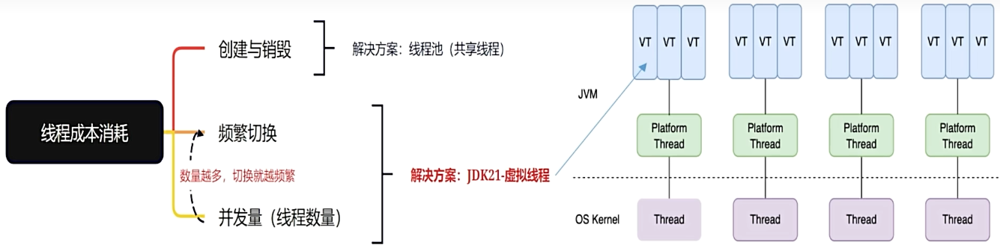
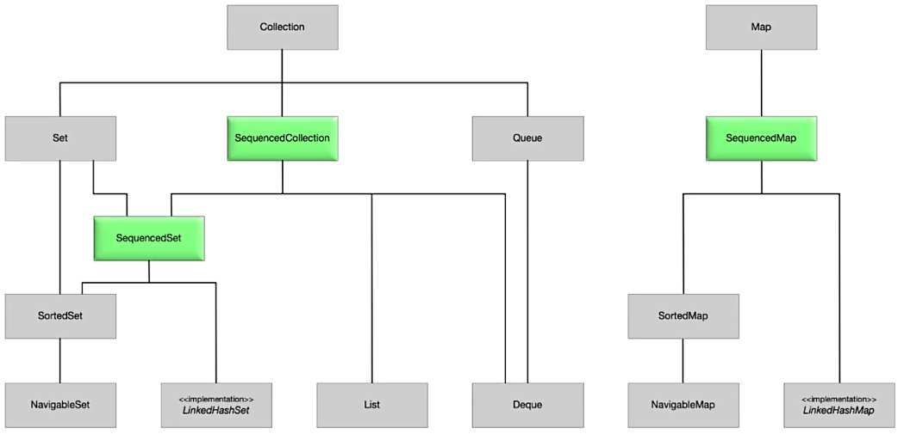

# 概览

1. 虚拟线程
2. 有序集合
3. ...

# Virtual Thread 虚拟线程

虚拟线程提供了一种更高效, 更轻量级的线程模型.



1. 虚拟线程无限提高并发量. 可以创建无数个虚拟线程
2. 同一个物理线程上的虚拟线程切换成本非常低

# Sequedced Collections 有序集合

```java
interface SequencedCollection<E> extends Collection<E> {
    SequencedCollection<E> reversed();
    void addFirst(E);
    void addLast(E);
    E getFirst();
    E getLast();
    E removeFirst();
    E removeLast();
}
```

