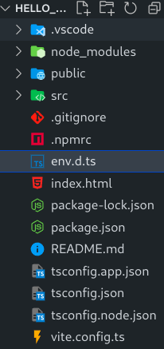

> vue3笔记

# Vue3

[vue3](https://github.com/vuejs/core)是组合式API ( Composition API )，相比于vue2的选项式API ( Options API)，更加易维护

# 创建工程

vue3官方推荐通过[vite](https://github.com/vitejs/vite)来构建项目。[帮助文档](https://cn.vuejs.org/guide/quick-start.html)

```shell
#创建项目
npm create vue@latest
```

```shell
#安装所有依赖
npm install 
```

```shell
#运行项目
npm run dev
```

# 目录结构



- `env.d.ts`  ts环境配置，让ts去认识别的格式的文件
- `index.html` 单页入口 提供id为app的挂载点

- `package*` 包声明文件
- `tsconfig*`  ts配置文件

- `vite.config.ts`  整个工程的配置文件 基于vite的配置

**src目录**

main.js：入口文件 createApp函数创建应用实例

```js
import './assets/main.css'

import { createApp } from 'vue'  //创建应用
import App from './App.vue'   //引入组件 (APP.vue是所有组件的根基)

createApp(App).mount('#app')  //将组件挂载到id为app的盒子上
```

App.vue: 根组件

- template不再要求唯一根元素
- script支持组合式API

# setup

- setup函数的生命周期**在beforeCreate钩子之前**。

- setup中**无法获取this**。因为他创建的时机太早了

- setup中的**数据和函数需要return**才能在模板中使用

## 语法糖

标签中加setup, 不需要return了 。该标签就相当于一个setup()函数。底层自动帮我们return了

```vue
<script lang="ts" setup>
    console.log("setup")
    const msg = "nihao"

    const logMessage = () => {
        console.log(msg)
    }
</script>
```

## ref和reactive

1. ref可以让**基本数据**和**对象数据**变为响应式的RefImpl对象，操作时需要调用`value`方法才能获取值

   ```vue
   <script lang="ts" setup name="abc">
       import {reactive, ref} from "vue"
       let count = ref(10) 
       //此时的count本质上是一个对象
       //因此想要修改count的值，必须调用其value方法
       let person = ref(
           {name:"zhangsan",age:18}
       )
       let changeCount = ()=>{
           count.value = count.value+1
       }
       let changePerson = ()=>{
           person.value.age = person.value.age+1
       }
   </script>
   
   <template>
       <div>
           {{ count }},{{ person }}
           <button @click="changeCount">changeCount</button>
           <button @click="changePerson">changePerson</button>
       </div>
   </template>
   ```

2. reactive只能让**对象数据**变为响应式的

   reactive定义的对象不能直接修改。想要修改可以调用Object的assign方法

   ```vue
   <script lang="ts" setup name="abc">
       import {reactive, ref} from "vue"
       let person = reactive(
           {name:"zhangsan",age:18}
       )
       let changePerson = ()=>{
           person.age = person.age+1
       }
   </script>
   
   <template>
       <div>
           {{ person }}
           <button @click="changePerson">changePerson</button>
       </div>
   </template>
   ```

3. ref底层是通过reactive实现的
4. 通过官方的volar插件，可以实现RefImpl对象的自动`.value()`，在设置里开启

### 何时使用？

在对象层级比较深的情况下，使用reactive。其他情况使用ref

# computed

1. 导入computed函数
2. 在回调参数中return数据，用变量接收

```vue
<script lang="ts" setup name="abc">
    import { ref, computed } from "vue"
    const list = ref([1,2,3,4,5,6,7,8])

    const computedList = computed(()=>{
        return list.value.filter(item=>item>2)
    })

    const changeList = () =>{
        list.value.push(666)
        //computedList.value.push(55) 无效操作
    }
</script>

<template>
    <div>
        <div>原始数据 ：{{ list }}</div>
        <div>计算后数据 ：{{ computedList }}</div>
        <button @click="changeList">修改</button>
    </div>
</template>
```

> - 计算属性中不应该有异步请求/修改dom等操作
> - 避免直接修改计算属性的值
>   - 计算属性应该是只读的

# watch

监听数据变化，在数据变化时执行回调函数

`watch(监听的数据,回调函数,属性)`

```vue
<script lang="ts" setup name="abc">
    import { ref, watch } from 'vue';
    const count = ref(0)
    const nickName = ref("张三")

    const changeCount = ()=>{
        count.value++
    }
    const changeNickName = () => {
        nickName.value = "李四"
    }
	//监听单个
    // watch(count,(newValue,oldValue) =>{
    //     console.log(newValue,oldValue)
    // })
    
    //监听多个
    watch(
        [count,nickName],
        (newArr,oldArr) =>{
            console.log("变化："+newArr+oldArr)
        }
    )
</script>
</script>
```

- immediate

  在监听器**创建时立即触发回调**，响应式数据变化之后继续执行回调

- deep 

  深度监视，watch默认是浅层监视。如果监视的是一个复杂类型数据 (对象)，就得启用deep属性

```vue
<script lang="ts" setup name="abc">
import { ref, watch } from 'vue';
const userInfo = ref({
    name: "张三",
    age: 18
})
const changeUserInfo = () => {
    userInfo.value.age++

}
watch(userInfo, (v1, v2) => {
    console.log("发生了变化,新值:" + v1 + ",旧值：" + v2)
}, {
    immediate: true,
    deep: true
})
</script>
```

- 精确侦听某个对象的属性

  ```vue
  watch(()=>userInfo.value.age,(v1,v2)=>{
      console.log('发生了变化,新值：'+v1+",旧值:"+v2)
  })
  ```

# 生命周期函数

| 选项式API            | 组合式API       |
| -------------------- | --------------- |
| beforeCreate/created | **setup**       |
| beforeMount          | onBeforeMount   |
| mounted              | onMounted       |
| beforeUpdate         | onBeforeUpdate  |
| updated              | onUpdated       |
| beforeUnmount        | onBeforeUnmount |
| unmounted            | onUnmounted     |

# 父子通信

1. 父传子

   - 父组件中给子组件绑定属性
   - 子组件内部通过props选项接收 

   ```vue
   <script lang="ts" setup name="abc">
       import {ref} from "vue"
       import sonCom from "./components/son-com.vue"
       const money = ref(100)
       const getMoney = ()=>{
           money.value+=10
       }
   </script>
   
   <template>
       <h3>我是父组件 - {{ money }}<button @click="getMoney">挣钱</button></h3> 
       <!-- 父组件给子组件添加属性 -->
       <sonCom car="宝马" :money="money"/>
   </template>
   ```

   ```vue
   <script lang="ts" setup>
       //defineProps编译器宏
       const props = defineProps({
           car:String,
           money:Number
       })
       console.log(props.car)
       console.log(props.money)
   </script>
   <template>
       <div class="son">我是子组件 - {{ car }} - {{ money }}</div>
   </template>
   ```

   > defineProps原理：编译阶段一个标识，实际编译器解析时，会进行解析转换为选项式的数据

2. 子传父

   - 父组件中给子组件标签通过@绑定时间
   - 子组件内部通过emit方法触发事件

   ```vue
   <script setup name="abc">
   import {ref} from "vue"
   import sonCom from "./components/son-com.vue"
   const money = ref(100)
   const getMoney = ()=>{
       money.value+=10
   }
   const changeFn = (newMoney)=>{
       money.value -= newMoney
   }
   </script>
   
   <template>
       <h3>父组件 - {{ money }}<button @click="getMoney">挣钱</button></h3> 
       <!-- 父组件给子组件添加属性 -->
       <sonCom @changeMoney="changeFn" car="宝马" :money="money"/>
   </template>
   ```

   ```vue
   <script lang="ts" setup>
       const props = defineProps({
           car:String,
           money:Number
       })
       const emit = defineEmits(["changeMoney"])
       console.log(props.car)
       console.log(props.money)
   
       const buy = ()=>{
           //需要emit去触发事件
           emit("changeMoney",5)
       }
   </script>
   <template>
       <div class="son">我是子组件 - {{ car }} - {{ money }}
       <button @click="buy">花钱</button>
       </div>
   </template>
   ```

# 模板引用

通过ref标识获取真实的dom对象或组件实例对象

1. 调用ref函数生成一个ref对象
2. 通过ref标识绑定ref对象到标签

```vue
<script lang="ts" setup>
import TestCom from "./test-com.vue"
import { onMounted, ref } from "vue"
//模板引用，可以获取dom也可以获取组件
//1.调用ref函数生成ref对象
//2.通过ref标识绑定
//3.通过ref对象.value即可访问到绑定的元素(前提是得等dom渲染完才能拿到值)
const input = ref(null)
const clickFn = ()=>{
    input.value.focus()
}

</script>
<template>
    <div>
        <input ref="input" type="text">
        <button @click="clickFn">点击让输入框聚焦</button>
        <TestCom />
    </div>
</template>
```

## defineExpose

默认情况下setup语法糖下组件内部的属性和方法是不开放给父组件使用的。可以通过编译器宏defineExpose暴露给父组件使用

```vue
<script lang="ts" setup>
const count = 999
const sayHi = ()=>{
    console.log("hello!")
}
defineExpose({
    count,
    sayHi   //此时父组件可以获取sayHi方法和count属性的值
}) 
</script>
<template>
    <div>
        我是用于测试的组件 - {{ count }}
    </div>
</template>
```

# provide和inject

顶层组件向任意的底层组件传递数据和方法，实现跨层组件通信

1. 顶层组件通过provide函数提供数据

   ```js
   provide("key",顶层组件中的数据)
   ```

2. 底层组件通过inject函数获取数据

   ```js
   const message = inject("key")
   ```

底层组件想要修改顶层的值，遵循谁的 ‘’数据谁维护的原则‘’ ，顶层可以给底层组件传一个能修改值的方法。

```ts
//跨层级传递函数=>给子组件传可以修改数据的方法
provide("changeCount",(newCount)=>{
    count.value = newCount
})
```

子组件调用方法修改值：

```ts
const changeCount = inject("changeCount")
const clickFn = ()=>{
    changeCount(1000)
}
```

# defineOptions

为了写与script setup同级的选项，vue3.3引入了defineOptions宏，用来定义Options API的选项。可以用defineOptions定义任意的项，props, emits, expose , slots除外(这些都有自己的宏函数)

```vue
<script lang="ts" setup>
defineOptions({
    name:"Loginindex"  //给组件命名
})
</script>
```

# Pinia

[pinia](https://pinia.web3doc.top/introduction.html)是vue的状态管理工具，是vuex的替代品

- 提供更简单的API ( **去掉了mutation** )
- 提供组合式风格API
- 更好的TS支持
- 每个store都是一个独立的模块，去掉了modules概念

安装pinia：

```sh
npm install pinia
```

main.js :

```js
import { createApp } from 'vue'
import { createPinia } from "pinia"

import App from './App.vue'

const pinia = createPinia() //创建实例

createApp(App).use(pinia).mount('#app') //安装
```

## setup store

在深入了解核心概念之前，我们需要知道 Store 是使用 `defineStore()` 定义的，并且它需要一个**唯一**名称，作为第一个参数传递：

counter.js : 

```js
import {defineStore} from "pinia"
import {computed, ref} from "vue"
// 定义store
//defineStore(仓库的唯一标识,()=>{ ... })
export const useCounterStore = defineStore("counter",()=>{
    //声明数据 相当于state
    const count = ref(100)
    const message = ref("hello pinia!")

    //声明方法 相当于actions
    const addCount = () => count.value++
    const minusCount = () => count.value--

    //声明数据的计算属性 相当于getters
    const double = computed(()=>count.value*2)

    return {count,message,addCount,minusCount,double}
})
```

调用共享数据：

```vue
<script setup>
import { useCounterStore } from "@/store/counter.js"
const counterStore = useCounterStore()
</script>

<template>
  <div>
    son1 - {{counterStore.count}} - {{ counterStore.double }} <button @click="counterStore.addCount">+</button>
  </div>
</template>
```

### 解构

以上示例中counterStore直接解构会导致数据丢失响应式。

- 想要解构出响应式数据，使用storeToRefs() 方法

```js
const {msg,count} = storeToRefs(counterStore)
```

- 解构方法则是直接解构

```js
const { getList } = channelStore
```

## 持久化

[pinia持久化插件](https://prazdevs.github.io/pinia-plugin-persistedstate/zh/)

1. 安装插件

   ```sh
   npm i pinia-plugin-persistedstate
   ```

2. 安装插件

   ```js
   import { createPinia } from 'pinia'
   import piniaPluginPersistedstate from 'pinia-plugin-persistedstate'
   
   const pinia = createPinia()
   pinia.use(piniaPluginPersistedstate)
   ```

3. 使用

   创建 Store 时，将 `persist` 选项设置为 `true`。

   ```js
   export const useCounterStore = defineStore("counter",()=>{
   	//...
   },{
       persist: true //开启持久化
   })
   ```

4. 自定义配置

   [帮助文档](https://prazdevs.github.io/pinia-plugin-persistedstate/zh/guide/config.html)

   ```js
   import {defineStore} from "pinia"
   import {computed, ref} from "vue"
   export const useCounterStore = defineStore("counter",()=>{
   	let count = ref(199)
       let msg = ref("hello")
       //...
   },{
       persist: {
           key: 'my-customKey', //持久化的key
           paths: ["count"] //持久化的数据,count会被持久化，msg不会被持久化
       }
   })
   ```
