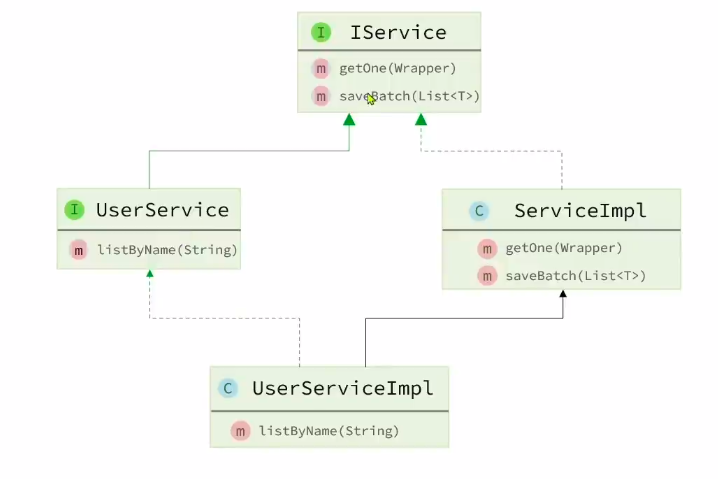
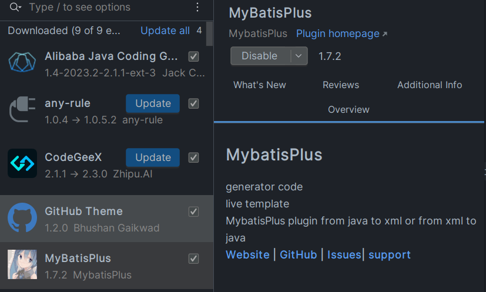

小 tips：

> 依赖注入的方式：
>
> 有时候我们使用`@AutoWired`注解进行依赖注入时，会有黄色波浪线提示，`spring`不希望我们通过这种方式进行依赖注入。更推荐通过构造器来注入。但是使用构造器注入很麻烦，所以我们可以借助`lombok`的`@RequiredArgsConstructor`注解帮忙实现依赖注入。该注解作用是只生成含有必要字段的构造器。我们加上这个注解后，定义成员变量时，加上`final`关键字修饰后，该字段就会被自动注入`spring`容器中。对于不想注入的字段，不加`final`修饰即可。
>
> 因为final修饰的字段表示为一个常量，必须被初始化。我们不在一开始定义的时候初始化他，那么他就会在构造器中被初始化。所以借助`@RequiredArgsConstructor`这个注解，我们能更优雅地实现依赖注入。

```java
@RequiredArgsConstructor //只生成含有必要参数的构造器
public class CartServiceImpl extends ServiceImpl<CartMapper, Cart> implements ICartService {
    private final RestTemplate restTemplate; //相当于构造器注入
    // ... 业务代码
}
```


---

# 使用mp

## 1. 引入mp起步依赖
其中继承了mybatis和mybatisplus的所有功能，并且实现了自动装配，因此使用mp的starter代替mybatis的starter
```xml
<!-- https://mvnrepository.com/artifact/com.baomidou/mybatis-plus-boot-starter -->
<dependency>
    <groupId>com.baomidou</groupId>
    <artifactId>mybatis-plus-boot-starter</artifactId>
    <version>3.5.3.1</version>
</dependency>
```

## 2. 继承BaseMapper

自定义的mapper继承mp提供的`BaseMapper`接口

```java
public interface UserMapper extends BaseMapper<User>{
    
}
```

## 3. 直接使用

调用接口的增删该查方法，直接使用即可。非常滴方便。

# 常见注解

## 我什么都没写，mp怎么知道我操作哪张表？

mp通过扫描实体类，并基于反射获取实体类信息作为数据库表信息。

```java
public interface UserMapper extends BaseMapper<User>{ }
```

通过泛型中的实体类获取信息，并根据约定获取数据库表信息。

**约定如下：**

> - 类名驼峰转下划线作为表名 
>
> >  UserInfo => user_info
>
> - 名为id的字段作为主键
>
> - 变量名驼峰转下划线作为表的字段名
>
> >  userName => user_name

## ‘‘不遵从约定‘’ - 常见自定义注解

见名知意

- `@TableName` 指定表名 
- `@TableId` 指定表id

>IdType枚举：
>
>1.  `AUTO`  自增长
>2.  `INPUT`  通过set方法自行输入
>3.  `ASSIGN_ID` 分配ID (不指定时的默认策略 雪花算法分配id)

- `@TableField` 指定表字段

# 常见自定义配置

```yaml
mybatis-plus:
	type-aliases-package: com.xxx.xxx #别名扫描
	mapper-location: "classpath*:/mapper/xx/xx.xml" #mapper.xml位置
	configuration:
		map-underscore-to-camel-case: true #下划线驼峰映射
		cache-enabled: false #二级缓存
    global-config:
    	db-config:
    		id-type: assign_id #id雪花算法自动分配
    		update-strategy: not_null #更新策略：只更新非空字段
```

值得注意的是，上述配置项中，除了要配置**别名**，其他都是默认值，不需要配置。

# mp核心功能

## 条件构造器 - Wrapper

*mp支持各种复杂的where条件*，通过wrapper来实现

- QueryWrapper和LambdaQueryWrapper通常用来构建select, delete, update的where条件部分
- UpdateWrapper和LambdaUpdateWrapper通常只有在set语句比较特殊时才会使用
- **尽量使用LambdaQuery/UpdateWrapper来避免硬编码**

```java
    @Test
	//QueryWrapper示例
    void testQueryWrapper(){
        QueryWrapper<User> wrapper = new QueryWrapper<User>().select("id","username","info","balance").like("username", "o").ge("balance", 1000);
        List<User> users = userMapper.selectList(wrapper);
        users.forEach(System.out::println);
    }

    @Test
	//LambdaQueryWrapper示例
    void testLambdaQueryWrapper(){
        LambdaQueryWrapper<User> wrapper = new LambdaQueryWrapper<User>().select(User::getId,User::getUsername,User::getInfo,User::getBalance).like(User::getUsername, "o").ge(User::getBalance, 1000);
        List<User> users = userMapper.selectList(wrapper);
        users.forEach(System.out::println);
    }

    @Test
	//QueryWrapper示例
    void testUpdateQueryWrapper(){
        User user = new User();
        user.setBalance(2000);
        QueryWrapper<User> wrapper = new QueryWrapper<User>().eq("username", "jack");
        userMapper.update(user,wrapper);
    }

    @Test
	//UpdateWrapper示例
    void testUpdateWrapper(){
        List<Long> ids = List.of(1L, 2L, 4L);
        UpdateWrapper<User> wrapper = new UpdateWrapper<User>().setSql("balance=balance-200").in("id", ids);
        userMapper.update(null, wrapper);
    }
```

## 自定义SQL

通常使用mp帮忙构建where条件中复杂的部分，然后自己定义SQL中的剩下部分

因为mp更擅长的是构建where条件，而where之前的那些条件，可能涉及到动态变量，我们可以自己构建。各自做自己擅长的事，提高效率。

1. **基于wrapper构建sql条件**

```java
    @Test
    void testCustomSqlUpdate(){
        List<Long> ids = List.of(1L, 2L, 4L);
        int amount = 200;
        QueryWrapper<User> wrapper = new QueryWrapper<User>().in("id", ids);
        userMapper.updateBalance(wrapper,amount);
    }
```

2. **调用自定义方法，传入wrapper和参数**

```java
 void updateBalance(@Param("ew") QueryWrapper<User> wrapper,@Param("amount") int amount);
```

3. **编写剩余的sql语句**

```xml
<update id="updateBalance">
    update tb_user set balance=balance-#{amount} ${ew.customSqlSegment}
</update>
```

## Service接口



🖕如上，`自定义服务层接口`继承mp为我们提供的IService，`自定义接口的实现类`还需要继承mp的IService的实现类ServiceImpl。这样就可以使用mp为我们提供的服务层功能了。

```java
//自定义服务层接口代码
public interface IUserService extends IService<User> {
}
```

```java
//自定义服务层实现类代码
@Service
public class UserServiceImpl extends ServiceImpl<UserMapper, User> implements IUserService {
}
```

```java
//测试类  可以直接开始使用服务层功能了
@SpringBootTest
class IUserServiceTest {
    @Autowired
    private IUserService userService;

    @Test
    void testSaveUser(){
        User user = new User();
        user.setUsername("Lilei");
        user.setPassword("123");
        user.setPhone("18688990011");
        user.setBalance(200);
        user.setInfo("{\"age\": 24, \"intro\": \"英文老师\", \"gender\": \"female\"}");
        user.setCreateTime(LocalDateTime.now());
        user.setUpdateTime(LocalDateTime.now());
        userService.save(user);
    }

    @Test
    void testQuery(){
        List<User> users = userService.listByIds(List.of(1L, 2L, 3L));
        users.forEach(System.out::println);
    }

}
```

## IService的Lambda方法

### `lambdaQuery()`

### `lambdaUpdate()`

## IService批量新增

IService提供批量插入方法：`saveBatch()`

实现真批量插入还需要开启`rewriteBatchedStatements`参数, 在数据库连接参数url中添加该参数，值设为true即可。

```yaml
spring:
  datasource:
    url: jdbc:mysql://127.0.0.1:3306/mp?useUnicode=true&characterEncoding=UTF-8&autoReconnect=true&serverTimezone=Asia/Shanghai&rewriteBatchedStatements=true
```

# mp扩展功能

## 代码生成

借助idea的mybatisplus插件生成controller, service, mapper, entity代码。



在顶栏other中进行数据库连接的配置和代码生成相关配置。

## Db工具类

`Db`类提供的方法，基本都和`IService`接口提供的方法差不多。

使用静态调用的方式，执行CRUD方法，避免`Spring`环境下`Service`循环注入、简洁代码，提升效率

## 逻辑删除

表中添加一个字段，用来标记数据是否删除。查询的时候只查询标记为未删除的数据。

逻辑删除：

```sql
update user set deleted = 1 where id = 1 and deleted = 0;
```

查询：

```sql
select * from user where deleted = 0;
```

mp提供逻辑删除功能，无需改变方法调用的方式，其底层会帮我们自动修改CRUD语句。我们只需要在application.yaml中配置逻辑删除的字段名称和值：

```yaml
mybatis-plus:
  global-config:
    db-config:
      #全局逻辑删除的实体字段名，字段类型可以是boolean, integer
      logic-delete-field: is_deleted 
      logic-delete-value: 1    #逻辑已删除值（默认为1）
      logic-not-delete-value: 0    #逻辑未删除值（默认为0）
```

## 枚举处理器

新增枚举类

```java
@Getter
public enum UserStatus {
    NORMAL(1,"正常"),
    FROZEN(2,"冻结"),
    ;
    @EnumValue
    @JsonValue
    private final int value;
    private final String desc;

    UserStatus(int value,String desc){
        this.value = value;
        this.desc = desc;
    }
}
```

user实体类中的状态字段设置为枚举类型

```java
/**
 * 使用状态（1正常 2冻结）
 */
private UserStatus status;
```

##### 如何实现po中的枚举类型和数据库字段的转换？

1. 给枚举中与数据库对应value值添加@EnumValue注解

```java
@EnumValue  //mp注解，用于和数据库字段对应
@JsonValue //springmvc注解，标识返回给前端的数据
private final int value;
private final String desc;
```

2. 在配置文件中配置统一的枚举处理器，实现类型转换

```yaml
mybatis-plus:
  configuration:
    default-enum-type-handler: com.baomidou.mybatisplus.core.handlers.MybatisEnumTypeHandler
```

## JSON处理器

mp没有为我们提供通过yaml配置实现的全局配置，因此我们只能单独去设置。

1. 在`@TableField`注解中有个属性是`typeHandler`. 该属性可以配置类型处理器

```java
@TableField(typeHandler = JacksonTypeHandler.class)
// Jackson是springmvc默认使用的Json框架
private UserInfo info;
```

2. 由于在实体中定义了返回值为一个类的字段，因此需要配置mybatis的resultmap映射。所以在`@TableName`注解上加上`autoResultMap`属性

```java
@TableName(value = "tb_user",autoResultMap = true)
public class User { ... }
```

# 分页插件

## 基本操作

1. 首先，要在配置类中注册mp的核心插件，同时添加分页插件

```java
@Configuration
public class MybatisConfig {

    @Bean
    public MybatisPlusInterceptor mybatisPlusInterceptor() {
        // 初始化核心插件
        MybatisPlusInterceptor interceptor = new MybatisPlusInterceptor();
        // 创建分页插件
        PaginationInnerInterceptor paginationInnerInterceptor = new PaginationInnerInterceptor(DbType.MYSQL);
        //配置一些基本参数
        paginationInnerInterceptor.setMaxLimit(1000L);
        // 添加分页插件
        interceptor.addInnerInterceptor(paginationInnerInterceptor);
        return interceptor;
    }
}
```

2. 然后就可以使用了。IService接口中提供分页查询方法

```java
@Test
void testPageQuery(){
    int pageNO = 1, pageSize = 2 ;
    // 1. 准备分页条件
    Page<User> page = Page.of(pageNO, pageSize);
    // 1.1 排序条件  可添加多个条件
    page.addOrder(new OrderItem("balance", true));
    // 2. 分页查询
    Page<User> p = userService.page(page);
    // 3. 解析
    System.out.println(p.getTotal());  //总数据条数
    System.out.println(p.getPages());  //总页数
    List<User> records = p.getRecords();  //查询到的结果
    records.forEach(System.out::println);  
}
```

## 通用分页实体

1. 封装统一的分页查询条件， 定义一些常见的查询条件，然后具体业务查询条件去继承这个类

```java
@Data
@ApiModel(description = "分页查询实体")
public class PageQuery{
    @ApiModelProperty("页码")
    private Integer pageNo;
    @ApiModelProperty("总页数")
    private Integer pageSize;
    @ApiModelProperty("排序字段")
    private String sortBy;
    @ApiModelProperty("是否升序")
    private Boolean isAsc;
}
```

```java
@Data
@ApiModel(description = "用户查询条件实体")
public class UserQuery extends PageQuery{
    @ApiModelProperty("用户名关键字")
    private String name;
    @ApiModelProperty("用户状态：1-正常，2-冻结")
    private Integer status;
    @ApiModelProperty("余额最小值")
    private Integer minBalance;
    @ApiModelProperty("余额最大值")
    private Integer maxBalance;
}
```

2. 封装通用的返回结果

```java
@Data
@ApiModel(description = "分页结果")
public class PageDTO<T> { 
    @ApiModelProperty("总条数")
    private Long total;
    @ApiModelProperty("总页数")
    private Long pages;
    @ApiModelProperty("结果集")
    private List<T> list;
}
```

