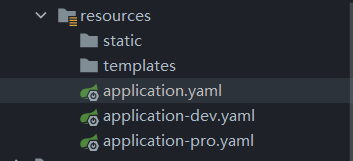
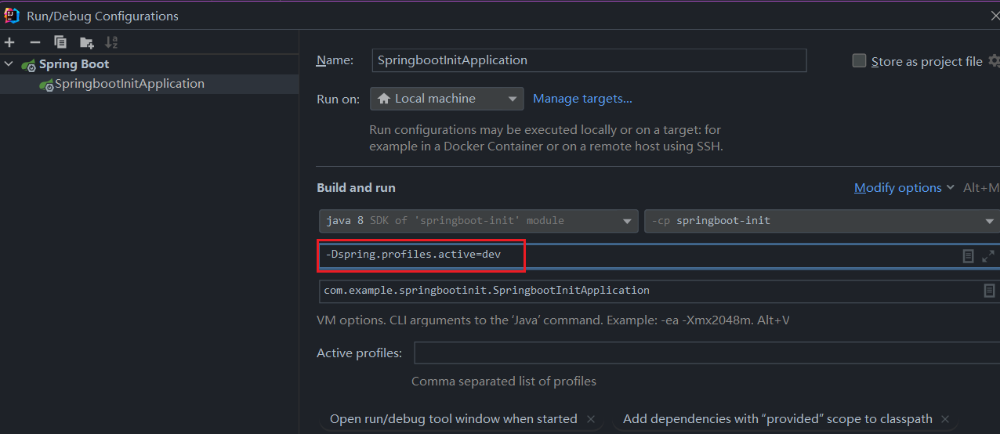
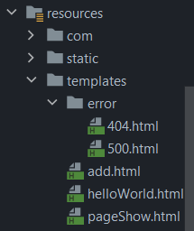
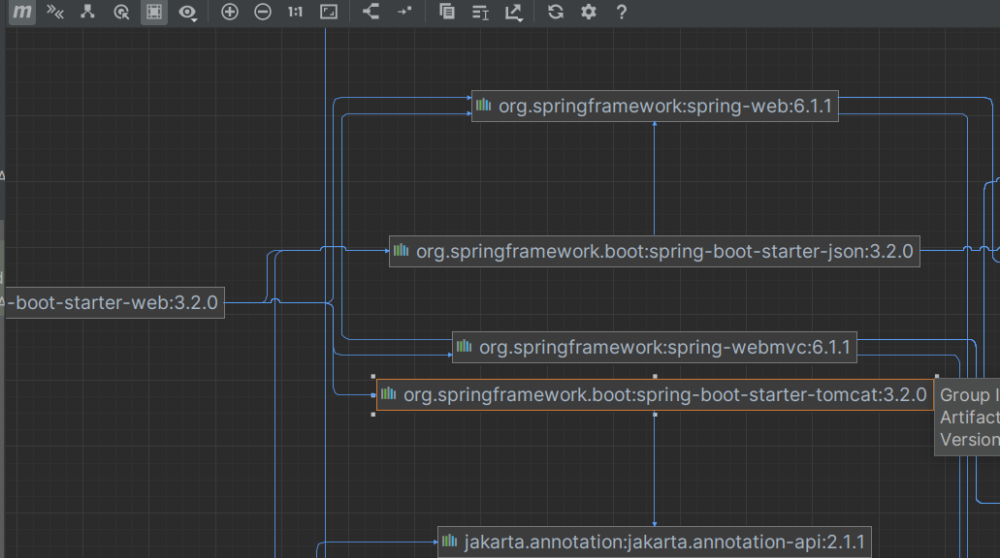

# springboot 学习记录

> 注意：Springboot注解`@SpringBootApplication`默认扫描当前类的同包或子包下的类。因此位置一定要放对！！否则访问地址会报404错误！！

## 起步依赖

1. idea搭建springboot项目依赖的是 [start.spring.io](https://start.spring.io) 需要网络
2. springboot帮我们配置好了所需依赖的版本，这样我们不用担心版本冲突的问题
3. **JDK8**对应的major version是**52**，**JDK17**对应的major version是**61**
4. `@RestController`相当于是`@Controller`和`@ResponseBody`的组合,也就是说, `@RestController`标记的类其方法返回值不会被当作视图来解析。而传统的`@Controller`注解，其返回值会被当作视图经过视图解析器来解析。

## 配置文件

springboot是**基于约定**的框架。想要替换其默认配置，通过`application.properties`或者`application.yaml`来进行配置

- properties:

```properties
server.port=8080
```

- yaml/yml: ( 冒号`:`和值`8080`之间**有空格** )
  
```yaml
server:
  port: 8080  #有空格
```

### springboot配置文件优先级

> springboot加载配置文件**有优先级**： 如果properties，yml，yaml三个配置文件在根目录中同时存在，那么*对于重复的配置部分*，**springboot会优先加载properties中的配置，其次是yml，最后是yaml。**

## yaml

yaml全程是 yaml ain't markup language。

yaml**以数据为中心**，能更直观的被人类理解，比传统xml方式更简洁。

### yaml语法

1. 大小写敏感
2. 数据值前必须有空格
3. 使用缩进表示层级关系
4. `#`表示注释
5. 缩进的空格数目不重要，只要相同层级的元素左侧对齐即可

### yaml数据格式

- 对象（map）
```yaml
person:
  name: zhangsan

person: {name: zhangsan}
```

- 数组
```yaml
address:
  - beijing
  - shanghai

address: [beijing,shanghai]
```

- 纯量
```yaml
msg1: "hello \n world"  #会识别转义字符，\n将被解析为空格
msg2: 'hello \n world'  #不会识别转义字符，\n将原样输出
```

### yaml参数引用

```yaml
name: lisi

person: 
  name: ${name}  #引用上值
```

## 读取配置内容

1. @Value
```java
@Value("${name}")
private String name;
```
2. Environment
```java
@Resource   //基于名称注入  @Autowired 基于类型注入
private Environment env;

System.out.println(env.getProperty("person.name"));
System.out.println(env.getProperty("address[0]"));
```
3. @ConfigurationProperties

创建一个类来接收配置文件中的属性

使用`@ConfigurationProperties`注解来接收配置文件中的属性

使用prefix属性来指定属性前缀，防止错误的注入

```java
@Component
@ConfigurationProperties(prefix = "person")
public class Person {
    private String name;
    private int age;

    public String getName() {
        return name;
    }

    public void setName(String name) {
        this.name = name;
    }

    public int getAge() {
        return age;
    }

    public void setAge(int age) {
        this.age = age;
    }

    @Override
    public String toString() {
        return "Person{" +
                "name='" + name + '\'' +
                ", age=" + age +
                '}';
    }
}
```
```yaml
server:
  port: 8080

name: abc

person:
  name: zhangsan
  age: 20

person2: {name: zhangsan, age: 20}

address: [beijing, shanghai]

msg: "hello \n word!"
msg2: 'hello \n word!'

```

## profiles

profiles属性可以指定当前配置文件生效的环境，在实际开发中通常一个springboot应用会在多个场景下使用，比如开发场景，生产场景，测试场景等。这些场景的配置文件不尽相同。如果每次都手动来更改配置文件，过于繁琐。因此，springboot 的 profiles 属性可以帮我们快速切换配置文件。

### 1. 多profile文件方式

假设现在有两个配置文件，`application-dev.yaml`和`application-pro.yaml`，分别对应开发环境和生产环境。想要快速切换这两个配置文件，只需要在主配置文件`application.yaml`中声明 profiles 属性即可



```yaml
spring:
  profiles:
    active: pro
```
### 2. yml多文档方式

多个配置文件方式写起来比较麻烦，我们可以通过一个application.yml文件来进行配置。只需要使用 `---` 来对不同环境下的配置进行分割即可。

```yaml

spring:
  profiles:
    active: test   # 设置激活的配置
---
server:
  port: 8080
spring:
  profiles: dev
---
server:
  port: 8081
spring:
  profiles: test
---
server:
  port: 8082
spring:
  profiles: pro
---

```

### 3. 外部参数方式

#### 1. 通过虚拟机选项 vm-options 来进行配置

这种方式会覆盖掉application.yaml中的配置



#### 2. 通过命令行参数进行配置

在运行项目的jar包时加上`--spring.profiles.active=dev`，可以指定当前激活的配置文件。

## 内部配置加载顺序

springboot启动时会从以下位置加载配置文件：

1. `file: ../config/` 当前项目下的/config目录
2. `file: ../` 当前项目的根目录
3. `classpath:/config/` classpath的/config目录
4. `classpath:/` classpath根目录

以上四个位置的配置文件都会被读取，高优先级的文件配置会覆盖低优先级的文件配置

## thymeleaf

thymeleaf是一个xml/xhtml/html5的模板引擎，可以作为springmvc的视图技术来使用。

```xml
<!DOCTYPE html>
<html lang="en" xmlns:th="http://www.thymeleaf.org">
<head>
    <meta charset="UTF-8">
    <title>分页信息展示</title>
</head>
<body>
    <table>
        <tr>
            <td>部门编号</td>
            <td>部门名称</td>
            <td>部门地址</td>
        </tr>
        <tr th:each="dept : ${pageInfo.list}">
            <td th:text="${dept.deptno}"></td>
            <td th:text="${dept.dname}"></td>
            <td th:text="${dept.loc}"></td>
        </tr>
    </table>
    <div th:if="!${pageInfo.isFirstPage}">
        <a th:text="首页" th:href="@{/pageGetAll(pageNum=1)}"></a>
        <a th:text="上一页" th:href="@{/pageGetAll(pageNum=${pageInfo.prePage})}"></a>
    </div>
    <div th:if="!${pageInfo.isLastPage}">
        <a th:text="尾页" th:href="@{/pageGetAll(pageNum=${pageInfo.pages})}"></a>
        <a th:text="下一页" th:href="@{/pageGetAll(pageNum=${pageInfo.nextPage})}"></a>
    </div>
</body>
</html>
```

## 异常处理

### 异常页面

在templates中新建一个`error`目录，在其中新建对应的错误页面。如404错误： 404.html
或者使用通配的名称，如400系列错误：4XX.html



这样配置后，项目出现对应的错误，springboot会自动去templates中找到对应页面显示。

### 局部异常处理

在Controller中添加异常处理方法，在方法上添加`@ExceptionHandler`注解，指定需要捕获的异常类型，并在方法中进行异常处理。

```java
@ExceptionHandler(Exception.class)   //表示捕获该controller中的所有异常
@ResponseBody
public String catchException(){
    System.out.println("进入异常捕获方法，。。。");   //异常处理
    return "500异常";   //可以进行页面跳转等操作
}
```
### 全局异常处理

新建一个异常处理类，使用`@ControllerAdvice`注解标注。并在方法中使用`@ExceptionHandler`注解，指定需要捕获的异常类型

```java
@ControllerAdvice
public class ExceptionCatcher {
    @ExceptionHandler(Exception.class)
    public String showExcep(){
        /* 进行异常处理 */
        return "/error/500";
    }
}
```

## 拦截器

### 使用拦截器步骤

1. 创建自定义拦截器，实现HandlerInterceptor接口并重写其中的 `preHandle`，`postHandle`，`afterCompletion` 方法
```java
@Component
public class MyInteceptor implements HandlerInterceptor {
    @Override
    public boolean preHandle(HttpServletRequest request, HttpServletResponse response, Object handler) throws Exception {
        System.out.println("进入springboot拦截器");
        return false;
    }
}
```

2. 新建拦截器的配置类，配置拦截路径和放行路径

```java
@Configuration
public class MyConfig implements WebMvcConfigurer {
    
    @Resource
    private MyInteceptor myInteceptor;
    
    @Override
    public void addInterceptors(InterceptorRegistry registry) {
        registry.addInterceptor(myInteceptor).addPathPatterns("/**").excludePathPatterns("/getAll");
        //表示拦截所有路径，放行`/getAll`路径
    }
}
```

## SpringBoot 整合Junit

### 步骤

1. 搭建SpringBoot工程

2. 引入starter-test起步依赖

3. 编写测试类

4. 添加测试相关注解

   - @RunWith(SpringRunner.class)   

   > @RunWith用于指定测试使用的运行器

   - @SpringBootTest(classes = 启动类.class)

   > 如果测试类所在的包和启动类所在的包相同，则不需要指定classes。@SpringBootTest注解会自动去本包下寻找启动类。

5. 编写测试方法

## SpringBoot整合Redis

### 步骤

1. 搭建SpringBoot工程
2. 引入redis起步依赖
3. 配置redis相关属性
4. 注入RedisTemplate模板
5. 编写方法

```java
@SpringBootTest
class SpringbootRedisApplicationTests {
	@Autowired
	private RedisTemplate redisTemplate;
	@Test
	public void testSet() {
		redisTemplate.boundValueOps("name").set("zhangsan");
	}
	@Test
	public void testGet(){
		System.out.println(redisTemplate.boundValueOps("name").get());
	}
}
```

```yaml
spring:
  data:
    redis:
      port: 6379
      host: 127.0.0.1
```

## SpringBoot整合MyBatis

### 步骤

1. 搭建SpringBoot工程
2. 引入mybatis起步依赖，添加mysql驱动
3. 编写DataSource和MyBatis相关配置
4. 定义表和实体类
5. 编写dao和mapper文件/纯注解开发
6. 测试

```yaml
  # datasource
spring:
  datasource:
    url: jdbc:mysql://localhost:3306/springboot
    username: root
    password: 123456
    driver-class-name: com.mysql.cj.jdbc.Driver
mybatis:
  type-aliases-package: com.mh.springbootmybatis.domain
```

## 配置SpringBoot的banner

1. resources目录中新增banner.txt文件，在里面写入想要展示的banner样式

```txt
  ██████  ██▓███   ██▀███   ██▓ ███▄    █   ▄████  ▄▄▄▄    ▒█████   ▒█████  ▄▄▄█████▓
▒██    ▒ ▓██░  ██▒▓██ ▒ ██▒▓██▒ ██ ▀█   █  ██▒ ▀█▒▓█████▄ ▒██▒  ██▒▒██▒  ██▒▓  ██▒ ▓▒
░ ▓██▄   ▓██░ ██▓▒▓██ ░▄█ ▒▒██▒▓██  ▀█ ██▒▒██░▄▄▄░▒██▒ ▄██▒██░  ██▒▒██░  ██▒▒ ▓██░ ▒░
  ▒   ██▒▒██▄█▓▒ ▒▒██▀▀█▄  ░██░▓██▒  ▐▌██▒░▓█  ██▓▒██░█▀  ▒██   ██░▒██   ██░░ ▓██▓ ░
▒██████▒▒▒██▒ ░  ░░██▓ ▒██▒░██░▒██░   ▓██░░▒▓███▀▒░▓█  ▀█▓░ ████▓▒░░ ████▓▒░  ▒██▒ ░
▒ ▒▓▒ ▒ ░▒▓▒░ ░  ░░ ▒▓ ░▒▓░░▓  ░ ▒░   ▒ ▒  ░▒   ▒ ░▒▓███▀▒░ ▒░▒░▒░ ░ ▒░▒░▒░   ▒ ░░
░ ░▒  ░ ░░▒ ░       ░▒ ░ ▒░ ▒ ░░ ░░   ░ ▒░  ░   ░ ▒░▒   ░   ░ ▒ ▒░   ░ ▒ ▒░     ░
░  ░  ░  ░░         ░░   ░  ▒ ░   ░   ░ ░ ░ ░   ░  ░    ░ ░ ░ ░ ▒  ░ ░ ░ ▒    ░
      ░              ░      ░           ░       ░  ░          ░ ░      ░ ░
                                                        ░
```

2. 在application.yml中配置banner

```yml
spring:
  banner:
    charset: UTF-8
    location: classpath:banner.txt
```

这样，项目运行时就能展示你的个性化banner啦！

## SpringBoot自动配置

### Condition

condition是spring4.0增加的条件判断功能，通过这个功能可以实现选择性创建bean。

#### 情景展示

假设现在有如下需求，在spring ioc容器中有一个User的bean。要求导入Jedis坐标后，才能创建User的bean, 否则不给创建。

#### 具体实现

1. 创建User这个bean

```java
public class User {
}
```

2. 创建配置类用于生产bean

```java
@Configuration
public class UserConfig {
    @Bean
    @Conditional(ClassCondition.class)  //自定义的条件类
    public User user(){
        return new User();
    }
}
```

@Conditional注解的作用就是为生成bean增加一个条件，matches方法返回true表示可以生产bean, 返回false不可生产bean.

3. 创建自定义条件类

```java
public class ClassCondition implements Condition {
    @Override
    public boolean matches(ConditionContext context, AnnotatedTypeMetadata metadata) {
        //1.导入jedis坐标后允许创建bean --返回true,否则返回false.
        //2.判断jedis对应的字节码文件是否存在。如果存在说明引入了jedis依赖，就返回true.否则返回false.
        try {
            Class.forName("redis.clients.jedis.Jedis");
        } catch (ClassNotFoundException e) {
            return false;
        }
        return true;
    }
}
```

> matches方法中的两个参数context和metadata
>
> context: 上下文对象，可以获取环境 ioc容器 classloader对象等
>
> metadata: 元数据对象，可以获取注解定义的属性值

4. 在启动类中进行测试

```java
@SpringBootApplication
public class SpringbootConditionApplication {

	public static void main(String[] args) {
		ConfigurableApplicationContext context = SpringApplication.run(SpringbootConditionApplication.class, args);  //context就是一个ioc容器
		Object user = context.getBean("user");  //从ioc容器中取user.如果引入了Jedis就会成功获取，否则会报错。
		System.out.println(user);
	}
}
```

#### 小结

- 自定义条件

  1. 自定义条件类： 自定义类实现Condition接口，重写其中的matches方法，在方法中进行逻辑判断，返回boolean值。方法中的两个参数：
     - context：上下文对象，可以获取环境(配置文件属性值)，ioc容器, 类加载器等
     - metadata: 元数据对象，可以获取注解属性

  	  2.    判断条件： 在初始化bean时，使用@Conditional(条件类.class)注解

- springboot常用条件注解：

  - ConditionalOnProperty 配置文件中有对应属性值时才初始化bean
  - ConditionalOnClass 环境中有对应的字节码文件时才初始化bean
  - ConditionalOnMissingBean 环境中没有对应的bean时才初始化bean

### 切换内置web服务器

springboot内置四个web服务器，默认使用的是tomcat.

这四个服务器分别是：Jetty , Netty , Tomcat, Undertow


这些服务器的源码其实都有@Conditional注解，条件都是环境中必须有对应的字节码文件才会去加载服务器的bean。所以切换内置服务器的思路就很明确了，直接在maven中导入对应服务器的依赖即可，但是由于springboot默认是tomcat服务器，所以需要先排除tomcat服务器的依赖

#### 步骤

在maven diagram中找到tomcat  

shift + delete快捷键排除依赖



之后pom中会自动生成派出依赖的代码：

```xml
<dependency>
    <groupId>org.springframework.boot</groupId>
    <artifactId>spring-boot-starter-web</artifactId>
    <exclusions>
        <exclusion>
            <artifactId>spring-boot-starter-tomcat</artifactId>
            <groupId>org.springframework.boot</groupId>
        </exclusion>
    </exclusions>
</dependency>
```

之后再引入其他服务器的依赖即可

```xml
<dependency>
    <groupId>org.springframework.boot</groupId>
    <artifactId>spring-boot-starter-jetty</artifactId>
</dependency>
```

再次启动项目，就发现是用的Jetty服务器啦！

### Enable*注解

springboot中的许多Enable开头的注解是用于启用某些功能的。其底层是使用@import注解来导入一些配置类，实现bean的动态加载。

```java
@Target({ElementType.TYPE})
@Retention(RetentionPolicy.RUNTIME)
@Documented
@Import(UserConfig.class)
public @interface EnableUser {
}
```

在模块springboot-enable中，我们想获取另一个模块springboot-enable-other中的user这个bean。直接获取行不通，有三种方法可以获取：

1. 使用`@ComponentScan()` 扫描bean所在的包。因为ioc容器获取bean会自动扫描启动类所在的包及其子包。因为第三方的bean不在这个包中，因此我们使用该注解让其额外扫描即可获取到bean

2. 使用`@Import`导入bean的配置类来获取bean

3. 对`@Import`注解进行封装，在另一个模块中封装一个`@EnableUser`注解，该注解底层通过`@Import`实现。

### @Import 注解

@Import四种用法：

1. 导入类
2. 导入配置类
3. 导入`ImportSelector`的实现类
4. 导入`ImportBeanDefinitionRegistrar`的实现类

***示例：***

```java
////ImportSelector的实现类
public class MyImportSelector implements ImportSelector {
    @Override
    public String[] selectImports(AnnotationMetadata importingClassMetadata) {
        return new String[]{"com.mh.domain.User","com.mh.domain.Role"};
    }
}
---------------------------------------------------------------------------
////使用@Import注解
@SpringBootApplication
@Import(MyImportSelector.class)
public class SpringbootEnableApplication {
    public static void main(String[] args) {
        ConfigurableApplicationContext context = SpringApplication.run(SpringbootEnableApplication.class, args);

        User user = context.getBean(User.class);
        System.out.println(user);
        
        Role role = context.getBean(Role.class);
        System.out.println(role);
    }
}
```

### @EnableAutoConfiguration注解

- @EnableAutoConfiguration内部使用@Import(AutoConfigurationImportSelector.class)来加载配置类
- 配置文件位置： META-INF/spring.factories ，该配置类文件中定义了大量的配置类，当springboot启动时会去加载这些配置类，初始化bean
- 并不是所有的bean都会被初始化，在配置类中满足Condition条件的bean才会被初始化。

## SpringBoot项目部署

springboot项目支持支持两种方式部署到服务器：

1. jar包(官方推荐)
2. war包

### 打jar包

1. jar包直接maven进行package即可

2. 然后可以将jar包放到服务器上，在服务器环境中安装jre后，`java -jar 项目jar包` 即可运行项目。此时使用的web服务器是springboot内置的tomcat服务器。

### 打war包

1. 首先需要创建一个类继承`SpringBootServletInitializer`并重写configure方法。当然也可以直接让启动类来继承并重写。如果新建一个类，该类需要和启动类在同一级目录下。

```java
//启动类直接继承
@SpringBootApplication
public class DeployApplication extends SpringBootServletInitializer {

	public static void main(String[] args) {
		SpringApplication.run(DeployApplication.class, args);
	}
	
	@Override
	protected SpringApplicationBuilder configure(SpringApplicationBuilder builder) {
		return builder.sources(DeployApplication.class);
	}
}
```

2. 之后，在pom中将打包方式改为war：    `<packaging>war</packaging>`

3. 最后使用maven进行package即可。

4. 将war包放到服务器外置的tomcat服务器中去，具体位置是放到tomcat的webapps目录下。在访问应用程序接口时，注意访问路径即可。

