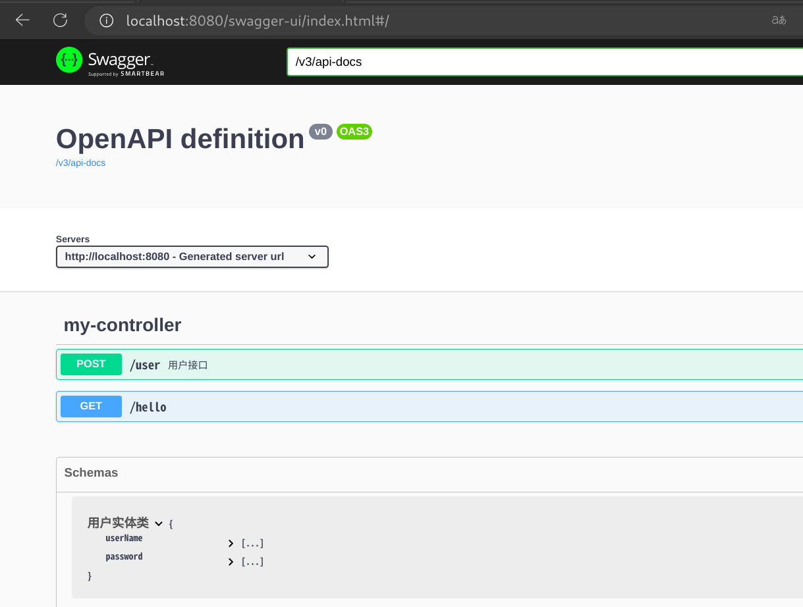

# Swagger
<details>

## 简介

- 号称世界上最流行的API框架

- RestFul API文档在线自动生成工具 => **API文档与API定义同步更新**

- 直接运行，可以在线测试API接口
- 支持多种语言 ( Java, Python, ...)

官网：https://swagger.io/


在项目中使用Swagger需要springbox：

- swagger2
- ui

## SpringBoot集成Swagger

在springboot2.x和springboot3.x中使用swagger有较大差异：https://zhuanlan.zhihu.com/p/661450912

1. 创建springboot web项目
2. 导入相关依赖

```xml
<!-- https://mvnrepository.com/artifact/io.springfox/springfox-swagger2 -->
<dependency>
    <groupId>io.springfox</groupId>
    <artifactId>springfox-swagger2</artifactId>
    <version>3.0.0</version>
</dependency>
<!-- https://mvnrepository.com/artifact/io.springfox/springfox-swagger-ui -->
<dependency>
    <groupId>io.springfox</groupId>
    <artifactId>springfox-swagger-ui</artifactId>
    <version>3.0.0</version>
</dependency>
```

Swagger3.0不支持SpringBoot3.x版本，因此在SpringBoot3.x版本使用如上依赖，启动项目会报错 。解决办法：

​	a. 使用2.x版本SpringBoot

​	b. 放弃使用Swagger，使用 springdoc-openapi-starter-webmvc-ui  **(忽略第三步，不需要配置类)**

```xml
<dependency>
    <groupId>org.springdoc</groupId>
    <artifactId>springdoc-openapi-starter-webmvc-ui</artifactId>
    <version>2.1.0</version>
</dependency>
```

>使用springdoc-openapi-starter-webmvc-ui后，注解有所变化：
>
>@Api(tags = “”) → @Tag(name = “”)
>@ApiModel(value=“”, description=“”) → @Schema(name=“”, description=“”)
>@ApiModelProperty(value = “”, required = true) → @Schema(name= “”, description = “”, required = true)
>@ApiOperation(value = “”, notes = “”) → @Operation(summary = “”, description = “”)
>@ApiParam → @Parameter
>@ApiResponse(code = 404, message = “”) → @ApiResponse(responseCode = “404”, description = “”)

3. 配置Swagger, 写一个config类  

```java
@Configuration
@EnableSwagger2    //启用swagger2
public class SwaggerConfig {
}
```

## 配置Swagger ( SpringBoot2.x需要 )

```java
@Configuration // 声明为配置文件，让spring加载
@EnableSwagger2 // 支持swagger2插件配置
public class Swagger2Config {
    @Bean
    public static BeanPostProcessor springfoxHandlerProviderBeanPostProcessor() {
        return new BeanPostProcessor() {

            @Override
            public Object postProcessAfterInitialization(Object bean, String beanName) throws BeansException {
                if (bean instanceof WebMvcRequestHandlerProvider) {
                    customizeSpringfoxHandlerMappings(getHandlerMappings(bean));
                }
                return bean;
            }

            private <T extends RequestMappingInfoHandlerMapping> void customizeSpringfoxHandlerMappings(List<T> mappings) {
                List<T> copy = mappings.stream()
                        .filter(mapping -> mapping.getPatternParser() == null)
                        .collect(Collectors.toList());
                mappings.clear();
                mappings.addAll(copy);
            }

            @SuppressWarnings("unchecked")
            private List<RequestMappingInfoHandlerMapping> getHandlerMappings(Object bean) {
                try {
                    Field field = ReflectionUtils.findField(bean.getClass(), "handlerMappings");
                    field.setAccessible(true);
                    return (List<RequestMappingInfoHandlerMapping>) field.get(bean);
                } catch (IllegalArgumentException | IllegalAccessException e) {
                    throw new IllegalStateException(e);
                }
            }
        };
    }

    // apiInfo对象主要是设置我们api文档的标题，描述，访问的地址，创建者等信息
    @Bean
    public ApiInfo apiInfo() {
        return new ApiInfoBuilder()
                //页面标题
                .title("RESTful API")
                //版本号
                .version("1.0")
                //描述
                .description("RESTful API")
                .build();
    }

    // docket容器设置我们的文档基础信息，api包的位置，以及路径的匹配规则（包含四种：全匹配，不匹配，正则匹配和ant匹配）
    @Bean
    public Docket docket() {
        return new Docket(DocumentationType.SWAGGER_2).apiInfo(apiInfo()).select()
                .apis(RequestHandlerSelectors.basePackage("com.mh.swagger")) // 这里请替换成自己的包名
                .paths(PathSelectors.any()).build();
    }
}
```

## 添加Swagger注解

```java
//旧的swagger注解
@RestController
public class DefaultController {

    @ApiOperation(value = "获取时间", httpMethod = "GET") // 在这里添加注解
    @RequestMapping(value = "/", method = RequestMethod.GET)
    public Object time() {
        ResponseData data = new ResponseData(200, "OK", new Date());
        return new ResponseEntity<ResponseData>(data, HttpStatus.OK);
    }
}
```

```java
//新的swagger注解
@RestController
public class MyController {

    @GetMapping("/hello")
    public String hello(){
        return "hello";
    }
    
    @Operation(summary = "用户接口",description = "这是描述信息")
    @Parameter(name = "param2",description = "可选参数")
    @ApiResponse(description = "服务器错误",responseCode = "500")
    @PostMapping("/user")
    public User user(String param1){
        return new User();
    }
    
}
```

```java
@Schema(name = "用户实体类")
public class User {
    public String userName;
    public String password;
}
```

## 访问ui界面

访问 `/swagger-ui.html` 地址 ， 即可查看接口文档



</details>

# Knife4J
https://doc.xiaominfo.com/docs/quick-start#openapi2
